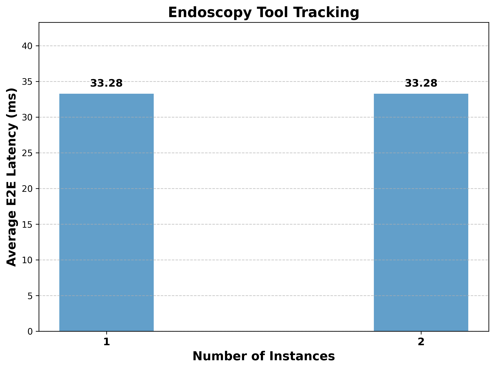
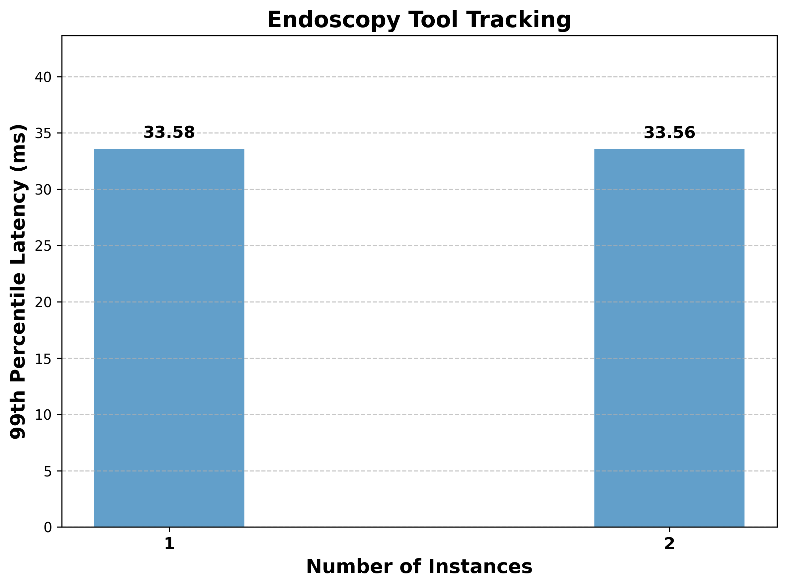
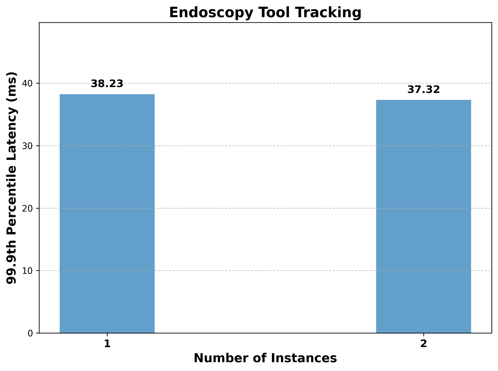
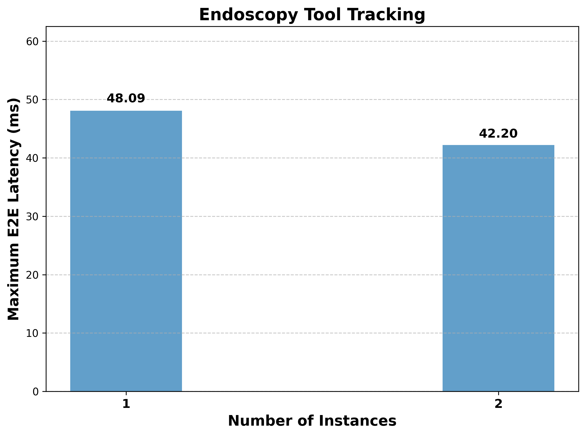
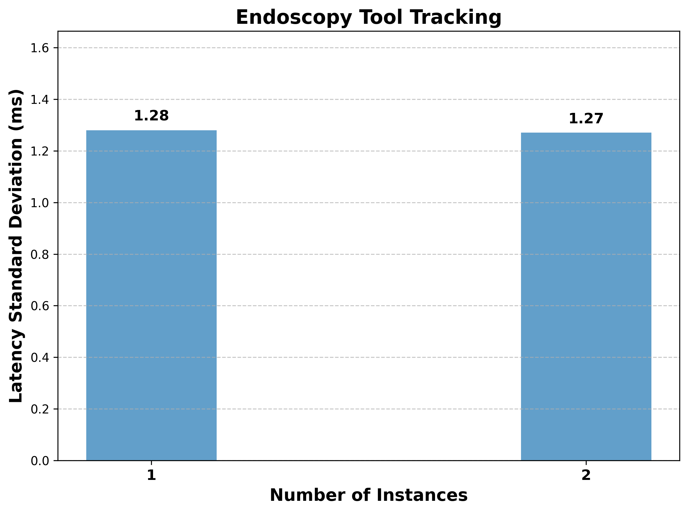

# HoloHub Benchmarks - Holoscan SDK v3.3.0

## Background

Holoscan SDK emphasizes low end-to-end latency in application pipelines. The following benchmarks
reflect latency measures in maintained HoloHub applications built with Holoscan SDK release v3.3.0.

## Platform Configurations

We collected benchmark data on the following platforms:

|         | x86_64 (A6000)| x86_64 (ADA6000) | IGX iGPU | IGX dGPU (A6000) | IGX dGPU (ADA6000) |
| ------- | ------ | ------ | -------- | -------- | -------- |
| OS      | Ubuntu 24.04.1 LTS | Ubuntu 24.04.1 LTS | Ubuntu 24.04.1 LTS | Ubuntu 24.04.1 LTS | Ubuntu 24.04.1 LTS |
| CPU     | AMD Ryzen 9 7950X 16-Core Processor | AMD Ryzen Threadripper PRO 7975WX 32-Cores | Cortex-A78AE | Cortex-A78AE | Cortex-A78AE |
| Discrete GPU | NVIDIA RTX A6000 | NVIDIA RTX 6000 Ada Generation | Orin (nvgpu) | NVIDIA RTX A6000 | NVIDIA RTX 6000 Ada Generation |
| NVIDIA Display Driver | 535.247.01 | 570.133.20 | 540.4.0 | 535.230.02 | 535.230.02 |
| CUDA Version | 12.8 | 12.8 | 12.8 | 12.8 | 12.8 |

## Benchmarking Procedure

We collected end-to-end latency benchmark results using [Holoscan Flow Tracking](/benchmarks/holoscan_flow_benchmarking/) tools applied to the Endoscopy Tool Tracking and Multi-AI Ultrasound applications. Benchmark trials varied the number of applications running concurrently on a given
platform under test, along with configurations for headless operations and real-time input.

## Applications

- Endoscopy Tool Tracking: Demonstrates an LSTM model applied to endoscopy video with Holoviz rendering.
- Multi-AI Ultrasound: Demonstrates multiple inference pipelines in a single application with Holoviz rendering.

### Definitions

- **Real-time Input**: Video replay occurs at the speed of frame collection, approximately 30fps.
- **"As Fast As Possible" Input**: Video replay input to the pipeline occurs as fast as possible without regard for original collection. Synonymous with "non-real-time" or "offline" input.
- **Headless Mode**: Rendering may not be output to the display.

### Execution

In each case:

- We ran the application pipeline with 1000 input messages per run, with results logged to the console for parsing with Holoscan Flow Benchmarking tools.
- We ran each application three times per configuration.
- We ran the application with greedy scheduling. 
    - For Multi-AI Ultrasound, we also ran with event-based scheduling.
- We ran the Cpp version of the applications. 
    - For Endoscopy Tool Tracking, we also ran the python version.
- We included a long-running benchmark for Endoscopy Tool Tracking.
    - 100,000 input frames
    - x86_64 with ADA6000 GPU
    - 1-2 instances
- We compared results without and without enabling [Holoviz Mutex](https://docs.nvidia.com/holoscan/sdk-user-guide/visualization.html#multiprocess-synchronization) Optimization
    - 1-5 instances on x86_64 with ADA6000 GPU 
    -  1-3 instances on IGX with A6000 dGPU

We delineate results by the following configurations:

- Endoscopy Tool Tracking
    - Cpp Version
        - Real-time input with display
        - "As Fast As Possible" input with display
        - "As Fast As Possible" input in headless mode
    - Python Version
        - "As Fast As Possible" input with display
    - Long-running Benchmark
        - Real-time input with display
- Multi-AI Ultrasound
    - Greedy Scheduler
        - Real-time input with display
        - "As Fast As Possible" input in headless mode
    - Event-based Scheduler
        - Real-time input with display

For each configuration, we ran several instances of the application pipeline in parallel to evaluate performance under load.
Up to 8 instances ran in parallel on the x86 platform under tests, while IGX machines were limited to 3 concurrent instances.

### Steps to Reproduce

1. Use Git to check out HoloHub commit 3e182757 to match the benchmarked versions of the Endoscopy Tool Tracking and Multi-AI Ultrasound applications.
2. Follow the [Release Benchmarking project instructions](/benchmarks/release_benchmarking/README.md)
to reproduce the benchmarking procedure.

## Results

End-to-end latency results are reported in milliseconds (ms). Vertical axes are scaled relative to results for each platform.

### Executive Summary

Overall, a major improvement over previous versions is that we no longer see large spikes in maximum latencies. This is perhaps due to improvements in our driver software. We observe improvement in performance compared to v3.0 in the experiments with "As Fast As Possible" mode for both applications. For this report, we add an additional python and event-based scheduler benchmark. We observe that the performance of the python version is comparable to the Cpp version in most cases. Though the average latency of the python version is slightly better, the 99.9th percentile and maximum latencies are slightly worse (Ex: 63.40ms vs 38.86ms on x86_64 (A6000)). 

The event-based scheduler has significantly worse maximum latency compared to the greedy scheduler for the multi-ai ultrasound application (Ex: 123.0ms vs 74.38ms on IGX-iGPU). This is likely due to the application not having much parallelism to exploit. 

We also add a long-running benchmark with 100,000 input frames and found that the end-to-end latency was stable and did not show any large spikes. Finally, we compare the performance of Endoscopy Tool Tracking with and without the Holoviz Mutex optimization. This optimization helps achieve more predictable maximum end-to-end latencies in case of simultaneously running Holoscan applications using visualization. We found that enabling it does not result in any significant regression in performance, while mitigating large spikes observed in previous reports for higher number of application instances.

### Comparison: Endoscopy Tool Tracking in "As Fast As Possible" Video Input Mode

Negative values indicate speedup with comparison to v3.0.0 results, while positive values indicate slowdown.

| Statistic                 | x86_64 (A6000)                    | x86_64 (ADA6000)               | IGX iGPU                       | IGX dGPU (A6000)               | IGX dGPU (ADA6000)             |
|---------------------------|-----------------------------------|-------------------------------|-------------------------------|--------------------------------|--------------------------------|
| Average E2E Latency       | Best case: decreased by up to 0.42%     | Best case: increased by 6%  | Best case: increased by 29%  | Best case: increased by 4.3%     | Best case: increased by 36%   |
|                           | Range: -0.42% to +6%                    | Range: +6% to +11%                | Range: +22% to +29%                 | Range: +4% to +6%                  | Range: +36% to +45%                  |
| 99.9 Percentile Latency   | Best case: decreased by up to 68%        | Best case: increased by up to 24%  | Best case: increased by 11.3% | Best case: increased by 18.8%                  | Best case: increased by 38%   |
|                           | Range: -68% to +38%                     | Range: +24% to +44%                 | Range: +11.3% to +11.8%       | Range: +18% to +26%                  | Range: +38% to +55%                  |
| Max Percentile Latency    | Best case: decreased by up to 28%| Best case: decreased by up to 36% | Best case: decreased by up to 40% | Best case: increased by 0.1%         | Best case: increased by up to 28% |
|                           | Range: -28% to +58%              | Range: -36% to +46%           | Range: -40% to +12%           | Range:  +0.1% to +8%                   | Range: +28% to +49%                  |

### Endoscopy Tool Tracking 

#### Real-Time Video Input - Cpp Version

| Statistic | x86_64 (A6000) | x86_64 (ADA6000) | IGX iGPU | IGX dGPU (A6000) | IGX dGPU (ADA6000) |
| ---------------------------- | ------ | ------ | -------- | -------- | -------- |
| Mean                         | |  |  |  |  |
| 90%                         | | | | | |
| 95%                         | | | | | |
| 99%                         | | | | | |
| 99.9%                         | | | | | |
| Max                         | | | | | |
| Std Deviation                         | | | | | |

#### "As Fast As Possible" Video Input - Cpp Version

| Statistic | x86_64 (A6000) | x86_64 (ADA6000) | IGX iGPU | IGX dGPU (A6000) | IGX dGPU (ADA6000) |
| ---------------------------- | ------ | ------ | -------- | -------- | -------- |
| Mean                         | | | | | |
| 90%                         | | | | | |
| 95%                         | | | | | |
| 99%                         | | | | | |
| 99.9%                         | | | | | |
| Max                         | | | | | |
| Std Deviation                         | | | | | |

#### "As Fast As Possible" Video Input and Headless Output - Cpp Version

| Statistic | x86_64 (A6000) | x86_64 (ADA6000) | IGX iGPU | IGX dGPU (A6000) | IGX dGPU (ADA6000) |
| ---------------------------- | ------ | ------ | -------- | -------- | -------- |
| Mean                         | | | | | |
| 90%                         | | | | | |
| 95%                         | | | | | |
| 99%                         | | | | | |
| 99.9%                         | | | | | |
| Max                         | | | | | |
| Std Deviation                         | | | | | |

#### "As Fast As Possible" Video Input - Python Version

| Statistic | x86_64 (A6000) | x86_64 (ADA6000) | IGX iGPU | IGX dGPU (A6000) | IGX dGPU (ADA6000) |
| ---------------------------- | ------ | ------ | -------- | -------- | -------- |
| Mean                         | | | | | |
| 90%                         | | | | | |
| 95%                         | | | | | |
| 99%                         | | | | | |
| 99.9%                         | | | | | |
| Max                         | | | | | |
| Std Deviation                         | | | | | |

#### Holoviz Mutex Optimization

| Statistic | x86_64 (ADA6000) | IGX dGPU (A6000) |
| ---------------------------- | ------ | ------ |
| Mean |  |  |
| 90% |  |  |
| 95% |  |  |
| 99% |  |  |
| 99.9% |  |  |
| Max |  |  |
| Std Deviation |  |  |

#### Long-running Experiment

| Statistic                    | x86_64 (ADA6000) | 
| ---------------------------- | ------ | 
| Mean                         |  |
| 90%                          |  |
| 95%                          |  |
| 99%                          |  |
| 99.9%                        |  |
| Max                          |  |
| Std Deviation                |  |

### Multi-AI Ultrasound 

#### Real-Time Video Input - Greedy Scheduler

| Statistic | x86_64 (A6000) | x86_64 (ADA6000) | IGX iGPU | IGX dGPU (A6000) | IGX dGPU (ADA6000) |
| ---------------------------- | ------ | ------ | -------- | -------- | -------- |
| Mean                         | | | | | |
| 90%                         | | | | | |
| 95%                         | | | | | |
| 99%                         | | | | | |
| 99.9%                         | | | | | |
| Max                         | | | | | |
| Std Deviation                 | | | | | |

#### Real-Time Video Input - Event-based Scheduler

| Statistic | x86_64 (A6000) | x86_64 (ADA6000) | IGX iGPU | IGX dGPU (A6000) | IGX dGPU (ADA6000) |
| ---------------------------- | ------ | ------ | -------- | -------- | -------- |
| Mean                         | | | | | |
| 90%                         | | | | | |
| 95%                         | | | | | |
| 99%                         | | | | | |
| 99.9%                         | | | | | |
| Max                         | | | | | |
| Std Deviation                 | | | | | |

#### "As Fast As Possible" Video Input and Headless Output - Greedy Scheduler

| Statistic | x86_64 (A6000) | x86_64 (ADA6000) | IGX iGPU | IGX dGPU (A6000) | IGX dGPU (ADA6000) |
| ---------------------------- | ------ | ------ | -------- | -------- | -------- |
| Mean                         | | | | | |
| 90%                         | | | | | |
| 95%                         | | | | | |
| 99%                         | | | | | |
| 99.9%                         | | | | | |
| Max                         | | | | | |
| Std Deviation                         | | | | | |

**Key Observations:**
- **IGX dGPU (A6000)**: The holoviz mutex version shows slightly better average latency (32.50ms vs 33.26ms) but significantly higher maximum latency spikes (48.02ms vs 39.80ms) and much higher standard deviation (3.59ms vs 1.37ms), indicating less consistent performance.
- **x86_64 (ADA6000)**: Similar pattern with the holoviz mutex version showing better average latency (32.88ms vs 33.29ms) but higher maximum latency (46.48ms vs 47.04ms) and higher standard deviation (2.57ms vs 1.54ms).
- Both platforms show that while holoviz mutex improves average performance, it introduces more latency variability and higher peak latencies, which could be problematic for real-time applications requiring consistent frame rates.

