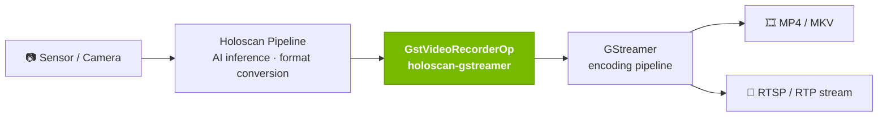
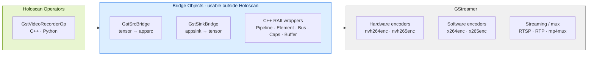

# Holoscan GStreamer Module

The Holoscan GStreamer Module bridges [NVIDIA Holoscan SDK](https://docs.nvidia.com/holoscan/sdk-user-guide/introduction/getting-started) applications to the [GStreamer](https://gstreamer.freedesktop.org/) multimedia framework, giving Holoscan pipelines access to GStreamer's extensive ecosystem of video encoding, streaming, and media processing plugins.



## Who should use this module?

Install this module if your Holoscan application needs to:

- **Record sensor or AI output to video files** — H.264/H.265 via NVIDIA hardware encoders (`nvh264enc`, `nvh265enc`) or software encoders (`x264`, `x265`), with MP4 or MKV container output
- **Stream video over a network** — RTSP, RTP, and other protocols supported by the GStreamer plugin ecosystem
- **Integrate GStreamer pipelines** into an existing Holoscan sensor processing or AI inference workflow without rewriting your media stack
- **Work with GPU memory efficiently** — zero-copy CUDA memory paths are supported when GStreamer 1.24+ and `gstreamer1.0-cuda` are available

This module is a good fit for robotics, broadcast, medical imaging, and industrial inspection applications where Holoscan handles the AI and sensor pipeline while GStreamer handles the media encoding and delivery side.

## What's included

| Component | Description |
| ----------- | ------------- |
| `GstVideoRecorderOp` | Holoscan operator that encodes incoming video tensors to file using a configurable GStreamer pipeline. Available in C++ and Python. |
| `GstSrcBridge` / `GstSinkBridge` | Framework-agnostic C++ bridge objects for pushing and pulling tensor data to/from GStreamer `appsrc`/`appsink` elements. Usable outside Holoscan. |
| C++ RAII wrappers | Type-safe wrappers for core GStreamer types (`Pipeline`, `Element`, `Bus`, `Caps`, `Buffer`, `Allocator`). |



## Installation

**System dependencies** (required on the host or in your container):

```bash
apt-get install -y \
  libgstreamer1.0-dev \
  libgstreamer-plugins-base1.0-dev \
  libgstreamer-plugins-bad1.0-dev \
  gstreamer1.0-plugins-good \
  gstreamer1.0-plugins-bad \
  gstreamer1.0-libav \
  gstreamer1.0-tools
```

A ready-to-use **Dockerfile** with all dependencies pre-installed is provided alongside the [GStreamer operator](https://nvidia-holoscan.github.io/holohub/operators/gstreamer/) in HoloHub.

## Quick start

```python
from holoscan.gstreamer import GstVideoRecorderOp

recorder = GstVideoRecorderOp(
    self,
    name="recorder",
    filename="output.mp4",
    encoder="nvh264",
)
```

For a complete, runnable example see the [gst_video_recorder](https://github.com/nvidia-holoscan/holohub/tree/main/applications/gstreamer/gst_video_recorder/) sample application, which records live camera or synthetic video to an MP4 file with configurable encoding parameters.

## Sample applications

| Application | Description |
| ------------- | ------------- |
| [gst_video_recorder](https://github.com/nvidia-holoscan/holohub/tree/main/applications/gstreamer/gst_video_recorder/) | Records V4L2 camera or synthetic video to H.264/H.265 MP4/MKV using `GstVideoRecorderOp` |
| [gst_to_holo](https://github.com/nvidia-holoscan/holohub/tree/main/applications/gstreamer/gst_to_holo/) | Injects a GStreamer source into a Holoscan pipeline |
| [holo_to_gst](https://github.com/nvidia-holoscan/holohub/tree/main/applications/gstreamer/holo_to_gst/) | Exports Holoscan pipeline output to a GStreamer sink |

## Detailed operator reference

For full parameter documentation, encoder configuration, CUDA memory details, and C++ class reference, see the [GStreamer operator](https://nvidia-holoscan.github.io/holohub/operators/gstreamer/) page in HoloHub.

## Requirements

- Holoscan SDK ≥ 4.2.0
- x86_64 or aarch64
- GStreamer 1.0 system packages (see Installation above)
- GStreamer 1.24+ and `gstreamer1.0-cuda` for CUDA zero-copy support (optional)
