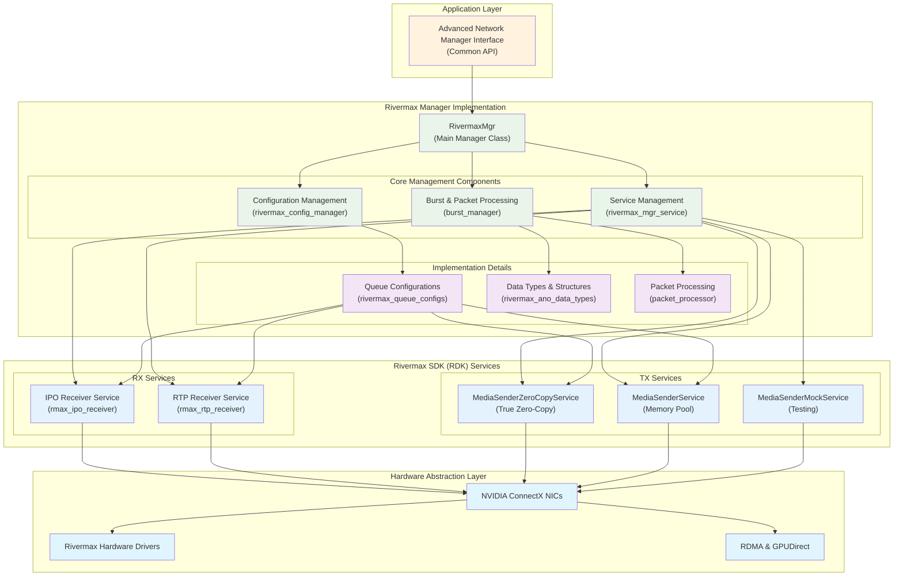
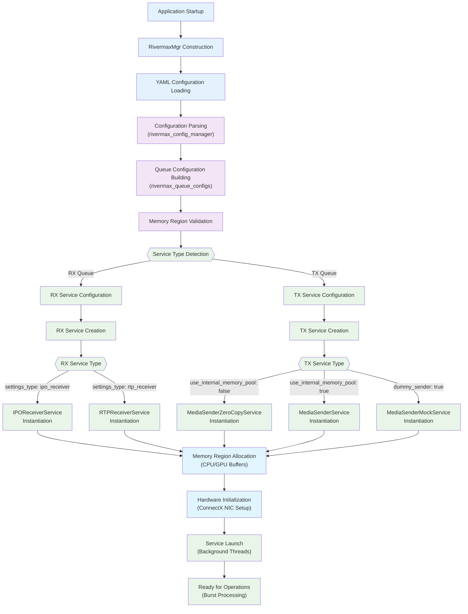
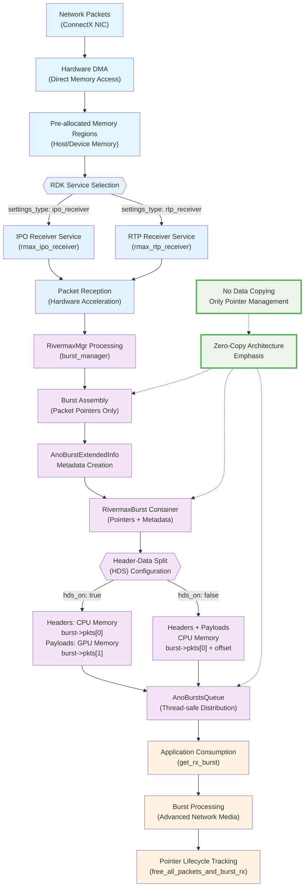
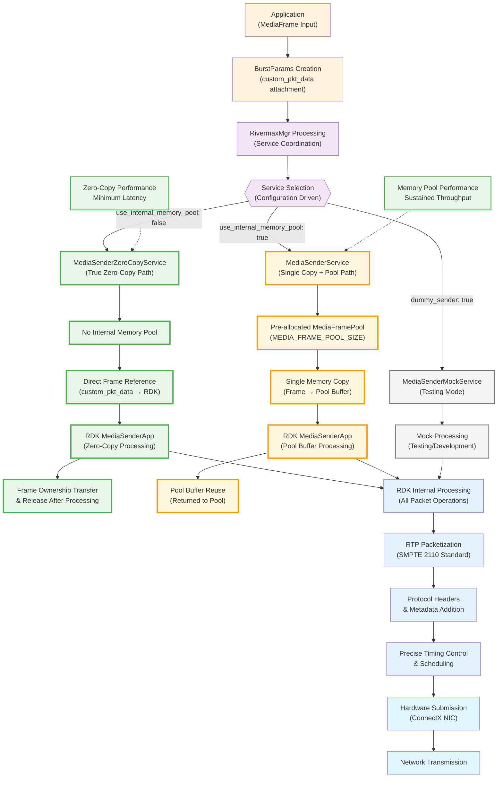

# Rivermax Manager Implementation

This directory contains the complete implementation of the Rivermax Manager for the Advanced Network library. The Rivermax Manager provides high-performance network streaming capabilities using NVIDIA's Rivermax SDK, specifically designed for professional media and broadcast applications requiring ultra-low latency and high throughput.

## Architecture Overview

The Rivermax Manager implements a service-oriented architecture that abstracts the complexity of NVIDIA's Rivermax SDK while providing a unified interface through the Advanced Network library's Manager interface.

### High-Level Architecture

## Directory Structure and File Roles

### Root Level Files

#### `adv_network_rivermax_mgr.h/cpp`
- **Purpose**: Main manager class implementing the Advanced Network Manager interface
- **Role**: Entry point for all Advanced Network operations, coordinates service lifecycle
- **Key Responsibilities**:
  - Manager initialization and configuration
  - Service creation and management
  - Burst and packet API implementation
  - Memory management coordination

#### `rivermax_ano_data_types.h`
- **Purpose**: Core data structures and type definitions for Rivermax operations
- **Role**: Defines the fundamental data types used throughout the manager
- **Key Components**:
  - `RivermaxBurst` - Packet burst container with metadata
  - `AnoBurstsQueue` - Thread-safe queue for burst management
  - `RivermaxPacketData` - Individual packet data structure
  - Extended info structures for packet metadata

#### `CMakeLists.txt`
- **Purpose**: Build configuration for the Rivermax manager
- **Role**: Defines compilation dependencies and linking requirements
- **Dependencies**: Rivermax SDK, Advanced Network common libraries

### Implementation Directory (`rivermax_mgr_impl/`)

This directory contains the core implementation components that handle the detailed functionality of the Rivermax manager.

#### Configuration Management

##### `rivermax_config_manager.h/cpp`
- **Purpose**: Comprehensive configuration parsing and validation
- **Role**: Translates Advanced Network configurations to Rivermax-specific settings
- **Key Components**:
  - `ConfigBuilderContainer` - Manages multiple configuration builders
  - `RxConfigManager` - Handles receive queue configurations
  - `TxConfigManager` - Handles transmit queue configurations
  - Configuration validation and memory region setup

##### `rivermax_queue_configs.h/cpp`
- **Purpose**: Queue-specific configuration builders and settings
- **Role**: Creates and manages Rivermax service configurations
- **Key Components**:
  - IPO Receiver configuration builders
  - RTP Receiver configuration builders  
  - Media Sender configuration builders
  - Memory allocator configuration

#### Service Management

##### `rivermax_mgr_service.h/cpp`
- **Purpose**: Service abstraction layer for Rivermax applications
- **Role**: Manages the lifecycle of Rivermax SDK services
- **Key Components**:
  - `RivermaxManagerService` - Base service interface
  - `RivermaxManagerRxService` - Base receiver service
  - `RivermaxManagerTxService` - Base transmitter service
  - `IPOReceiverService` - IPO protocol receiver implementation
  - `RTPReceiverService` - RTP protocol receiver implementation
  - `MediaSenderService` - Media transmission service with memory pool management
  - `MediaSenderZeroCopyService` - Zero-copy media transmission service

#### Packet and Burst Processing

##### `burst_manager.h/cpp`
- **Purpose**: Manages packet bursts and memory allocation
- **Role**: Handles burst lifecycle, memory management, and packet pointer organization
- **Key Components**:
  - `RivermaxBurst` - Enhanced burst implementation with `AnoBurstExtendedInfo` metadata
  - `RxBurstsManager` - Manages received packet bursts with pointer-based architecture
  - Burst allocation and deallocation strategies
  - Packet pointer management (no data copying at burst level)

##### `packet_processor.h`
- **Purpose**: Packet-level processing and transformation
- **Role**: Handles individual packet operations and metadata processing
- **Key Components**:
  - Packet validation and filtering
  - Metadata extraction and processing
  - Protocol-specific packet handling

#### Core Implementation

##### `adv_network_rivermax_mgr.cpp`
- **Purpose**: Main manager implementation
- **Role**: Implements all Manager interface methods using Rivermax services
- **Key Functions**:
  - Service initialization and coordination
  - Burst and packet API implementations
  - Memory management and buffer allocation
  - Statistics collection and reporting

##### `rivermax_chunk_consumer_ano.h`
- **Purpose**: Chunk-based data consumption interface
- **Role**: Provides an interface for consuming data chunks from Rivermax streams
- **Integration**: Used by the burst manager for efficient data handling

### Service Directory (`rivermax_service/`)

#### `CMakeLists.txt`
- **Purpose**: Build configuration for Rivermax service components
- **Role**: Manages additional service-specific build requirements
- **Integration**: Extends the main build configuration with service-specific dependencies

## External Services and Dependencies

### NVIDIA Rivermax SDK (RDK)

The manager relies heavily on the Rivermax Development Kit, which provides:

> **Note**: For more information about the Rivermax Development Kit, see the official repository: [NVIDIA Rivermax Dev Kit](https://github.com/NVIDIA/rivermax-dev-kit). The Rivermax Dev Kit is a high-level C++ software kit designed to accelerate and simplify Rivermax application development, offering intuitive abstractions and developer-friendly services for IP-based media and data streaming use cases.

#### Core Services
- **`rmax_ipo_receiver`**: An RX service for receiving RTP data using Rivermax Inline Packet Ordering (IPO) feature
- **`rmax_rtp_receiver`**: An RX service for receiving RTP data using Rivermax Striding protocol
- **`rmax_xstream_media_sender`**: High-performance media transmission service with multiple variants:
  - `MediaSenderZeroCopyService`: True zero-copy path using application frame buffers directly
  - `MediaSenderService`: Single-copy path with internal memory pool for generated data

#### Key Capabilities
- **Hardware Acceleration**: Direct NIC hardware access for minimal latency
- **Memory Management**: Advanced memory allocation strategies (huge pages, GPU memory)
- **Protocol Support**: SMPTE 2110, RTP, custom protocols
- **Timing Control**: Precise packet timing for broadcast applications

### Hardware Dependencies

#### NVIDIA ConnectX NICs
- **ConnectX-6 or later**: Required for Rivermax functionality
- **Hardware Features**: RDMA, GPUDirect, hardware timestamping
- **Driver Requirements**: MOFED drivers for full functionality

#### GPU Integration
- **GPUDirect Support**: Zero-copy GPU-to-NIC data paths
- **Memory Management**: Device memory allocation and management
- **Compute Integration**: GPU-based packet processing capabilities

## Operational Flow

### Initialization Sequence

The Rivermax manager follows a carefully orchestrated initialization process to ensure optimal performance and proper resource allocation:

#### Detailed Initialization Steps

1. **Configuration Parsing**: Parse YAML configuration into Rivermax-specific settings using ConfigBuilderContainer
2. **Service Creation**: Instantiate appropriate Rivermax services based on queue configuration and service types
3. **Memory Setup**: Allocate and configure memory regions (CPU/GPU) with proper alignment and access patterns
4. **Hardware Initialization**: Initialize NIC hardware, establish RDMA connections, and configure hardware queues
5. **Service Launch**: Start background services for packet processing with proper CPU affinity and threading

### Receive Path (RX)

The RX path implements a sophisticated pointer-based architecture for zero-copy packet processing:

#### Key RX Path Characteristics

1. **Packet Reception**: Rivermax service receives packets from NIC hardware directly into pre-allocated memory regions
2. **Burst Assembly**: Packet **pointers** are aggregated into `RivermaxBurst` containers with `AnoBurstExtendedInfo` metadata (no data copying)
3. **Metadata Extraction**: Extract timing, flow, and protocol information from packet headers
4. **HDS Configuration**: Headers and payloads placed in CPU/GPU memory based on Header-Data Split settings
5. **Queue Management**: Bursts (containing pointers) are queued for application consumption via `AnoBurstsQueue`
6. **Memory Management**: Coordinate buffer allocation, cleanup, and pointer lifecycle tracking

### Transmit Path (TX)

The TX path implements frame-level processing with configurable memory management strategies:

#### Key TX Path Characteristics

1. **Burst Preparation**: Applications provide frame data in burst format with MediaFrame references via `custom_pkt_data`
2. **Service Selection**: Route to appropriate MediaSender service based on configuration:
   - `MediaSenderZeroCopyService`: Direct frame buffer access (zero-copy, minimum latency)
   - `MediaSenderService`: Copy to internal memory pool (single-copy, sustained throughput)
   - `MediaSenderMockService`: Testing mode with minimal functionality
3. **RDK Processing**: All packet formatting, RTP headers, and protocol handling performed by RDK services
4. **Timing Control**: Apply precise transmission timing within RDK for SMPTE 2110 compliance
5. **Hardware Submission**: Submit formatted packets to NIC hardware via Rivermax acceleration
6. **Resource Cleanup**: Free frame buffers and update statistics based on service type

### Memory Architecture Components

#### Memory Region Types
- **Host Memory**: Standard system memory for headers and control data
- **Huge Pages**: Large page allocations for improved performance and reduced TLB misses
- **Device Memory**: GPU memory for zero-copy operations and GPU-accelerated processing
- **Pinned Memory**: Host memory accessible to GPU and NIC for efficient DMA transfers

#### Buffer Management Strategy
- **Pre-allocation**: Buffers are allocated during initialization to avoid runtime allocation overhead
- **Pool Management**: Efficient buffer reuse through pool allocation reduces memory fragmentation
- **Lifecycle Tracking**: Careful buffer ownership and cleanup management prevents memory leaks
- **Burst Metadata**: `AnoBurstExtendedInfo` structure carries configuration details:
  - **HDS Configuration**: `hds_on`, `header_stride_size`, `payload_stride_size`
  - **Memory Location Flags**: `header_on_cpu`, `payload_on_cpu`
  - **Segment Indices**: `header_seg_idx`, `payload_seg_idx` for memory region mapping

#### HDS Memory Layout Optimization
- **HDS Enabled**: Headers stored in CPU memory, payloads in GPU memory for optimal processing
- **HDS Disabled**: Headers and payloads stored together in CPU memory with calculated offsets

## Performance Optimizations

The Rivermax manager implements multiple layers of performance optimization for ultra-low latency streaming:

### Multi-Layer Optimization Strategy

#### Zero-Copy Architecture
- **Pointer-Based Bursts**: Bursts contain only pointers to packet data, no copying at burst level
- **Direct Memory Access**: Minimize data copying between components through DMA and pointer management
- **GPU Integration**: Direct GPU-to-NIC data paths where supported through GPUDirect
- **Frame Reference Management**: MediaFrame objects reference original application buffers (TX zero-copy path)
- **Buffer Sharing**: Efficient buffer sharing between services and applications through pointer management

#### Memory Copy Optimization
- **Strategy-Based Processing**: RX path uses optimal copy strategies (contiguous/strided) based on memory layout
- **Adaptive Strategy Selection**: Runtime detection of optimal copy strategy based on buffer alignment
- **Single Copy Principle**: When copying is necessary, ensure only one copy operation per data path

### Thread Management
- **Service Threads**: Dedicated threads for each Rivermax service
- **CPU Affinity**: Thread pinning to isolated CPU cores
- **Lock-Free Queues**: High-performance inter-thread communication

### Hardware Optimization
- **Batch Processing**: Process multiple packets per operation through burst containers
- **Hardware Queues**: Utilize multiple NIC queues for parallelism
- **Interrupt Mitigation**: Reduce interrupt overhead through batching
- **Memory Copy Optimization**: 
  - Contiguous packets: Single `cudaMemcpy` operation
  - Strided packets: Optimized `cudaMemcpy2D` with detected stride parameters
  - Adaptive strategy selection based on runtime memory layout analysis

## Configuration Integration

The Rivermax manager integrates seamlessly with the Advanced Network configuration system:

### Supported Configurations
- **Network Interfaces**: Multiple NIC configuration support
- **Memory Regions**: Flexible memory allocation strategies
- **Queue Settings**: Per-queue configuration with protocol-specific options
- **Protocol Parameters**: RTP, IPO, and media streaming parameters

### Validation and Error Handling
- **Configuration Validation**: Comprehensive parameter validation
- **Runtime Monitoring**: Service health monitoring and error reporting
- **Graceful Degradation**: Fallback strategies for partial failures

## Future Extensibility

The architecture is designed for future enhancements:

### Protocol Support
- Additional protocol implementations can be added through the service interface
- New Rivermax SDK features can be integrated without changing the manager interface

### Hardware Support
- Support for new ConnectX generations through configuration updates
- Enhanced GPU integration as hardware capabilities evolve

### Performance Enhancements
- Additional optimization strategies can be implemented in the service layer
- New memory management techniques can be integrated transparently 