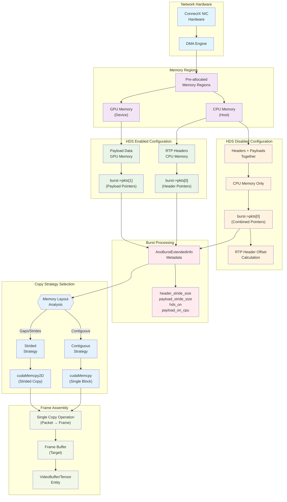
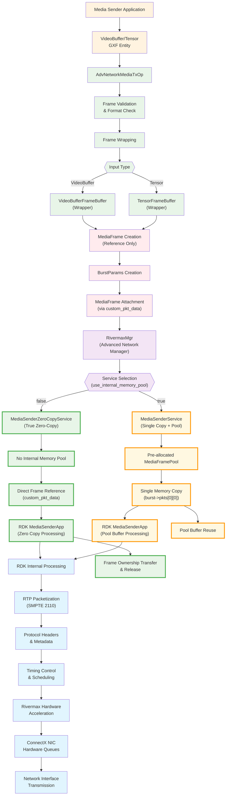
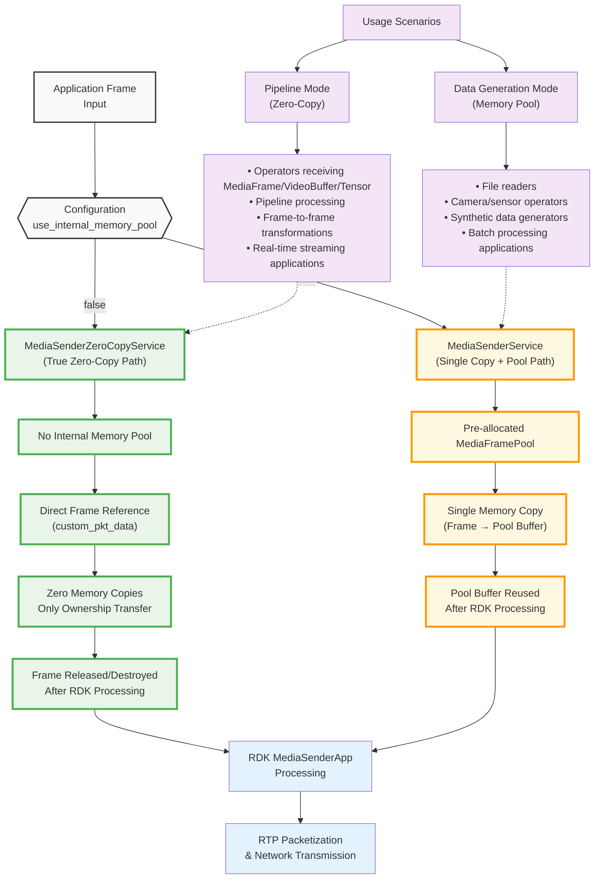

# Advanced Network Media Operators

This directory contains operators for high-performance media streaming over advanced network infrastructure. The operators provide efficient transmission and reception of media frames (such as video) using NVIDIA's Rivermax SDK and other high-performance networking technologies.

> [!NOTE]
> These operators build upon the [Advanced Network library](../advanced_network/README.md) to provide specialized functionality for media streaming applications. They are designed for professional broadcast and media streaming use cases that require strict timing and high throughput.

## Operators

The Advanced Network Media library provides two main operators:

### `holoscan::ops::AdvNetworkMediaRxOp`

Operator for receiving media frames over advanced network infrastructure. This operator receives video frames over Rivermax-enabled network infrastructure and outputs them as GXF VideoBuffer or Tensor entities.

**Inputs**
- None (receives data directly from network interface via Advanced Network Manager library)

**Outputs**
- **`output`**: Video frames as GXF entities (VideoBuffer or Tensor)
  - type: `gxf::Entity`

**Parameters**
- **`interface_name`**: Name of the network interface to use for receiving
  - type: `std::string`
- **`queue_id`**: Queue ID for the network interface (default: 0)
  - type: `uint16_t`
- **`frame_width`**: Width of incoming video frames in pixels
  - type: `uint32_t`
- **`frame_height`**: Height of incoming video frames in pixels
  - type: `uint32_t`
- **`bit_depth`**: Bit depth of the video format
  - type: `uint32_t`
- **`video_format`**: Video format specification (e.g., "RGB888", "YUV422")
  - type: `std::string`
- **`hds`**: Indicates if header-data split mode is enabled in the input data
  - type: `bool`
- **`output_format`**: Output format for the received frames ("video_buffer" for VideoBuffer, "tensor" for Tensor)
  - type: `std::string`
- **`memory_location`**: Memory location for frame buffers ("device", "host", etc.)
  - type: `std::string`

### `holoscan::ops::AdvNetworkMediaTxOp`

Operator for transmitting media frames over advanced network infrastructure. This operator processes video frames from GXF entities (either VideoBuffer or Tensor) and transmits them over Rivermax-enabled network infrastructure.

**Inputs**
- **`input`**: Video frames as GXF entities (VideoBuffer or Tensor)
  - type: `gxf::Entity`

**Outputs**
- None (transmits data directly to network interface)

**Parameters**
- **`interface_name`**: Name of the network interface to use for transmission
  - type: `std::string`
- **`queue_id`**: Queue ID for the network interface (default: 0)
  - type: `uint16_t`
- **`video_format`**: Video format specification (e.g., "RGB888", "YUV422")
  - type: `std::string`
- **`bit_depth`**: Bit depth of the video format
  - type: `uint32_t`
- **`frame_width`**: Width of video frames to transmit in pixels
  - type: `uint32_t`
- **`frame_height`**: Height of video frames to transmit in pixels
  - type: `uint32_t`

## Requirements

- All requirements from the [Advanced Network library](../advanced_network/README.md)
- NVIDIA Rivermax SDK
- Compatible video formats and frame rates
- Proper network configuration for media streaming

## Features

- **High-performance media streaming**: Optimized for professional broadcast applications
- **SMPTE 2110 compliance**: Supports industry-standard media over IP protocols
- **Low latency**: Direct hardware access minimizes processing delays
- **GPU acceleration**: Supports GPUDirect for zero-copy operations
- **Flexible formats**: Support for various video formats and bit depths
- **Header-data split**: Optimized memory handling for improved performance

## RX Data Flow Architecture

When using Rivermax for media reception, the data flows through multiple optimized layers from network interface to the application. This section traces the complete RX path:

### Complete RX Data Flow

```mermaid
graph TD
    %% Network Layer
    A["Network Interface<br/>(ConnectX NIC)"] --> B["Rivermax Hardware<br/>Acceleration"]
    B --> C{{"RDK Service Selection"}}
    C -->|ipo_receiver| D["IPO Receiver Service<br/>(rmax_ipo_receiver)"]
    C -->|rtp_receiver| E["RTP Receiver Service<br/>(rmax_rtp_receiver)"]

    %% Hardware to Memory
    D --> F["Direct Memory Access<br/>(DMA)"]
    E --> F
    F --> G["Pre-allocated Memory<br/>Regions"]

    %% Advanced Network Manager Layer
    G --> H["RivermaxMgr<br/>(Advanced Network Manager)"]
    H --> I["Burst Assembly<br/>(burst_manager)"]
    I --> J["RivermaxBurst Container<br/>+ AnoBurstExtendedInfo"]

    %% Memory Layout Decision
    J --> K{{"Header-Data Split<br/>(HDS) Config"}}
    K -->|HDS Enabled| L["Headers: CPU Memory<br/>burst->pkts[0]<br/>Payloads: GPU Memory<br/>burst->pkts[1]"]
    K -->|HDS Disabled| M["Headers + Payloads<br/>CPU Memory<br/>burst->pkts[0] + offset"]

    %% Queue Management
    L --> N["AnoBurstsQueue<br/>(Pointer Distribution)"]
    M --> N

    %% Media RX Operator
    N --> O["AdvNetworkMediaRxOp"]
    O --> P["Burst Processor<br/>(network_burst_processor)"]
    P --> Q["Frame Assembly<br/>(MediaFrameAssembler)"]

    %% Strategy Selection
    Q --> R{{"Memory Layout<br/>Analysis"}}
    R -->|Contiguous| S["ContiguousStrategy<br/>cudaMemcpy()"]
    R -->|Strided| T["StridedStrategy<br/>cudaMemcpy2D()"]

    %% Frame Assembly
    S --> U["Frame Assembly<br/>(Single Copy)"]
    T --> U
    U --> V["VideoBuffer/Tensor<br/>Entity Creation"]

    %% Output
    V --> W["Media Player Application"]
    W --> X["HolovizOp<br/>(Real-time Display)"]
    W --> Y["FramesWriter<br/>(File Output)"]

    %% Styling
    classDef networkLayer fill:#e1f5fe
    classDef managerLayer fill:#f3e5f5
    classDef operatorLayer fill:#e8f5e8
    classDef applicationLayer fill:#fff3e0
    classDef dataStructure fill:#ffebee

    class A,B,C,D,E,F,G networkLayer
    class H,I,J,K,L,M,N managerLayer
    class O,P,Q,R,S,T,U,V operatorLayer
    class W,X,Y applicationLayer
    class J,L,M dataStructure
```



### 1. Network Layer → Hardware Acceleration
```
Network Interface (ConnectX NIC) → Rivermax Hardware Acceleration
├── IPO (Inline Packet Ordering) Receiver Service  [OR]
├── RTP Receiver Service                            [OR]
└── Direct Memory Access (DMA) to pre-allocated buffers
```

**Key Components:**
- **ConnectX NIC**: NVIDIA ConnectX-6 or later with hardware streaming acceleration
- **Rivermax SDK (RDK) Services** (configured as one of the following):
  - `rmax_ipo_receiver`: RX service for receiving RTP data using Rivermax Inline Packet Ordering (IPO) feature
  - `rmax_rtp_receiver`: RX service for receiving RTP data using Rivermax Striding protocol
- **Hardware Features**: RDMA, GPUDirect, hardware timestamping for minimal latency

> **Note**: The choice between IPO and RTP receiver services is determined by the `settings_type` configuration parameter (`"ipo_receiver"` or `"rtp_receiver"`). These services are provided by the Rivermax Development Kit (RDK).

### 2. Advanced Network Manager Layer
```
Rivermax Services → Advanced Network Manager (RivermaxMgr)
├── Configuration Management (rivermax_config_manager)
├── Service Management (rivermax_mgr_service)
├── Burst Management (burst_manager)
└── Memory Management (CPU/GPU memory regions)
```

**Key Responsibilities:**
- **Packet Reception**: Rivermax services receive packets from NIC hardware directly into pre-allocated memory regions
- **Burst Assembly**: Packet **pointers** are aggregated into `RivermaxBurst` containers for efficient processing (no data copying)
- **Memory Coordination**: Manages memory regions (host/device) and buffer allocation
- **Metadata Extraction**: Extract timing, flow, and RTP sequence information from packet headers
- **Burst Metadata**: Includes `AnoBurstExtendedInfo` with configuration details (HDS status, stride sizes, memory locations)
- **Queue Management**: Thread-safe queues (`AnoBurstsQueue`) for burst pointer distribution

> **Zero-Copy Architecture**: Bursts contain only pointers to packets in memory, not the packet data itself. No memcpy operations are performed at the burst level.

### 3. Advanced Network Media RX Operator
```
Advanced Network Manager → AdvNetworkMediaRxOp
├── Burst Processing (network_burst_processor)
├── Frame Assembly (media_frame_assembler)
│   ├── Frame Assembly Controller (state management)
│   ├── Memory Copy Strategy Detection (ContiguousStrategy/StridedStrategy)
│   ├── Memory Copy Optimization (cudaMemcpy/cudaMemcpy2D)
│   └── RTP Sequence Validation
└── Frame Buffer Management (frame_buffer)
```

**Conversion Process:**
- **Burst Processing**: Receives burst containers with **packet pointers** from Advanced Network Manager (no data copying)
- **HDS-Aware Packet Access**: Extracts packet data based on Header-Data Split configuration:
  - **HDS Enabled**: RTP headers from `CPU_PKTS` array (CPU memory), payloads from `GPU_PKTS` array (GPU memory)
  - **HDS Disabled**: Both headers and payloads from `CPU_PKTS` array with RTP header offset
- **Dynamic Strategy Detection**: Analyzes packet memory layout via pointers to determine optimal copy strategy:
  - `ContiguousStrategy`: For exactly contiguous packets in memory (single `cudaMemcpy` operation)
  - `StridedStrategy`: For packets with memory gaps/strides (optimized `cudaMemcpy2D` with stride parameters)
  - **Adaptive Behavior**: Strategy can switch mid-stream if memory layout changes (buffer wraparound, stride breaks)
- **Frame Assembly**: Converts RTP packet data (accessed via pointers) to complete video frames
- **Format Handling**: Supports RGB888, YUV420, NV12 with proper stride calculation
- **Memory Optimization**: Only one copy operation from packet memory to frame buffer (when needed)

> **Key Point**: The burst processing layer works entirely with packet pointers. The only data copying occurs during frame assembly, directly from packet memory locations to final frame buffers.

### 4. Media Player Application
```
AdvNetworkMediaRxOp → Media Player Application
├── HolovizOp (Real-time Display)
├── FramesWriter (File Output)
└── Format Conversion (if needed)
```

**Output Options:**
- **Real-time Visualization**: Direct display using HolovizOp with minimal latency
- **File Output**: Save frames to disk for analysis or post-processing
- **Format Flexibility**: Output as GXF VideoBuffer or Tensor entities

### Memory Flow Optimization

The RX path is optimized for minimal memory copies through pointer-based architecture:

```
Network → NIC Hardware → Pre-allocated Memory Regions → Packet Pointers → Frame Assembly → Application
    ↓              ↓                    ↓                     ↓                  ↓              ↓
ConnectX      DMA Transfer         CPU/GPU Buffers      Burst Containers   Single Copy    Display/File
                                                      (pointers only)    (if needed)
```

### Memory Architecture and HDS Configuration



**Memory Architecture:**
- **Direct DMA**: Packets arrive directly into pre-allocated memory regions via hardware DMA
- **Pointer Management**: Bursts contain only pointers to packet locations, no intermediate data copying
- **Single Copy Strategy**: Only one memory copy operation (from packet memory to frame buffer) when format conversion or memory location change is needed
- **Header-Data Split (HDS) Configuration**:
  - **HDS Enabled**: Headers stored in CPU memory (`burst->pkts[0]`), payloads in GPU memory (`burst->pkts[1]`)
  - **HDS Disabled**: Headers and payloads together in CPU memory (`burst->pkts[0]`) with RTP header offset
- **Memory Regions**: Configured via `AnoBurstExtendedInfo` metadata (header/payload locations, stride sizes)
- **True Zero-Copy Paths**: When packet memory and frame buffer are in same location and format, no copying required

### Performance Characteristics

- **Latency**: Sub-millisecond packet processing through hardware acceleration and pointer-based architecture
- **Throughput**: Multi-gigabit streaming with batched packet processing (no burst-level copying)
- **Efficiency**: Minimal CPU usage through hardware offload, GPU acceleration, and zero-copy pointer management
- **Memory Efficiency**: Maximum one copy operation from packet memory to frame buffer (often zero copies)
- **Scalability**: Multiple queues and CPU core isolation for parallel processing

### Configuration Integration

The RX path is configured through YAML files that specify:
- **Network Settings**: Interface addresses, IP addresses, ports, multicast groups
- **Memory Regions**: Buffer sizes, memory types (host/device), allocation strategies
- **Video Parameters**: Format, resolution, bit depth, frame rate
- **Rivermax Settings**: IPO/RTP receiver configuration, timing parameters, statistics


This architecture provides professional-grade media streaming with hardware-accelerated packet processing, pointer-based zero-copy optimization, and flexible output options suitable for broadcast and media production workflows. The key advantage is that packet data is never unnecessarily copied - bursts manage only pointers, and actual data movement occurs only once during frame assembly when needed.

## Data Structures and Relationships

Understanding the key data structures and their relationships is crucial for working with the Advanced Network Media operators:

### Core Data Structures

```mermaid
classDiagram
    %% RX Data Structures
    class BurstParams {
        +BurstHeader hdr
        +std::array~void**~ pkts
        +std::array~uint32_t*~ pkt_lens
        +void** pkt_extra_info
        +std::shared_ptr~void~ custom_pkt_data
        +cudaEvent_t event
    }

    class RivermaxBurst {
        +get_burst_info() AnoBurstExtendedInfo*
        +get_port_id() uint16_t
        +get_queue_id() uint16_t
        +get_burst_id() uint16_t
        +reset_burst_packets() void
    }

    class AnoBurstExtendedInfo {
        +uint32_t tag
        +uint16_t burst_id
        +bool hds_on
        +uint16_t header_stride_size
        +uint16_t payload_stride_size
        +bool header_on_cpu
        +bool payload_on_cpu
        +uint16_t header_seg_idx
        +uint16_t payload_seg_idx
    }

    class MediaFrameAssembler {
        -std::shared_ptr~IFrameProvider~ frame_provider_
        -std::shared_ptr~FrameBufferBase~ current_frame_
        -std::unique_ptr~IMemoryCopyStrategy~ copy_strategy_
        +process_incoming_packet(RtpParams, payload) void
        +configure_burst_parameters() void
        +set_completion_handler() void
        +get_statistics() Statistics
    }

    class IFrameProvider {
        <<interface>>
        +get_new_frame() FrameBufferBase*
        +get_frame_size() size_t
        +has_available_frames() bool
        +return_frame_to_pool() void
    }

    class FrameBufferBase {
        <<abstract>>
        #MemoryLocation memory_location_
        #MemoryStorageType src_storage_type_
        #size_t frame_size_
        #Entity entity_
        +get() byte_t*
        +get_size() size_t
        +get_memory_location() MemoryLocation
    }

    class VideoFrameBufferBase {
        <<abstract>>
        #uint32_t width_
        #uint32_t height_
        #VideoFormat format_
        +validate_frame_parameters() Status
        #validate_format_compliance() Status
    }

    %% TX Data Structures
    class VideoBufferFrameBuffer {
        -Handle~VideoBuffer~ buffer_
        -std::vector~ColorPlane~ planes_
        +get() byte_t*
        +wrap_in_entity() Entity
    }

    class TensorFrameBuffer {
        -Handle~Tensor~ tensor_
        +get() byte_t*
        +wrap_in_entity() Entity
    }

    class AllocatedVideoBufferFrameBuffer {
        -void* data_
        +get() byte_t*
        +wrap_in_entity() Entity
    }

    class AllocatedTensorFrameBuffer {
        -void* data_
        -uint32_t channels_
        +get() byte_t*
        +wrap_in_entity() Entity
    }

    %% RDK Service Classes (External SDK)
    class MediaFrame {
        <<RDK SDK>>
        Note: Rivermax SDK class
    }

    class MediaFramePool {
        <<RDK SDK>>
        Note: Rivermax SDK class
    }

    class MediaSenderZeroCopyService {
        -std::shared_ptr~BufferedMediaFrameProvider~ tx_media_frame_provider_
        -bool is_frame_in_process_
        +get_tx_packet_burst() Status
        +send_tx_burst() Status
        +is_tx_burst_available() bool
    }

    class MediaSenderService {
        -std::unique_ptr~MediaFramePool~ tx_media_frame_pool_
        -std::shared_ptr~BufferedMediaFrameProvider~ tx_media_frame_provider_
        -std::shared_ptr~MediaFrame~ processing_frame_
        +get_tx_packet_burst() Status
        +send_tx_burst() Status
        +is_tx_burst_available() bool
    }

    %% Inheritance Relationships
    RivermaxBurst --|> BurstParams : inherits
    VideoFrameBufferBase --|> FrameBufferBase : inherits
    VideoBufferFrameBuffer --|> VideoFrameBufferBase : inherits
    TensorFrameBuffer --|> VideoFrameBufferBase : inherits
    AllocatedVideoBufferFrameBuffer --|> VideoFrameBufferBase : inherits
    AllocatedTensorFrameBuffer --|> VideoFrameBufferBase : inherits

    %% Composition and Association Relationships
    RivermaxBurst *-- AnoBurstExtendedInfo : stores in hdr.custom_burst_data
    RivermaxBurst ..> MediaFrameAssembler : processed by
    MediaFrameAssembler ..> FrameBufferBase : creates
    MediaFrameAssembler o-- IFrameProvider : uses

    BurstParams ..> MediaFrame : references via custom_pkt_data
    BurstParams ..> FrameBufferBase : references via custom_pkt_data

    MediaSenderService *-- MediaFramePool : manages
    MediaFramePool o-- MediaFrame : provides

    MediaSenderZeroCopyService ..> MediaFrame : uses directly
    MediaSenderService ..> MediaFrame : copies to pool
```



## TX Data Flow Architecture

When using Rivermax for media transmission, the data flows from application through frame-level processing layers to the RDK MediaSender service, which handles all packet processing internally. This section traces the complete TX path:

### Complete TX Data Flow



### 1. Media Sender Application → Advanced Network Media TX Operator
```
Media Sender Application → AdvNetworkMediaTxOp
├── Video Frame Input (GXF VideoBuffer or Tensor entities)
├── Frame Validation and Wrapping
│   ├── VideoBufferFrameBuffer (for VideoBuffer input)
│   ├── TensorFrameBuffer (for Tensor input)
│   └── MediaFrame Creation (wrapper around frame buffer)
└── Frame Buffer Management (no packet processing)
```

**Frame Processing:**
- **Frame Reception**: Receives video frames as GXF VideoBuffer or Tensor entities from application
- **Format Validation**: Validates input format against configured video parameters (resolution, bit depth, format)
- **Frame Wrapping**: Creates MediaFrame wrapper around the original frame buffer data (no data copying)
- **Buffer Management**: Manages frame buffer lifecycle and memory references

> **Key Point**: No packet processing occurs at this level. All operations work with complete video frames.

### 2. Advanced Network Media TX Operator → Advanced Network Manager
```
AdvNetworkMediaTxOp → Advanced Network Manager (RivermaxMgr)
├── Burst Parameter Creation
├── MediaFrame Attachment (via custom_pkt_data)
├── Service Coordination
└── Frame Handoff to RDK Services
```

**Frame Handoff Process:**
- **Burst Creation**: Creates burst parameters container (`BurstParams`) for transmission
- **Frame Attachment**: Attaches MediaFrame to burst via `custom_pkt_data` field (no data copying)
- **Service Routing**: Routes burst to appropriate MediaSender service based on configuration
- **Memory Management**: Coordinates frame buffer ownership transfer

> **Zero-Copy Architecture**: MediaFrame objects contain only references to original frame buffer memory. No frame data copying occurs.

### 3. Advanced Network Manager → Rivermax SDK (RDK) Services
```
Advanced Network Manager → Rivermax SDK (RDK) Services
├── MediaSenderZeroCopyService (true zero-copy) [OR]
├── MediaSenderService (single copy + mempool)  [OR]
├── MediaSenderMockService (testing mode)      [OR]
└── Internal Frame Processing via MediaSenderApp
```

**RDK Service Paths:**

#### MediaSenderZeroCopyService (True Zero-Copy Path)
- **No Internal Memory Pool**: Does not create internal frame buffers
- **Direct Frame Transfer**: Application's MediaFrame is passed directly to RDK via `custom_pkt_data`
- **Zero Memory Copies**: No memcpy operations - only ownership transfer of application's frame buffer
- **Frame Lifecycle**: After RDK processes the frame, it is released/destroyed (not reused)
- **Memory Efficiency**: Maximum efficiency - application frame buffer used directly by RDK

#### MediaSenderService (Single Copy + Memory Pool Path)
- **Internal Memory Pool**: Creates pre-allocated `MediaFramePool` with `MEDIA_FRAME_POOL_SIZE` buffers
- **One Memory Copy**: Application's frame data is copied from `custom_pkt_data` to pool buffer via `burst->pkts[0][0]`
- **Pool Management**: Pool frames are reused after RDK finishes processing
- **Frame Lifecycle**: Pool frames are returned to memory pool for subsequent transmissions
- **Buffering**: Provides buffering capability for sustained high-throughput transmission

#### MediaSenderMockService (Testing Mode)
- **Mock Implementation**: Testing service with minimal functionality
- **Single Pre-allocated Frame**: Uses one static frame buffer for testing

> **Note**: The choice of MediaSender service depends on configuration (`use_internal_memory_pool`, `dummy_sender` flags). All services are provided by the Rivermax Development Kit (RDK).

### 4. RDK MediaSender Service → Network Hardware
```
MediaSenderApp (RDK) → Internal Processing → Hardware Transmission
├── Frame-to-Packet Conversion (RTP/SMPTE 2110)
├── Packet Timing and Scheduling
├── Hardware Queue Management
└── DMA to Network Interface
```

**RDK Internal Processing:**
- **Packetization**: RDK internally converts video frames to RTP packets following SMPTE 2110 standards
- **Timing Control**: Applies precise packet timing for synchronized transmission
- **Hardware Integration**: Direct submission to ConnectX NIC hardware queues via DMA
- **Network Transmission**: Packets transmitted with hardware-controlled timing precision

### Memory Flow Optimization

The TX path maintains frame-level processing until RDK services, with two distinct memory management strategies:

#### MediaSenderZeroCopyService Path (True Zero-Copy)
```
Application → Frame Buffer → MediaFrame Wrapper → Direct RDK Transfer → Internal Packetization → Network
    ↓              ↓              ↓                        ↓                      ↓                   ↓
Media Sender   GXF Entity    Reference Only         Zero-Copy Transfer      RTP Packets        Wire Transmission
                                                    (ownership transfer)     (RDK Internal)
```

#### MediaSenderService Path (Single Copy + Pool)
```
Application → Frame Buffer → MediaFrame Wrapper → Pool Buffer Copy → Internal Packetization → Network
    ↓              ↓              ↓                      ↓                   ↓                   ↓
Media Sender   GXF Entity    Reference Only       Single memcpy         RTP Packets        Wire Transmission
                                                  (to pool buffer)       (RDK Internal)
                                                        ↓
                                                  Pool Reuse
```

**Memory Architecture Comparison:**

**Zero-Copy Path (`MediaSenderZeroCopyService`):**
- **Frame Input**: Video frames received from application as GXF VideoBuffer or Tensor
- **Reference Management**: MediaFrame wrapper maintains references to original frame buffer
- **Direct Transfer**: Application's frame buffer ownership transferred directly to RDK (no copying)
- **Frame Lifecycle**: Frames are released/destroyed after RDK processing
- **Maximum Efficiency**: True zero-copy from application to RDK

**Memory Pool Path (`MediaSenderService`):**
- **Frame Input**: Video frames received from application as GXF VideoBuffer or Tensor
- **Reference Management**: MediaFrame wrapper maintains references to original frame buffer
- **Single Copy**: One memcpy operation from application frame to pre-allocated pool buffer
- **Pool Management**: Pool buffers are reused for subsequent frames
- **Sustained Throughput**: Buffering capability for high-throughput sustained transmission
- **Hardware DMA**: RDK performs direct memory access from pool buffers to NIC hardware

### Performance Characteristics

#### MediaSenderZeroCopyService (True Zero-Copy Path)
- **Latency**: Absolute minimal latency - no memory copying overhead
- **Throughput**: Maximum single-stream throughput with zero-copy efficiency
- **Memory Efficiency**: Perfect efficiency - application frame buffer used directly by RDK
- **CPU Usage**: Minimal CPU usage - no memory copying operations
- **Frame Rate**: Optimal for variable frame rates and low-latency applications

#### MediaSenderService (Memory Pool Path)
- **Latency**: Single memory copy latency (application frame → pool buffer)
- **Throughput**: High sustained throughput with buffering capabilities
- **Memory Efficiency**: One copy operation but optimized through buffer pool reuse
- **CPU Usage**: Minimal additional CPU usage for single memory copy
- **Frame Rate**: Optimal for sustained high frame rate streaming with consistent throughput

#### Common Characteristics
- **Timing Precision**: Hardware-controlled packet scheduling managed by RDK services
- **Packet Processing**: Zero CPU usage for RTP packetization (handled by RDK + hardware)
- **Scalability**: Multiple transmission flows supported through service instances
- **Hardware Integration**: Direct NIC hardware acceleration for transmission

### Configuration Integration

The TX path is configured through YAML files that specify:
- **Network Settings**: Interface addresses, destination IP addresses, ports
- **Video Parameters**: Format, resolution, bit depth, frame rate (for RDK packetization)
- **Memory Regions**: Buffer allocation strategies for RDK internal processing
- **Service Mode Selection**: Choose between zero-copy and memory pool modes

#### Service Mode Configuration

**Zero-Copy Mode** (`MediaSenderZeroCopyService`):
```yaml
advanced_network:
  interfaces:
  - tx:
      queues:
      - rivermax_tx_settings:
          use_internal_memory_pool: false  # Enables zero-copy mode
```

**Memory Pool Mode** (`MediaSenderService`):
```yaml
advanced_network:
  interfaces:
  - tx:
      queues:
      - rivermax_tx_settings:
          use_internal_memory_pool: true   # Enables memory pool mode
```

#### Service Selection Decision Flow

Understanding when each MediaSender service is selected is crucial for optimizing your application:



#### When to Use Each Mode

**Use Zero-Copy Mode** (`use_internal_memory_pool: false`):
- **Low-latency applications**: When minimal latency is critical
- **Variable frame rates**: When frame timing is irregular
- **Memory-constrained environments**: When minimizing memory usage is important
- **Single/few streams**: When not requiring high sustained throughput buffering

**Use Memory Pool Mode** (`use_internal_memory_pool: true`):
- **High sustained throughput**: When streaming at consistent high frame rates
- **Buffering requirements**: When you need frame buffering capabilities
- **Multiple concurrent streams**: When handling multiple transmission flows
- **Production broadcast**: When requiring consistent performance under sustained load

This TX architecture provides professional-grade media transmission by maintaining frame-level processing in Holohub components while delegating all packet-level operations to optimized RDK services. The key advantages are:
- **MediaSenderZeroCopyService**: True zero-copy frame handoff for maximum efficiency and minimal latency
- **MediaSenderService**: Single copy with memory pool management for sustained high-throughput transmission
Both modes benefit from hardware-accelerated packet processing in the RDK layer.

## System Requirements

> [!IMPORTANT]
> Review the [High Performance Networking tutorial](../../tutorials/high_performance_networking/README.md) for guided instructions to configure your system and test the Advanced Network Media operators.

- Linux
- NVIDIA NIC with ConnectX-6 or later chip
- NVIDIA Rivermax SDK
- System tuning as described in the High Performance Networking tutorial
- Sufficient memory and bandwidth for media streaming workloads

