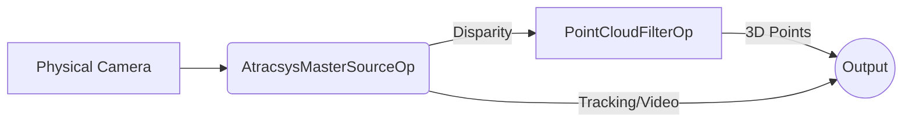

# Atracsys Camera Operators

This package contains the optional live-camera path for the Atracsys visualizer.
It is not required for the default replay build.

## Architecture

The package provides:

- `AtracsysMasterSourceOp` for visible, infrared, marker-pose, and disparity output
- `PointCloudFilterOp` for converting disparity plus Q-matrix data into structured-light points asynchronously via the GPU.

## Proprietary SDK Dependency

The live camera operator relies on vendor SDKs which are **not included**. To compile and use this operator, you must:

1. Contact Atracsys to obtain the latest SDK and the S3DK.
2. Install the Atracsys SDK so that its CMake package is discoverable (e.g., at `/opt/atracsys-4.9.0`).
3. Install the S3DK such that it is discoverable through `S3DK_ROOT` (e.g., at `/opt/s3dk`).

Build requirements:

- Atracsys SDK with CMake package discovery
- S3DK installation discoverable through `S3DK_ROOT`
- OpenCV with CUDA support plus the stereo-processing modules used by S3DK
- TBB and OpenMP support available to the OpenCV/S3DK stack

Runtime requirements:

- supported Atracsys hardware
- installed vendor SDKs
- any required USB/container privileges for device access

This operator package is intended to be enabled explicitly as an optional dependency for
`atracsys_visualizer` live-camera mode.
