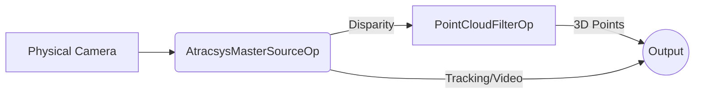

# Atracsys Camera Operators

This package contains the optional live-camera path for the Atracsys visualizer.
It is not required for the default replay build.

## Architecture

The package provides:

- `AtracsysMasterSourceOp` for visible, infrared, marker-pose, and disparity output
- `PointCloudFilterOp` for converting disparity plus Q-matrix data into structured-light points asynchronously via the GPU.

## Proprietary SDK Dependency

> **SDK status and usage notice:** This integration uses the engineering AArch64 version of the spryTrack SDK and S3DK for evaluation and development purposes only. The SDK libraries and headers are included solely to support this specific integration. Any extraction, reuse, redistribution, or separate use of these SDK/S3DK components outside this specific integration requires prior written approval. For a full-featured or production-ready integration, please contact the Wayland team.

The live camera operator relies on proprietary SDK components that are **not included** in this
repository. The AArch64 spryTrack SDK and S3DK used here are integration-specific engineering
versions for evaluation and development only; they are not certified or officially supported
Atracsys releases. Access and packaging are limited to this integration and require prior written
approval. Contact **<contact@wayland.io>** for a full-featured or production-ready integration.

For an approved integration package:

1. Install the Atracsys SDK so that its CMake package is discoverable (e.g., at `/opt/atracsys-4.9.0`).
2. Install the S3DK such that it is discoverable through `S3DK_ROOT` (e.g., at `/opt/s3dk`).

Build requirements:

- Atracsys SDK with CMake package discovery
- S3DK installation discoverable through `S3DK_ROOT`
- OpenCV with CUDA support plus the stereo-processing modules used by S3DK
- TBB and OpenMP support available to the OpenCV/S3DK stack

Runtime requirements:

- supported Atracsys hardware
- installed vendor SDKs
- any required USB/container privileges for device access

This operator package is intended to be enabled explicitly as an optional dependency for
`atracsys_visualizer` live-camera mode.
