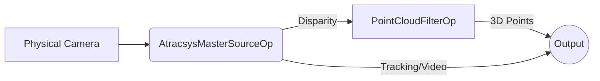

# Atracsys Camera Operators

This package contains the optional live-camera path for the Atracsys visualizer.
It is not required for the default replay build.

## Architecture

```mermaid
graph LR
    HW[Physical Camera] --> Master(AtracsysMasterSourceOp)
    Master -- Disparity --> Filter[PointCloudFilterOp]
    Filter -- 3D Points --> Out((Output))
    Master -- Tracking/Video --> Out
```

The package provides:

- `AtracsysMasterSourceOp` for visible, infrared, marker-pose, and disparity output
- `PointCloudFilterOp` for converting disparity plus Q-matrix data into structured-light points asynchronously via the GPU.

## Proprietary SDK Dependency

> **SDK status and usage notice:** This integration uses engineering AArch64 versions of the spryTrack SDK and S3DK for evaluation and development purposes only. The proprietary SDK/S3DK libraries and headers are not included in HoloHub. When approved for this specific integration, the required components must be supplied separately by Wayland. Any extraction, reuse, redistribution, or separate use of those components outside this specific integration requires prior written approval. These engineering components are not certified or officially supported Atracsys releases. For a full-featured or production-ready integration, please contact the Wayland team.

The live camera operator requires these separately supplied proprietary components. Access is
reviewed case by case and is subject to prior written approval. Contact
**<contact@wayland.io>** to discuss access for this specific integration.

For an approved integration package:

1. Install the Atracsys SDK so that its CMake package is discoverable (e.g., at `/opt/atracsys-4.9.0`).
2. Install the S3DK such that it is discoverable through `S3DK_ROOT` (e.g., at `/opt/s3dk`).

Build requirements:

- Atracsys SDK with CMake package discovery
- S3DK installation discoverable through `S3DK_ROOT`
- OpenCV with CUDA support plus the stereo-processing modules used by S3DK
- TBB and OpenMP support available to the OpenCV/S3DK stack

Runtime requirements:

- supported Atracsys hardware
- installed vendor SDKs
- any required USB/container privileges for device access

This operator package is intended to be enabled explicitly as an optional dependency for
`atracsys_visualizer` live-camera mode.
