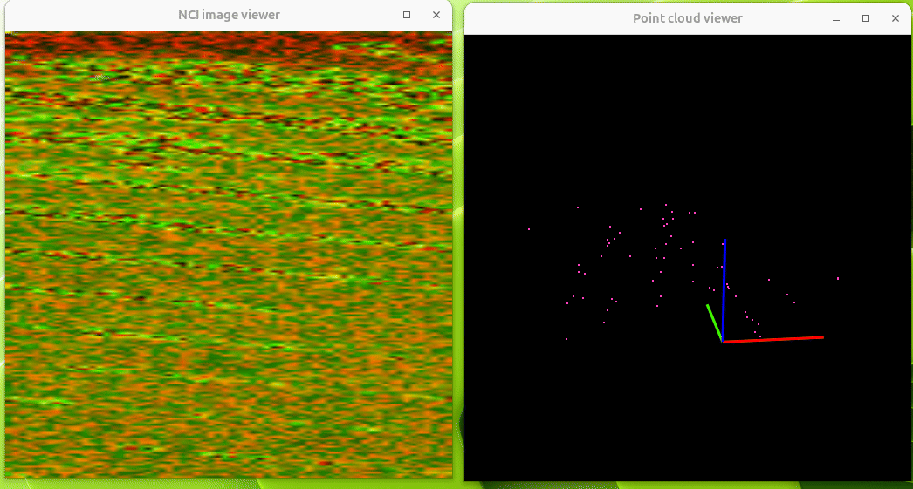

# RADAR signal processing using PVA



## Overview

The PVA Radar Operator demonstrates RADAR signal processing offload using NVIDIA's PVA (Programmable Vision Accelerator) on Holoscan.
This operator is designed to run on both Jetson devices and x86 hosts, leveraging the PVA-SDK and associated solutions provided by NVIDIA
to accelerate radar processing pipelines.

## Features

- **RADAR Signal Processing:** Offloads heavy-lifting signal and tensor computations to the onboard PVA hardware.
- **PVA-SDK Integration:** Integrates with NVIDIA's PVA-SDK for direct access to low-level accelerator APIs.
- **Flexible Deployment:** Supports running and prototyping on both x86 (emulator) and Jetson (Arm) devices with the same code base.
- **Portable Containerized Workflow:** Uses Docker for environment reproducibility, isolating dependencies for reliable deployment.

## Requirements

- Access to the NVIDIA PVA-SDK and pva-solutions packages. See the [PVA documentation](https://developer.nvidia.com/embedded/pva) for details.
- A Jetson IGX or AGX, Orin or newer.

## Building the Container

First, download the PVA-SDK and pva-solutions packages. Then, build the pva-solutions repository following
it's [instructions](https://docs.nvidia.com/pva/solutions/0.4.0/index.html) to generate deb packages for l4t and native targets.
Include the PVA-SDK packages, pva-solutions source, and pva-solutions deb files in the `deps/` folder.
The contents of `deps/` should look like this:

```sh
$ ls operators/pva_radar/deps/
pva-sdk-2.8-local-core_2.8.0_all.deb  pva-solutions-0.4.0-native-samples.deb
pva-sdk-2.8-local-gen2_2.8.0_all.deb  pva-solutions-0.4.0-sample-assets.deb
pva-sdk-2.8-local-gen3_2.8.0_all.deb  pva-solutions-0.4.0.tar.gz
pva-solutions-0.4.0-l4t.deb           pva-solutions-0.4.0-test-assets.deb
pva-solutions-0.4.0-native.deb
```

To build the container and operators, use the [HoloHub CLI](../../README.md). From the root of your HoloHub repository, run:

```sh
./holohub build pva_radar
```

This command will:

- Copy local PVA-SDK and PVA solutions debian packages from `operators/pva_radar/deps/` (see comments in `Dockerfile` for details)
- Build a container image targeting either x86 (amd64) or Jetson (arm64) depending on your build host
- Prepare all tools and environment variables for development and running PVA radar operators
- Build the pva_radar operator libraries

## Usage

Once the container is built, you can launch it for development:

```sh
./holohub run-container pva_radar
```
Refer to the sample application [pva_radar_pipeline](../../applications/pva_radar_pipeline/README.md)
for an end-to-end example of the radar pipeline in operation.

## Folder Contents

- `Dockerfile`: Recipe for building a complete development container.
- `deps/`: Place to store required PVA-SDK and pva-solutions packages/tarballs.
- `pva_radar`: Implementation of the PVA Radar signal processing operator.
- `raw_radar_cube_source`: Operator that loads sample data from files, imitating a RADAR sensor.
- `pva_radar_graphics`: Helper operator to convert from NVCVTensorHandle outputs from the pva_radar operator to holoscan
  graphics buffers that can be rendered with holoviz operators.
