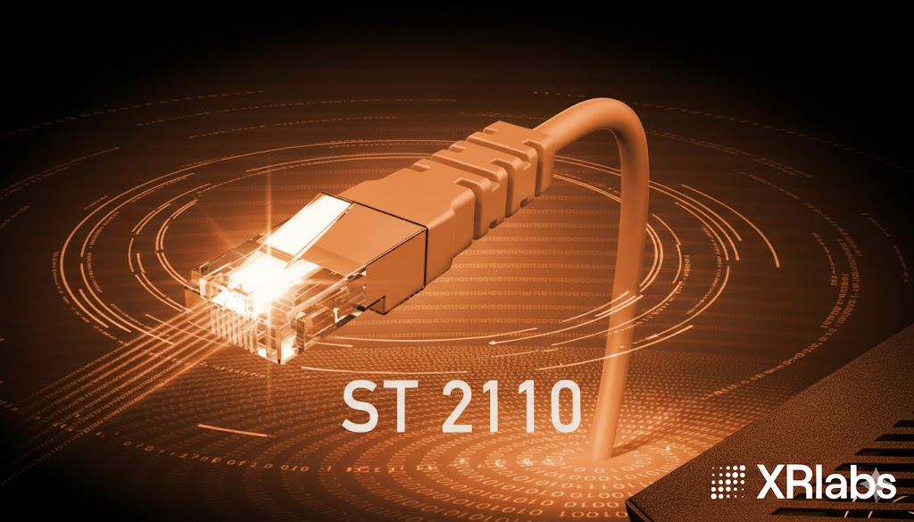

# ST 2110 Source Operator



The ST 2110 Source operator receives SMPTE ST 2110-20 uncompressed video streams over IP networks. This operator is designed for professional broadcast and media production workflows requiring video ingestion from ST 2110-compliant sources.

## Overview

SMPTE ST 2110 is a suite of standards for the transmission of professional media over managed IP networks. ST 2110-20 specifically defines the transport of uncompressed video using RTP (Real-time Transport Protocol). This operator:

- Receives ST 2110-20 RTP packets via Linux UDP sockets
- Parses RTP and ST 2110-20 headers for frame reassembly
- Reassembles packets into complete video frames using line number/offset addressing
- Provides CUDA kernels for 10-bit YCbCr to RGBA/NV12 conversion
- Supports multiple simultaneous output formats
- Compatible with both x86_64 and aarch64 (ARM64) platforms including NVIDIA Thor AGX

## Architecture

The operator uses a triple-buffer architecture with CUDA pinned memory for efficient CPU-to-GPU transfer:

```text
UDP Socket (multicast)
        │
        ▼
   recvmmsg() batch receive
        │
        ▼
   RTP/ST2110 header parsing
        │
        ▼
   Triple-buffer (pinned memory)
   [Assembling] [Complete] [Complete]
        │
        ▼
   cudaMemcpyAsync (H2D)
        │
        ├──► raw_output (YCbCr-4:2:2-10bit)
        │
        ├──► CUDA kernel ──► rgba_output (RGBA 8-bit)
        │
        └──► CUDA kernel ──► nv12_output (NV12 8-bit)
```

## Output Ports

The operator provides three output ports:

| Port | Format | Description |
| ---- | ------ | ----------- |
| `raw_output` | YCbCr-4:2:2-10bit | Raw ST 2110-20 frame data (always emitted) |
| `rgba_output` | RGBA 8-bit | Converted frame for visualization (optional) |
| `nv12_output` | NV12 8-bit | Converted frame for video encoding (optional) |

## Parameters

| Parameter | Type | Description | Default |
|-----------|------|-------------|---------|
| `multicast_address` | string | Multicast IP address for ST 2110 stream | "239.0.0.1" |
| `port` | uint16_t | UDP port for ST 2110 stream | 5004 |
| `interface_name` | string | Linux network interface name (e.g., "mgbe0_0", "eth0") | "eth0" |
| `width` | uint32_t | Width of the video stream in pixels | 1920 |
| `height` | uint32_t | Height of the video stream in pixels | 1080 |
| `framerate` | uint32_t | Expected frame rate of the video stream | 60 |
| `stream_format` | string | Input format: "YCbCr-4:2:2-10bit", "YCbCr-4:2:2-8bit", "RGBA-8bit" | "YCbCr-4:2:2-10bit" |
| `enable_rgba_output` | bool | Enable RGBA conversion and emission | false |
| `enable_nv12_output` | bool | Enable NV12 conversion and emission | false |
| `batch_size` | uint32_t | Number of packets to receive per compute() call | 1000 |
| `max_packet_size` | uint16_t | Maximum ST 2110 packet size in bytes | 1514 |

## Requirements

### Hardware

- CUDA-capable NVIDIA GPU
- Network interface with multicast support
- ST 2110-compliant video source (e.g., Blackmagic Design equipment)

### Software

- Holoscan SDK 3.7.0 or later
- CUDA Toolkit 12.x or later
- Linux with multicast routing configured

## Usage Examples

### Python Example

```python
from holoscan.core import Application
from holoscan.operators import HolovizOp
from holohub.st2110_source import ST2110SourceOp

class ST2110App(Application):
    def compose(self):
        # Create ST 2110 source operator with RGBA output enabled
        source = ST2110SourceOp(
            self,
            name="st2110_source",
            multicast_address="239.255.66.60",
            port=16388,
            interface_name="mgbe0_0",
            width=1920,
            height=1080,
            framerate=50,
            stream_format="YCbCr-4:2:2-10bit",
            enable_rgba_output=True
        )

        # Visualize received video
        visualizer = HolovizOp(
            self,
            name="visualizer",
            width=1920,
            height=1080
        )

        # Connect RGBA output to visualizer
        self.add_flow(source, visualizer, {("rgba_output", "receivers")})

if __name__ == "__main__":
    app = ST2110App()
    app.run()
```

### C++ Example

```cpp
#include "holoscan/holoscan.hpp"
#include "st2110_source.hpp"

class ST2110App : public holoscan::Application {
 public:
  void compose() override {
    using namespace holoscan;

    auto source = make_operator<ops::ST2110SourceOp>(
        "st2110_source",
        Arg("multicast_address", "239.255.66.60"),
        Arg("port", static_cast<uint16_t>(16388)),
        Arg("interface_name", "mgbe0_0"),
        Arg("width", 1920u),
        Arg("height", 1080u),
        Arg("framerate", 50u),
        Arg("stream_format", "YCbCr-4:2:2-10bit"),
        Arg("enable_rgba_output", true));

    auto visualizer = make_operator<ops::HolovizOp>(
        "visualizer",
        Arg("width", 1920),
        Arg("height", 1080));

    add_flow(source, visualizer, {{"rgba_output", "receivers"}});
  }
};

int main() {
  auto app = holoscan::make_application<ST2110App>();
  app->run();
  return 0;
}
```

## Building

To build the operator:

```bash
./holohub build st2110_source
```

To build with Python bindings:

```bash
./holohub build st2110_source --configure-args "-DHOLOHUB_BUILD_PYTHON=ON"
```

## Network Configuration

### System Configuration

Increase the socket buffer size for high-bandwidth streams:

```bash
# Temporary (until reboot)
sudo sysctl -w net.core.rmem_max=268435456
sudo sysctl -w net.core.rmem_default=268435456

# Permanent (add to /etc/sysctl.conf)
net.core.rmem_max=268435456
net.core.rmem_default=268435456
```

### Multicast Routing

Ensure multicast traffic is routed to the correct interface:

```bash
# Add multicast route for your interface
sudo ip route add 239.0.0.0/8 dev mgbe0_0

# Verify multicast group membership
ip maddr show dev mgbe0_0
```

## Supported Video Formats

The operator supports ST 2110-20 uncompressed video at various resolutions:

- 720p (1280x720)
- 1080p/1080i (1920x1080)
- 2K (2048x1080)
- UHD/4K (3840x2160, 4096x2160)

Supported input formats:

- **YCbCr-4:2:2-10bit**: 2.5 bytes per pixel (default, common for broadcast)
- **YCbCr-4:2:2-8bit**: 2 bytes per pixel
- **RGBA-8bit**: 4 bytes per pixel

## Troubleshooting

### No packets received

- Verify multicast address and port match your ST 2110 source
- Check interface name is correct (`ip link show`)
- Ensure multicast routing is configured
- Check firewall allows UDP traffic: `sudo ufw allow 5004/udp`

### Packet drops / frame tearing

- Increase socket buffer size (see Network Configuration)
- Reduce other network traffic on the interface
- Check CPU load - ensure sufficient cores available

### Color issues

- Verify `stream_format` matches your source (10-bit vs 8-bit)
- Check source colorimetry settings (BT.709 assumed)

## Platform Support

- **x86_64**: Full support
- **aarch64 (ARM64)**: Full support including NVIDIA Thor AGX with MGBE

## References

- [SMPTE ST 2110-20:2017](https://www.smpte.org/) - Uncompressed Video
- [SMPTE ST 2110-21:2017](https://www.smpte.org/) - Traffic Shaping and Delivery Timing
- [Holoscan SDK Documentation](https://docs.nvidia.com/holoscan/)
