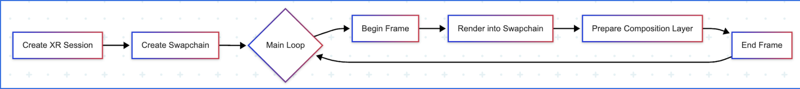

# OpenXR Operators

A collection of Holoscan operators for XR (Extended Reality) integration, enabling real-time XR applications with Vulkan graphics and CUDA compute capabilities.

## Overview

The XR operators provide a complete framework for building Holoscan applications that can render to XR headsets. The implementation leverages the [OpenXR standard](https://www.khronos.org/openxr/) for cross-platform XR support, Vulkan for graphics, and CUDA for compute operations, enabling high-performance real-time XR applications.

## Core Components

Below is a diagram showing how to use these operators in a typical XR workflow:

### Frame Management Operators

#### XrBeginFrameOp

- Synchronizes application with XR device timing
- Calls OpenXR `xrWaitFrame` (blocks until the next frame is ready and returns a predicted display time)
- Calls OpenXR `xrBeginFrame` (signals the start of rendering for the new frame)
- Outputs frame state for downstream operators

#### XrEndFrameOp

- Calls OpenXR `xrEndFrame` to submit composition layers to XR device

### XrSession

The central resource that manages the OpenXR session lifecycle:

- **Initialization**: Creates OpenXR instance, system, session, and Vulkan graphics context
- **Plugin System**: Supports extensible plugins for additional XR functionality
- **View Space Management**: Provides reference and view spaces for pose tracking
- **Graphics Integration**: Manages Vulkan instance, device, and queue creation

### Rendering Infrastructure

#### XrSwapchainCuda

- Manages OpenXR swapchains with CUDA interop
- Provides Vulkan/CUDA memory sharing via external memory
- Supports multiple formats: RGBA8, depth buffers
- Handles GPU synchronization between CUDA and Vulkan

#### XrCompositionLayerManager

- Manages color and depth swapchains
- Creates composition layer storage for frame rendering
- Provides simplified interface for XR rendering

#### XrCompositionLayerProjectionStorage

- Stores projection layer views and depth information
- Supports stereo rendering with side-by-side layout
- Handles depth range and near/far plane configuration

### Input Tracking

#### XrHandTracker

- Implements OpenXR hand tracking extension
- Provides joint locations for both hands
- Supports 26 hand joints per hand
- Real-time pose tracking with validation

## Features

- **Session Management**: Create and manage XR sessions, including initialization, lifecycle, and management of reference/view spaces.
- **Frame Operations**: Handle XR frame begin and end operations to synchronize rendering and presentation with the XR device.
- **CUDA Swapchain**: Enable direct GPU processing of OpenXR swapchain images using CUDA, supporting efficient zero-copy memory sharing between CUDA and Vulkan.
- **Layer Composition and Stereo Rendering**: Collect and manage all layers (color, depth, etc.) to be displayed, with built-in support for stereo rendering using side-by-side layouts.
- **Input Systems**: Provide 6DOF pose tracking and hand tracking (OpenXR EXT_hand_tracking).
- **Performance and Efficiency**: Leverage efficient CUDA-Vulkan interoperability, GPU synchronization, and external memory/semaphore primitives for high-performance XR rendering.

## Dependencies

### External Libraries

- **OpenXR SDK**: Cross-platform XR API
- **OpenXR-Hpp**: C++ headers for OpenXR
- **GLM**: Mathematics library for graphics
- **Vulkan**: Graphics API for XR rendering
- **CUDA**: Compute API for GPU operations

### Holoscan Requirements

- **Minimum SDK Version**: 3.3.0
- **Tested Versions**: 3.3.0
- **Platforms**: x86_64

## Usage Example

For practical usage examples, see the following applications that utilize these XR operators:

- [xr_holoviz](../../applications/xr_holoviz/README.md): Simple XR visualization using Holoviz.
- [xr_gsplat](../../applications/xr_gsplat/README.md): XR rendering of 3D scenes using Gaussian Splatting.
