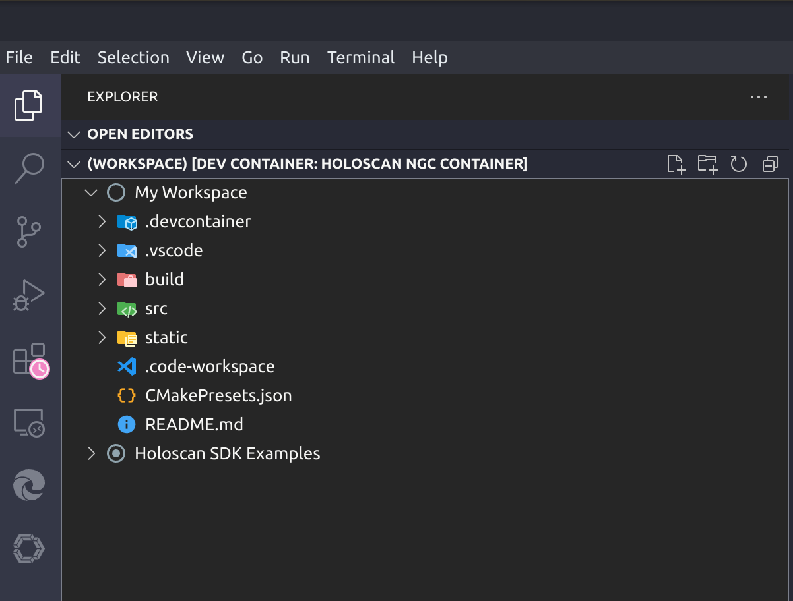
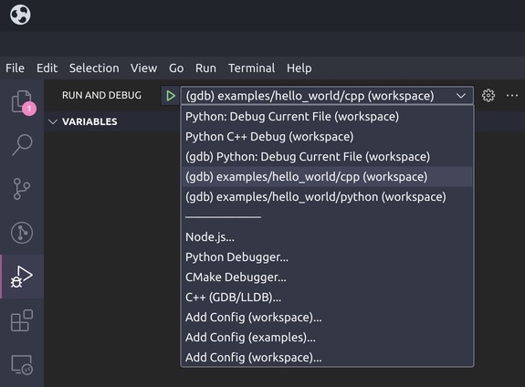
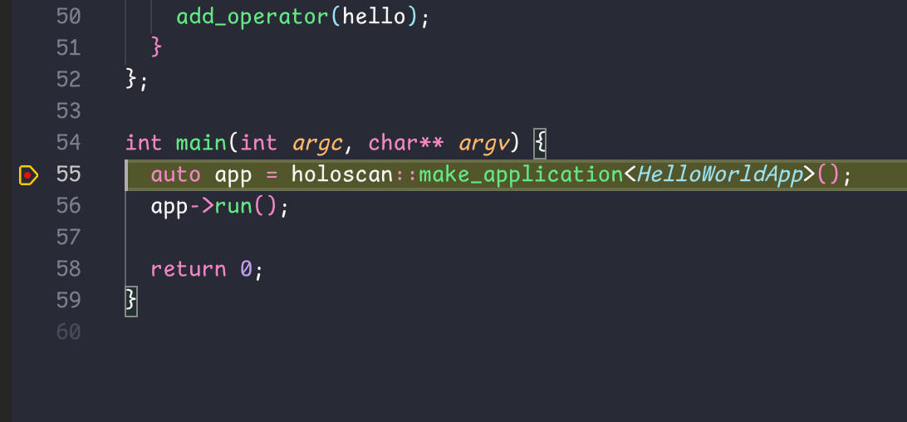
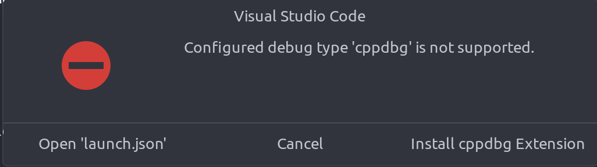

# Holoscan SDK VS Code DevContainer Template

This directory contains the necessary files and configurations to start developing Holoscan applications in the [Holoscan NGC Container](https://catalog.ngc.nvidia.com/orgs/nvidia/teams/clara-holoscan/containers/holoscan) using a [Dev Container](https://code.visualstudio.com/docs/devcontainers/containers) for [VS Code](https://code.visualstudio.com/).

## Prerequisites

- [Docker](https://www.docker.com/)
- [VS Code](https://code.visualstudio.com/) with the [Dev Container Extension Pack](https://marketplace.visualstudio.com/items?itemName=ms-vscode-remote.remote-containers)
- [NVIDIA Container Toolkit](https://docs.nvidia.com/datacenter/cloud-native/container-toolkit/latest/install-guide.html)
- [NVIDIA CUDA Toolkit](https://developer.nvidia.com/cuda-downloads)

## DevContainer Setup

1. Download everything in this directory to a folder of your choice.
2. Open [.devcontainer/Dockerfile](.devcontainer/Dockerfile) and change the `ARG HOLOSCAN_SDK_IMAGE` line to match the [Holoscan SDK container]((https://catalog.ngc.nvidia.com/orgs/nvidia/teams/clara-holoscan/containers/holoscan)) image you want to use.
3. Start VS Code, press `F1` or `Ctrl+Shift+P`, type to select `Dev Containers: Open Folder in Container...` and select the folder where you stored step 1.
4. Wait for the Dev Container to start up. Building the container and installing all the required extensions will take a while. (Switch to the `Output` view and select the `Server` option from the dropdown to check the status of extension installations.)
5. Finally, from the **File** menu, select **Open Workspace from File...** and select `/workspace/.vscode/workspace.code-workspace` to open a pre-configured workspace.

When everything is ready, you should see the following in the VS Code Explorer sidebar.

*Tip: The screenshot below shows a pink clock icon over the Extensions sidebar, which indicates that VS Code is still installing all the required extensions.*



The `My Workspace` section contains all the files that you've downloaded. The `Holoscan SDK` section includes the Holoscan example applications from `~/examples`.

### Directory Structure

```bash
├── .devcontainer/: contains the Dev Container configuration file and Dockerfile that you've downloaded
├── .vscode/: contains the VSCode configuration files for debugging
├── build/: contains the Holoscan sample applications built by CMake
├── src/: where you may start your development
├── static/: contains images and other assets used in this README
├── .code-workspace: pre-configured VSCode workspace described in step 5 above
└── README.md: this file
```

## Debugging Applications


### Debugging a C++ Application

This section will walk you through the steps to debug the [Hello World](../home/holoscan/examples/hello_world/README.md) application using VS Code.

Click on **Explorer** from the sidebar and expand the **examples** folder. Find and open `hello_world.cpp` under `hello_world/cpp` directory.
Let's put a breakpoint on this line: `auto app = holoscan::make_application<HelloWorldApp>();` (Feel free to put more breakpoints wherever you want).

Now, let's switch to the **Run and Debug** panel on the sidebar, and then click on the dropdown box as shown below:


Select `(gdb) examples/hello_world/cpp` from the list of available launch configurations.

Hit **F5** on the keyboard or click the green arrow to start debugging. VS Code shall hit the breakpoint and stop as the screenshot shows below:


***What happens when you hit F5?*** VS Code looks up the launch profile for `(gdb) examples/hello_world/cpp` in the [.vscode/launch.json](.vscode/launch.json) file and calls the `CMake: Build` task as defined in the `preLaunchTask` field of that launch profile. The `CMake: Build` task is configured to build the all the example application using CMake as defined in the [.vscode/tasks.json](.vscode/tasks.json) file.


### Debugging a Python Application

There are a few options when debugging a Python application. In the [.vscode/launch.json](.vscode/launch.json) file, you may find the following options to debug the Hello World application:

* **Python: Debug Current File**: with this option selected, open [hello_world.py](../home/holoscan/examples/hello_world/python/hello_world.py) file and hit F5. It shall stop at any breakpoints selected.
* **Python C++ Debug**: similar to the previous option, this launch profile allows you to debug both the Python and C++ code.

Note: When the debug session starts, it stops at the top of the main application file and brings up a prompt in the terminal asking for superuser access. You may answer `Y` or `y` to continue the debug session.

```bash
Superuser access is required to attach to a process. Attaching as superuser can potentially harm your computer. Do you want to continue? [y/N]
```

* **(debugpy) examples/hello_world/python**: this third launch profile allows you to debug the Python code only. Configure the [hello_world.py](../home/holoscan/examples/hello_world/python/hello_world.py) file with a few breakpoints and hit F5 to start debugging.

*Note: you must open a Python file and make sure the file tab is active to debug with the first two launch profiles.*

## Troubleshotting

### Cannot Start Debugger



* Configured debug type 'cppdbg' is not supported.
* Configured debug type 'debugpy' is not supported.
* Configured debug type 'pythoncpp' is not supported.
* Configured debug type 'python' is not supported.

If you encounter the above errors, please ensure all the required extensions are installed in VS Code. It may take a while to install them for the first time.

### Cannot Set Breakpoints

If you cannot set breakpoints, please ensure all the required extensions are installed in VS Code. It may take a while to install them for the first time.