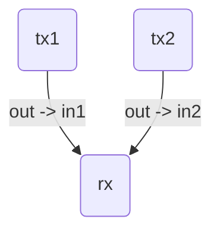
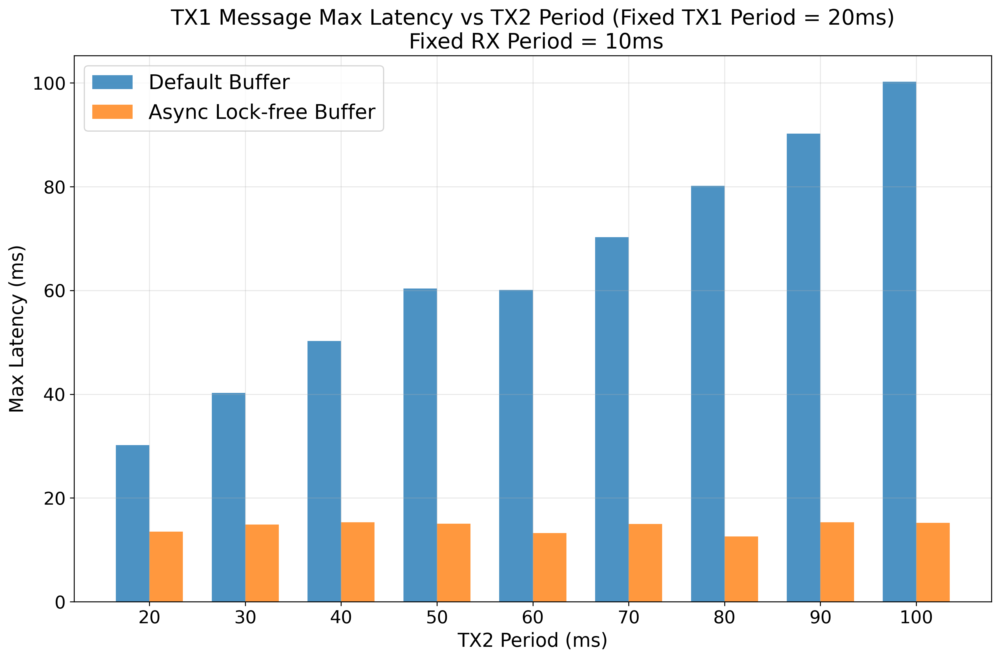
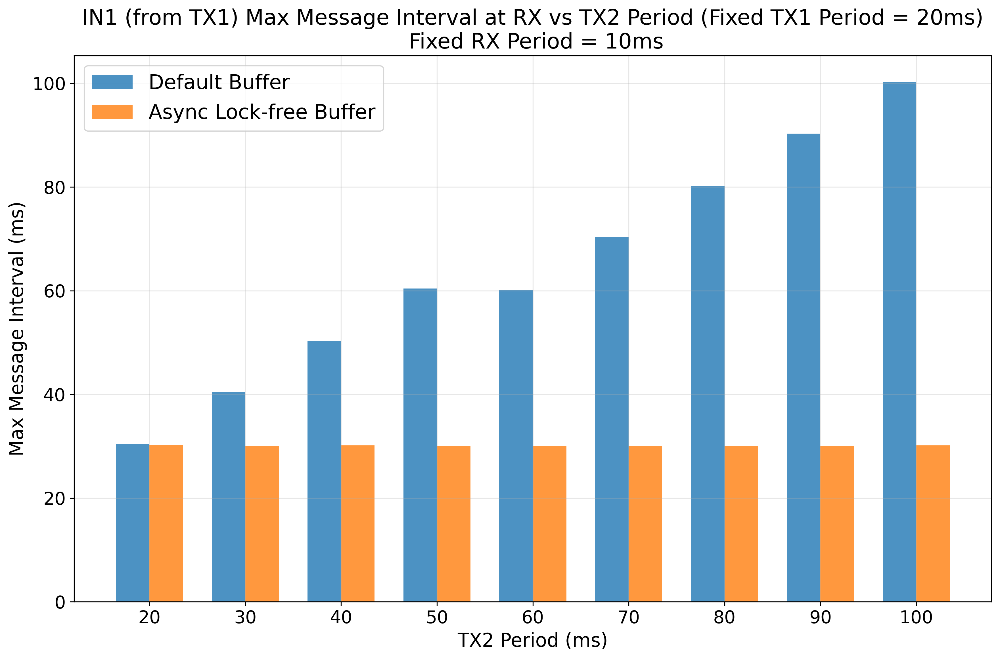
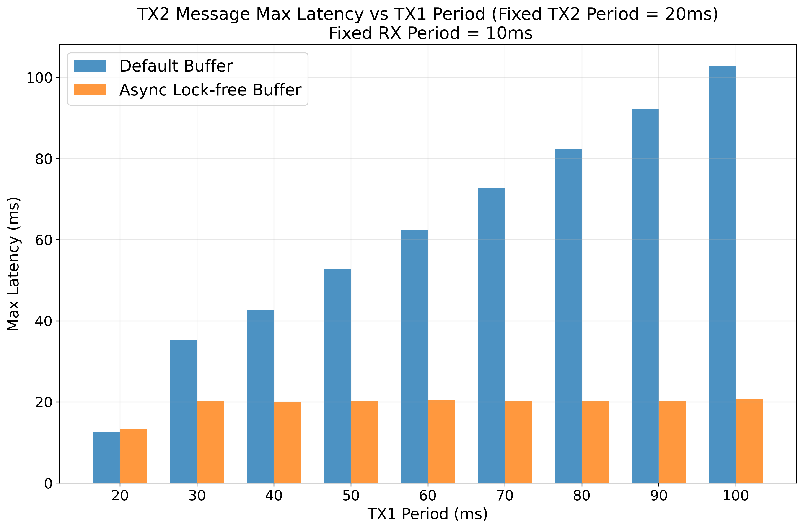
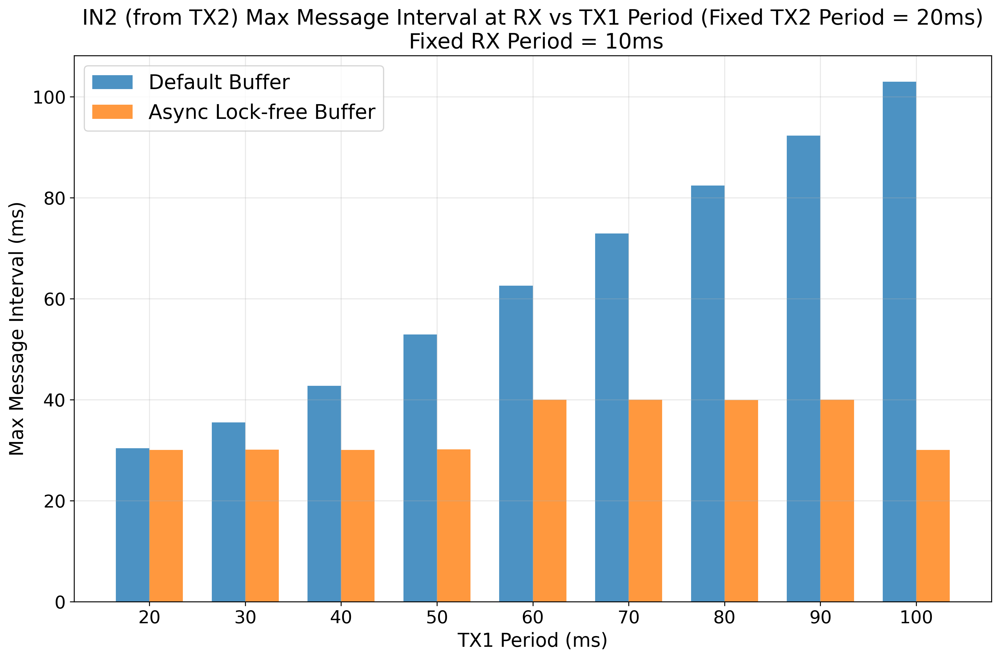

# A Study using Asynchronous Lock-free Buffer with SCHED_DEADLINE

This tutorial demonstrates the impact of using an 
[asynchronous lock-free buffer](https://docs.nvidia.com/holoscan/sdk-user-guide/api/cpp/classholoscan_1_1fragment.html#exhale-class-classholoscan-1-1fragment:~:text=Add%20a%20flow%20between%20two%20operators%20with%20a%20connector%20type.) 
with
`SCHED_DEADLINE` scheduling policy in Linux on the message latency in a Holoscan
SDK application and compares it with the default buffer.

## Application Configuration

The application source code is provided in the [application directory](../../applications/async_buffer_deadline).

The application consists of two `PingTxOp` operators (`tx1` and `tx2`) and one `PingRxOp` operator (`rx`). Both `tx1` and `tx2` generate messages and send them to `rx`.



- **`tx1`**: Sends messages after busy-waiting for 5ms. The busy-wait is
  representative of reading sensor data and a brief processing time.
- **`tx2`**: Sends messages after busy-waiting for 10ms. The busy-wait is
  representative of reading sensor data and a brief processing time.
- **`rx`**: Receives messages from both `tx1` and `tx2`, and calculates
  message latency and inter-message interval period.
  Then, it waits for a brief
  1 ms which could be representative of acutating a signal after a brief
  processing time.

The connection between the operators is configured to use either a default
buffer (`DoubleBuffer`) or an async lock-free buffer.

### Experiment Run Instructions

Application-specific run instructions are provided in the [application
directory](../../applications/async_buffer_deadline).

The following is an example application run instruction:

```
./holohub run async_buffer_deadline --as-root --docker-opts='--ulimit rtprio=99 --cap-add=CAP_SYS_NICE'
```

We need to run the application with root privileges and other flags as
`SCHED_DEADLINE` Linux scheduling policy requires those flags.

#### Experiment Scripts

To run all the experiments in this tutorial:

```
./tutorials/async_buffer_deadline/run_experiment.sh
```

The above script will run the experiment and generate the plots in
`period_variation` under this directory.

## Experimental Setup

The experiment demonstrates how an async lock-free buffer can allow Holoscan SDK
operators to be run with different `SCHED_DEADLINE` periods independently
without being affected by each other's periods or runtimes.

We measure two key metrics:
- **Max Message Latency**: The highest latency observed for messages being
  generated at `tx1` (or at `tx2`) and then received at `rx`.
- **Max Message Interval**: The longest time interval between two consecutive
  messages from `tx1` (or from `tx2`) and then received at `rx`.

We run two main scenarios with fixed `rx` period of 10ms:

1.  **Fixed `tx1` Period, Varying `tx2` Period**:
    - `tx1` period is fixed at 20ms.
    - `tx2` period is varied from 20ms to 100ms.
    - We measure the impact on `tx1`'s latency and message interval.
    - Since the periods `tx1` and `rx` are fixed, the message timings of `tx1`
      must ideally not be impacted with varying `tx2` periods.

2.  **Fixed `tx2` Period, Varying `tx1` Period**:
    - `tx2` period is fixed at 20ms.
    - `tx1` period is varied from 20ms to 100ms.
    - We measure the impact on `tx2`'s latency and message interval.
    - Since the periods `tx2` and `rx` are fixed, the message timings of `tx2`
      must ideally not be impacted with varying `tx1` periods.

## Results

The results show that with the default buffer, the performance of one operator
is heavily dependent on the other. However, with the async lock-free buffer,
they are decoupled enabling true asynchronous execution of the operators.

### TX1 Message Latency vs. TX2 Period



With the default buffer, as `tx2`'s period increases, `tx1`'s maximum latency
also increases linearly. Since `rx` cannot run before both the upstream
operators (`tx1` and `tx2`) have written messages for it, the latency of `tx1`
is affected by `tx2`. With the async lock-free buffer, `tx1`'s latency 
remains consistent and low, regardless of `tx2`'s period. Therefore, async
lock-free buffer unlocks independent connection between `tx1` and `rx`
irrespective of the behavior of `tx2`.

### IN1 Message Interval vs. TX2 Period



Similarly, the maximum message interval for `tx1` (at the `in1` port of `rx`)
increases with `tx2`'s period when using the default buffer.
The async lock-free buffer keeps the interval stable.

### TX2 Message Latency vs. TX1 Period



The same trend is visible here. `tx2`'s message latency is affected by `tx1`'s period with the default buffer, but not with the async lock-free buffer.

### IN2 Message Interval vs. TX1 Period



The message interval for `tx2` (at the `in2` port of `rx`) remains stable with the async lock-free buffer, independent of `tx1`'s period.

### Conclusion and Guidance

The asynchronous lock-free buffer connection between operators enables true
independent execution when using `SCHED_DEADLINE` Linux scheduling policy. 
This buffer type allows each operator to maintain its specified runtime and 
period without interference from other operators in the pipeline.

**Key Insights:**
- **With async lock-free buffer**: Operators run independently with their 
  configured `SCHED_DEADLINE` runtime and periods, achieving predictable real-time performance
- **With default buffer (DoubleBuffer)**: Operators become coupled, where one 
  operator's performance can be impacted by another operator's 
  behavior, even when `SCHED_DEADLINE` policy is applied

**Developer Recommendations:**
1. **Use async lock-free buffers** when implementing soft real-time applications 
   with `SCHED_DEADLINE` scheduling to ensure predictable operator performance
2. **Avoid default buffers** in `SCHED_DEADLINE` scenarios where operator 
   independence is critical for meeting real-time constraints
3. **Using default buffer with `SCHED_DEADLINE` policy** means satisfying both
   the constraints of the double buffer and periodic execution of
   `SCHED_DEADLINE`. Depending on the application, this may not be desirable.
4. **Using `SCHED_DEADLINE` for a chosen few operators** (for example, source
   operators in a DAG) along with default
   buffer may provide a good balance because this provides predictable execution
   for chosen few `SCHED_DEADLINE` operators while allowing applications to run
   normally otherwise.
3. **Test both buffer types** during development to understand the performance 
   implications in your specific use case, especially when using `SCHED_DEADLINE`
   policy
4. **Monitor message latency and intervals** to verify that operators maintain 
   their intended timing characteristics

