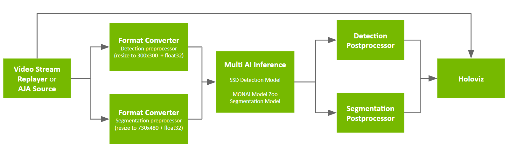
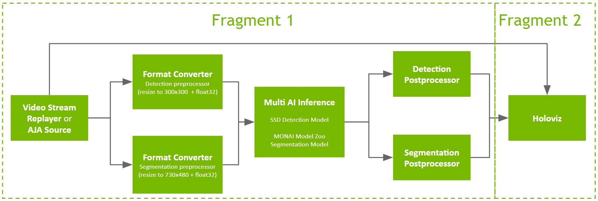
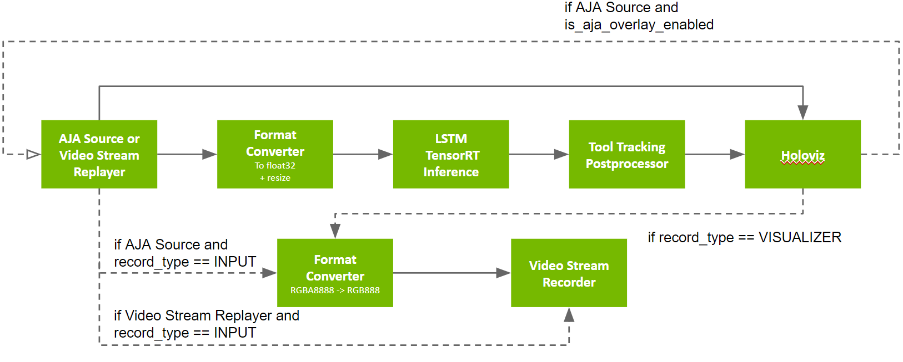
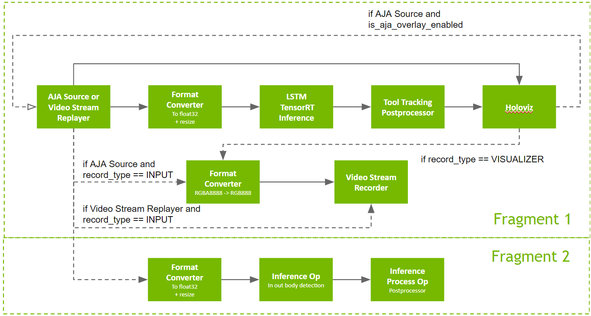

# Creating Multi Node Applications

In this tutorial, we will walk through the process in two scenarios of creating a multi node application from existing applications. We will demonstrate the process with Python applications but it's similar for C++ applications as well.

1. When we would want to divide an application that was previously running on a single node into two fragments running on two nodes. This corresponds to use cases where we want to separate the compute and visualization workloads onto two different nodes, for example in the case of surgical robotics, the visualization node should be closest to the surgeon. For this purpose we choose the example of the [`multiai_endoscopy`](../../applications/multiai_endoscopy/) application.

2. When we would want to connect and combine two previously independent applications into one application with two fragments. This corresponds to the use cases where we want to run time-critical task(s) on a node closest to the data stream, and non time-critical task(s) on another node that can have a bit more latency, for example saving the inbody video recording of the surgery to cloud can have a higher latency than the real-time visualization. For this purpose we choose the example of the [`endoscopy_tool_tracking`](../../applications/endoscopy_tool_tracking/) application and the [`endoscopy_out_of_body_detection`](../../applications/endoscopy_out_of_body_detection/) application.


The SDK documentation on [Creating a Distributed Application](https://docs.nvidia.com/holoscan/sdk-user-guide/holoscan_create_distributed_app.html) contains the necessary core concepts and description for distributed applications, please familiarize yourself with the documentation before proceeding to this tutorial.

Please also see two SDK examples [ping_distributed](https://github.com/nvidia-holoscan/holoscan-sdk/tree/main/examples/ping_distributed) and [video_replayer_distributed](https://github.com/nvidia-holoscan/holoscan-sdk/tree/main/examples/video_replayer_distributed) on simple examples of creating distributed applications.

In this tutorial, we will focus on modifying existing applications you have created into distributed applications.
## Scenario 1 - Divide an application into two fragments
The [`multiai_endoscopy`](../../applications/multiai_endoscopy/) application has its app graph like below:



We will divide it into two fragments. The first fragment will include all operators excluding the visualizer and the second fragment will include the visualizer, as illustrated below:



### Changes in scenario 1 - Extra Imports
To created a distributed application, we will need to import the Fragment object.  

```python
from holoscan.core import Fragment
```


### Changes in scenario 1 - Changing the way command-line arguments are parsed
As seen in the [documentation](https://docs.nvidia.com/holoscan/sdk-user-guide/holoscan_create_distributed_app.html#adding-user-defined-command-line-arguments), it is recommended to parse user-defined arguments from the `argv ((C++/Python))` method/property of the application. To parse in user-defined command line arguments (such as `--data`, `--source`, `--labelfile` in this app), let's make sure to avoid arguments that are unique to the multi-fragment applications, such as  `--driver`, `--worker`, `--address`, `--worker-address`, `--fragments` (see the [documentation](https://docs.nvidia.com/holoscan/sdk-user-guide/holoscan_create_distributed_app.html#adding-user-defined-command-line-arguments) for more details on using those arguments).
<br>
In the [non-distributed application](../../applications/multiai_endoscopy/), we would have 
```python
if __name__ == "__main__":
    parser = ArgumentParser(description="Multi-AI Detection Segmentation application.")
    parser.add_argument(...) # for the app config yaml file via --config 
    parser.add_argument(...) # for args needed in app init --source --data --labelfile
    args = parser.parse_args()
    # logic to define args (config_file, labelfile) needed to pass into application init and config
    app = MultiAIDetectionSegmentation(source=args.source, data=args.data, labelfile=labelfile)
    app.config(config_file)
    app.run()
```

In the distributed application, we need to make the following changes mainly to `parser.parse_args`:
```python !5,6
if __name__ == "__main__":
    parser = ArgumentParser(description="Multi-AI Detection Segmentation application.")
    parser.add_argument(...) # for the app config yaml file via --config 
    parser.add_argument(...) # for args needed in app init --source --data --labelfile
    apps_argv = Application().argv # difference
    args = parser.parse_args(apps_argv[1:]) # difference
    # logic to define args (config_file, labelfile) needed to pass into application init and config
    app = MultiAIDetectionSegmentation(source=args.source, data=args.data, labelfile=labelfile)
    app.config(config_file)
    app.run()
```
### Changes in scenario 1 - Changing the application structure
Previously, we defined our non distributed applications with the `__init__()` and `compose()` methods. 
```python
class MultiAIDetectionSegmentation(Application):
    def __init__(self, data, source="replayer", labelfile=""):
        ...

    def compose(self):
        # define operators and add flow
        ...
```
Now we will define two fragments, and add and connect them in the application's `compose()` method:
```python
class Fragment1(Fragment):
    # operators in fragment1 need the objects: sample_data_path, source, label_dict 
    def __init__(self, app, name, sample_data_path, source, label_dict):
        super().__init__(app, name)
        ...
    def compose(self):
        # define fragment1 operators
        # add flow
        ... 

class Fragment2(Fragment):
    # operators in fragment2 need the object: label_dict 
    def __init__(self, app, name, label_dict):
        super().__init__(app, name)
        ...
    def compose(self):
        # define the one operator in fragment2 (Holoviz)
        # add operator
        # no need to add_flow because there's only one operator in this fragment
        ... 

class MultiAIDetectionSegmentation(Application):
    def __init__(self, data, source="replayer", labelfile=""):
        super().__init__()
        # set self.name
        # get self.label_dict from labelfile,self.source, self.sample_data_path
        ...
        
    def compose(self):
        # define the two fragments in this app: fragment1, fragment2
        # pass in the objects needed to each fragment's operators when defining each fragment
        # operators in fragment1 need the objects: sample_data_path, source, label_dict 
        fragment1 = Fragment1(self, name="fragment1", source=self.source, sample_data_path=self.sample_data_path, label_dict=self.label_dict)
        # operators in fragment2 need the object: label_dict 
        fragment2 = Fragment2(self, name="fragment2", label_dict=self.label_dict)

        # Connect the two fragments 
        # There are three connections between fragment1 and fragment2:
        # (1) from the data source to Holoviz
        source_output = self.source + ".video_buffer_output" if self.source.lower() == "aja" else self.source + ".output"
        self.add_flow(fragment1, fragment2, {(source_output, "holoviz.receivers")})
        # (2) from the detection postprocessor to Holoviz
        self.add_flow(fragment1, fragment2, {("detection_postprocessor.out" , "holoviz.receivers")})
        # (3) from the segmentation postprocessor to Holoviz
        self.add_flow(fragment1, fragment2, {("segmentation_postprocessor.out_tensor" , "holoviz.receivers")})
```
### Changes in scenario 1 - Defining objects shared among fragments
When creating your fragments, first make a list of all the objects each fragment's operators will need. If there are objects that are needed across multiple fragments (such as `self.label_dict` in this case), before passing them into fragments in the application's `compose()` method, create such objects in the app's `__init()__` method ideally. In the non-distributed application, in the app's `compose()` method we define `label_dict` from `self.labelfile`, and continue using `label_dict` while composing the application. In the distributed application, we move the definition of `label_dict` from `self.labelfile` into the application's `__init()__` method, and refer to `self.label_dict` in the application's `compose()` method and each fragment's `__init__()`/`compose()` methods.

Non distributed application:
```python
class MultiAIDetectionSegmentation(Application):
    def compose(self):
        # construct the labels dictionary if the commandline arg for labelfile isn't empty
        label_dict = self.get_label_dict(self.labelfile)
```

Distributed application:
```python
class Fragment1(Fragment):
    def __init__(self, app, name, sample_data_path, source, label_dict):
        super().__init__(app, name)

        self.source = source
        self.label_dict = label_dict
        self.sample_data_path = sample_data_path

    def compose(self):
        ...
        # Use self.label_dict

class Fragment2(Fragment):
    def __init__(self, app, name, label_dict):
        super().__init__(app, name)

        self.label_dict = label_dict
        
    def compose(self):
        ...
        # Use self.label_dict

class MultiAIDetectionSegmentation(Application):
    def __init__(self, data, source="replayer", labelfile=""):
        ...
        self.label_dict = self.get_label_dict(labelfile)
    def compose(self):
        fragment1 = Fragment1(self, name="fragment1", source=self.source, sample_data_path=self.sample_data_path, label_dict=self.label_dict)
        fragment2 = Fragment2(self, name="fragment2", label_dict=self.label_dict)
        ...
```

### Changes in scenario 1 - Adding Operators to App Graph
When composing a non-distributed application, operators are created in the `compose()` method, then added to the app graph one of two ways:
   1. For applications with a single operator (rare), `add_operator()` should be called.
   1. for applications with multiple operators, using `add_flow()` will take care of adding each operator to the app graph on top of connecting them.
This applies to distributed applications as well: when composing multiple fragments, each of them are responsible for adding all their operators to the app graph in their `compose()` method. Calling `add_flow()` in the `compose()` method of the distributed application when connecting fragments together does not add the operators to the app graph. This is often relevant when breaking down a single fragment application in a multi fragments application for distributed use cases, as some fragments might end up owning a single operator, and the absence of `add_flow()` in that fragment should come with the addition of `add_operator()` instead.

In the non distributed application:
```python
class MultiAIDetectionSegmentation(Application):
    def compose(self):
        # define operators
        source = SourceClass(...)
        detection_preprocessor = FormatConverterOp(...)
        segmentation_preprocessor = FormatConverterOp(...)
        multi_ai_inference = InferenceOp(...)
        detection_postprocessor = DetectionPostprocessorOp(...)
        segmentation_postprocessor = SegmentationPostprocessorOp(...)
        holoviz = HolovizOp(...)

        # add flow between operators
        ...

```

In a distributed application:
```python #11-17
class Fragment1(Fragment):
    def compose(self):
        # define operators
        source = SourceClass(...)
        detection_preprocessor = FormatConverterOp(...)
        segmentation_preprocessor = FormatConverterOp(...)
        multi_ai_inference = InferenceOp(...)
        detection_postprocessor = DetectionPostprocessorOp(...)
        segmentation_postprocessor = SegmentationPostprocessorOp(...)

        # add flow between operators
        ...
        

class Fragment2(Fragment):
    def compose(self):
        holoviz = HolovizOp(...)
        self.add_operator(holoviz)
```

### Changes in scenario 1 - Shared resources
In a non distributed application, there may be some shared resources defined in the application's `compose()` method, such as a `UnboundedAllocator` for various operators. When splitting the application into multiple fragments, remember to create those resources once for each fragment.

Non distributed application:
```python
class MultiAIDetectionSegmentation(Application):
    def compose(self):
        pool = UnboundedAllocator(self, name="pool")
```

Distributed application:
```python
class Fragment1(Fragment):
    def compose(self):
        pool = UnboundedAllocator(self, name="pool")
        # ... operator definitions in fragment1 with parameter pool=pool,

class Fragment2(Fragment):
    def compose(self):
        pool = UnboundedAllocator(self, name="pool")
        # ... operator definitions in fragment2 with parameter pool=pool,
```

### Changes in scenario 1 - Running the application
Previously for a non distributed application, the command to launch is `python3 multi_ai.py --data <DATA_DIR>`, now in the distributed application we will have the option to specify a few more things:
```sh
# To run fragment 1 on current node as driver and worker:
python3 multi_ai.py --data /workspace/holohub/data/ --driver --worker --address <node 1 IP address>:<port> --fragments fragment1
# To run fragment 2 on current node as worker:
python3 multi_ai.py --data /workspace/holohub/data/  --worker --address <node 1 IP address>:<port> --fragments fragment2

```

For more details on the commandline arguments for multi fragment apps, see the [documentation](https://docs.nvidia.com/holoscan/sdk-user-guide/holoscan_create_distributed_app.html).

To run the app we create in scenario 1, please see [Running the Applications](#running-the-applications).

## Scenario 2 - Connect two applications into a multi-node application with two fragments
In this scenario, we will combine the existing application [endoscopy_tool_tracking](../../applications/endoscopy_tool_tracking/python/) and [endoscopy_out_of_body_detection](../../applications/endoscopy_out_of_body_detection/) into a distributed application with 2 fragments.

Since [endoscopy_out_of_body_detection](../../applications/endoscopy_out_of_body_detection/) is implemented in C++, we will quickly implement the Python version of the app for our Fragment2.

The app graph for `endoscopy_tool_tracking`:

The app graph for `endoscopy_out_of_body_detection`:

The distributed app graph we want to create:



### Changes in scenario 2  - Extra Imports
Similar to scenario 1, to created a distributed application, we will need to import the Fragment object. When combining two non distributed apps into a multi-fragment application, remember to import all prebuilt Holoscan operators needed in both fragments.

```python
from holoscan.core import Fragment
from holoscan.operators import (
    AJASourceOp,
    FormatConverterOp,
    HolovizOp,
    VideoStreamRecorderOp,
    VideoStreamReplayerOp,
    InferenceOp,
    InferenceProcessorOp
)
```

### Changes in scenario 2 - Changing the way command-line arguments are parsed

Similar to [Changing the way command-line arguments are parse in scenario 1](#changes-in-scenario-1---changing-the-way-command-line-arguments-are-parsed), instead of the following for the non distributed app:
```python
if __name__ == "__main__":
    ...
    args = parser.parse_args()
    ...
```
For the distributed app we will have:
```python
if __name__ == "__main__":
    ...
    apps_argv = Application().argv
    args = parser.parse_args(apps_argv[1:])
    ...
```

### Changes in scenario 2 - Modifying non-distributed application(s) into a distributed application

In the new distributed app, we will define the app graph in `endoscopy_tool_tracking` as the new app's fragment 1. 
The non distributed app `endoscopy_tool_tracking` had its `__init__()` and `compose()` methods structured like following:
```python
class EndoscopyApp(Application):
    def __init__(self, data, record_type=None, source="replayer"):
        super().__init__()
        # set self.name
        ...
        # get parameters for app graph composition: 
        # self.record_type, self.source, self.sample_data_path 
        ...
    def compose(self):
        # Create operators including:
        # source operator (video replayer, AJA, Yuan), 
        # format converters, recorder
        # LSTMTensorRTInferenceOp, ToolTrackingPostprocessorOp
        # HolovizOp
        ...
        
        # Add flow between operators
        ...
```


We can define our fragment1 modified from `endoscopy_tool_tracking` app with the following structure.

```python
class Fragment1(Fragment):
    def __init__(self, app, name, sample_data_path, source, record_type):
        super().__init__(app, name)

        self.source = source
        self.sample_data_path = sample_data_path
        self.record_type = record_type
    def compose(self):
        # Create operators including:
        # source operator (video replayer, AJA, Yuan), 
        # format converters, recorder
        # LSTMTensorRTInferenceOp, ToolTrackingPostprocessorOp
        # HolovizOp
        ...
        
        # Add flow between operators
        ...
```

We will define the app graph in `endoscopy_out_of_body_detection` as the new app's fragment 2.
```python
class Fragment2(Fragment):
    def __init__(self, app, name, source, model_path, record_type):
        super().__init__(app, name)

        self.source = source
        self.record_type = record_type
        self.model_path = model_path
    def compose(self):
        
        is_aja = self.source.lower() == "aja"
        
        pool = UnboundedAllocator(self, name="fragment2_pool")
        in_dtype = "rgba8888" if is_aja else "rgb888"
       
        out_of_body_preprocessor = FormatConverterOp(
            self,
            name="out_of_body_preprocessor",
            pool=pool,
            in_dtype=in_dtype,
            **self.kwargs("out_of_body_preprocessor"),
        )

        model_path_map = {"out_of_body": os.path.join(self.model_path, "out_of_body_detection.onnx")}
        for k, v in model_path_map.items():
            if not os.path.exists(v):
                raise RuntimeError(f"Could not find model file: {v}")
        inference_kwargs = self.kwargs("out_of_body_inference")
        inference_kwargs["model_path_map"] = model_path_map
        out_of_body_inference = InferenceOp(
            self,
            name="out_of_body_inference",
            allocator=pool,
            **inference_kwargs,
        )
        out_of_body_postprocessor = InferenceProcessorOp(
            self,
            name="out_of_body_postprocessor",
            allocator=pool,
            disable_transmitter=True,
            **self.kwargs("out_of_body_postprocessor")
        )
        
        # add flow between operators
        self.add_flow(out_of_body_preprocessor, out_of_body_inference, {("", "receivers")})
        self.add_flow(out_of_body_inference, out_of_body_postprocessor, {("transmitter", "receivers")})
```
We can then define our distributed application with the following structure. Notice how the objects `self.record_type`, `self.source`, and `self.sample_data_path` are passed into each fragment.

```python
class EndoscopyDistributedApp(Application):
    def __init__(self, data, record_type=None, source="replayer"):
        super().__init__()
        # set self.name
        ...
        # get parameters for app graph composition: 
        # self.record_type, self.source, self.sample_data_path 
        ...
    def compose(self):
        is_aja = self.source.lower() == "aja"
        
        fragment1 = Fragment1(self, 
                            name="fragment1", 
                            source = self.source, 
                            sample_data_path=os.path.join(self.sample_data_path, "endoscopy"), 
                            record_type=self.record_type)
        fragment2 = Fragment2(self, 
                            name="fragment2", 
                            source = self.source, 
                            model_path=os.path.join(self.sample_data_path, "endoscopy_out_of_body_detection"),
                            record_type = self.record_type)
        
        self.add_flow(fragment1, fragment2, {("aja.video_buffer_output" if is_aja else "replayer.output", "out_of_body_preprocessor")})
```
### Changes in scenario 2 - Combining objects needed by each fragments in distributed app init time
Note how the `__init__()` method in the distributed app structured above is now the place to get parameters for the app graph composition for both fragment1 and fragment 2. In this case, Fragment1 needs the following objects at `__init__()` time: 
```python
class Fragment1(Fragment):
    def __init__(self, app, name, sample_data_path, source, record_type):
        super().__init__(app, name)

        self.source = source
        self.sample_data_path = sample_data_path
        self.record_type = record_type
```
and Fragment 2 needs the following objects at `__init__()` time:
```python
class Fragment2(Fragment):
    def __init__(self, app, name, source, model_path, record_type):
        super().__init__(app, name)

        self.source = source
        self.record_type = record_type
        self.model_path = model_path
```
We need to make sure in the distributed app's `__init__()` method, we are creating the corresponding objects to pass in to each fragment's `__init__()` time.


### Changes in scenario 2 - Configuration File
If you had two `yaml` files for configuring each of the non distributed applications, now in the combined distributed application you will need to combine the content of both in a `yaml` file.

### Changes in scenario 2 - Running the application
In the newly created distributed application we will launch the application like below:
```sh
# To run fragment 1 on current node as driver and worker:
python3 /workspace/holohub/applications/distributed_app/python/endoscopy_tool_tracking.py --source replayer --data /workspace/holohub/data --driver --worker --fragments fragment1 --address <node 1 IP address>:<port>

# To run fragment 2 on current node as worker:
python3 /workspace/holohub/applications/distributed_app/python/endoscopy_tool_tracking.py --data /workspace/holohub/data --source replayer --worker --fragments fragment2 --address <node 1 IP address>:<port>

# To run on a single node:
python3 /workspace/holohub/applications/distributed_app/python/endoscopy_tool_tracking.py --source replayer --data /workspace/holohub/data --driver --worker --fragments fragment1,fragment2 
```

For more details on the commandline arguments for multi fragment apps, see the [documentation](https://docs.nvidia.com/holoscan/sdk-user-guide/holoscan_create_distributed_app.html).


To run the app we create in scenario 2, please see [Running the Applications](#running-the-applications).

## Configuration
You can run a distributed application across any combination of hardware that are compatible with the Holoscan SDK. Please see [SDK Installation Prerequisites](https://docs.nvidia.com/holoscan/sdk-user-guide/sdk_installation.html#prerequisites) for a list of compatible hardware. 

If you would like the distributed application fragments to communicate through high speed ConnectX NICs, enable the ConnectX NIC for GPU Direct RDMA, for example the ConnectX-7 NIC on the IGX Orin Developer Kit, follow [these instructions](https://docs.nvidia.com/holoscan/sdk-user-guide/set_up_gpudirect_rdma.html). Enabling ConnectX NICs could bring significant speedup to your distributed app connection, for example, the RJ45 ports on IGX Orin Developer Kit supports 1GbE while the QSFP28 ports connected to ConnectX-7 support up to 100 GbE.

If connecting together two IGX Orin Developer Kits with dGPU, follow the above instructions on each devkit to enable GPU Direct RDMA through ConnectX-7, and make the hardware connection through the QSFP28 ports on the back panel. A QSFP-QSFP cable should be included in your devkit box alongside power cables etc in the inner small box. Use either one of the two port on the devkit, and make sure to find out the logical name of the port as detailed in the instructions.


On each machine, make sure to specify an address for the network logical name that has the QSFP cable connected, and when running your distributed application, make sure to specify that address for the `--driver` machine.

## Running the Applications
Follow [Container Build](https://github.com/nvidia-holoscan/holohub?tab=readme-ov-file#container-build-recommended) instructions to build and launch the HoloHub dev container.


### Scenario 1 Application
Before we start to launch the application, let's first run the original application. In the dev container, make sure to build and launch the [`multiai_endoscopy`](../../applications/multiai_endoscopy/) app, this will convert the downloaded ONNX model file into a TensorRT engine at first run. 

> Build and run instructions may change in the future, please refer to the original application.
```sh
# on the node that runs fragment 1, or a node that runs the entire app
./holohub build multiai_endoscopy
./holohub run multiai_endoscopy --language python
```
Now we're ready to launch the distributed application in scenario 1.
```sh
cd scenario1/
```
To launch the two fragments on separate nodes, launch fragment 1 on node 1 as the driver node with:
```sh
# with replayer as source:
python3 multi_ai.py --source replayer --data /workspace/holohub/data/ --driver --worker --address <node 1 IP address>:<port number> --fragments fragment1
# with AJA video capture card as source:
python3 multi_ai.py --source aja  --data /workspace/holohub/data/ --driver --worker --address <node 1 IP address>:<port number> --fragments fragment1
```
and launch fragment 2 with:
```sh
python3 multi_ai.py --worker --address <node 1 IP address>:<port number> --fragments fragment2
```
To launch the two fragments together on a single node, simply launch the application without specifying the additional parameters:
```sh
# with replayer as source:
python3 multi_ai.py --source replayer --data /workspace/holohub/data/ 
# with AJA video capture card as source:
python3 multi_ai.py --source aja  --data /workspace/holohub/data/ 
```


### Scenario 2 Application
Let's first run the original applications. In the dev container, make sure to build and launch the [`endoscopy_tool_tracking`](../../applications/endoscopy_tool_tracking/) and [`endoscopy_out_of_body_detection`](../../applications/endoscopy_out_of_body_detection/) apps, this will convert the downloaded ONNX models into TensorRT engines at first run. 

> Build and run instructions may change in the future, please refer to the original applications.
```sh
# On the node that runs fragment 1 or a node that runs the entire app
./holohub build endoscopy_tool_tracking
./holohub run endoscopy_tool_tracking --language python

# On the node that runs fragment 2 or a node that runs the entire app
./holohub build endoscopy_out_of_body_detection
cd build && applications/endoscopy_out_of_body_detection/endoscopy_out_of_body_detection --data ../data/endoscopy_out_of_body_detection
```
Now we're ready to launch the distributed application in scenario 2. 
```sh
# don't forget to do this on both machines
# configure your PYTHONPATH environment variable 
export PYTHONPATH=/opt/nvidia/holoscan/lib/cmake/holoscan/../../../python/lib:/workspace/holohub/build/python/lib
# run in the build directory of Holohub in order to load extensions
cd /workspace/holohub/build
```

To launch the two fragments on separate nodes, launch fragment 1 on node 1 as the driver node with:
```sh
# with replayer as source:
python3 /workspace/holohub/tutorials/creating-multi-node-applications/scenario2/endoscopy_distributed_app.py --source replayer --data /workspace/holohub/data --driver --worker --fragments fragment1 --address <node 1 IP address>:<port number>
# with AJA video capture card as source:
python3 /workspace/holohub/tutorials/creating-multi-node-applications/scenario2/endoscopy_distributed_app.py --source aja --driver --worker --fragments fragment1 --address <node 1 IP address>:<port number>
```
and launch fragment 2 with:
```sh
# with replayer as source:
python3 /workspace/holohub/tutorials/creating-multi-node-applications/scenario2/endoscopy_distributed_app.py  --worker --fragments fragment2 --address <node 1 IP address>:<port number>
# with AJA video capture card as source:
python3 /workspace/holohub/tutorials/creating-multi-node-applications/scenario2/endoscopy_distributed_app.py  --source aja --worker --fragments fragment2 --address <node 1 IP address>:<port number>
```
To launch the two fragments together on a single node, simply launch the application without specifying the additional parameters:
```sh
# with replayer as source:
python3 /workspace/holohub/tutorials/creating-multi-node-applications/scenario2/endoscopy_distributed_app.py --source replayer --data /workspace/holohub/data --driver --worker --fragments fragment1,fragment2
# with AJA video capture card as source:
python3 /workspace/holohub/tutorials/creating-multi-node-applications/scenario2/endoscopy_distributed_app.py --source aja --driver --worker --fragments fragment1,fragment2 
```