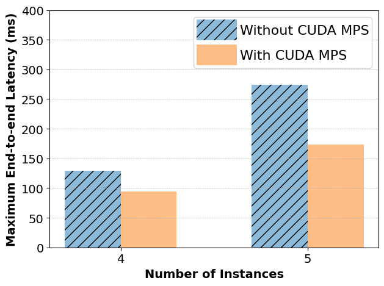
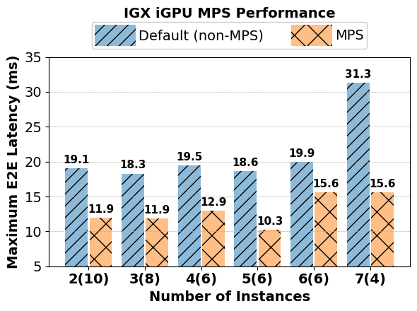
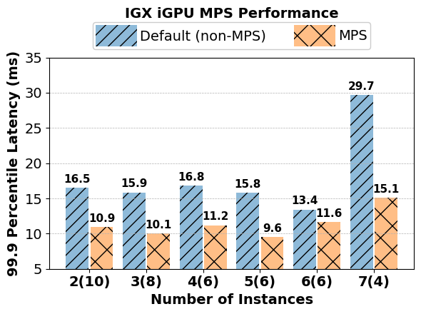
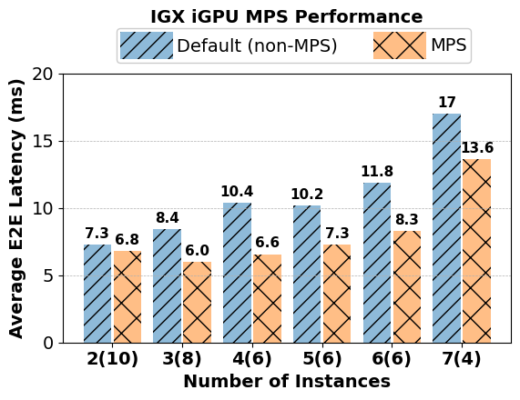

# CUDA MPS Tutorial for Holoscan Applications

CUDA MPS is NVIDIA's [Multi-Process Service](https://docs.nvidia.com/deploy/mps/index.html) for CUDA
applications. It allows multiple CUDA applications to share a single GPU, which can be useful for
running more than one Holoscan application on a single machine featuring one or more GPUs. This
tutorial describes the steps to enable CUDA MPS and demonstrate few performance benefits of using it.

## Table of Contents

1. [Steps to enable CUDA MPS](#steps-to-enable-cuda-mps)
2. [Customization](#customization)
3. [x86 System Performance](#performance-benefits-on-x86-system)
4. [IGX Orin](#igx-orin)
    1. [Model Benchmarking Application Setup](#model-benchmarking-application-setup)
    1. [Performance Benchmark Setup](#performance-benchmark-setup)
    1. [Performance Benefits on IGX Orin w/ Discrete GPU](#performance-benefits-on-igx-orin-w-discrete-gpu)
        1. [Varying Number of Instances](#varying-number-of-instances)
        1. [Varying Number of Parallel Inferences](#varying-number-of-parallel-inferences)
    1. [ IGX Orin w/ iGPU](#igx-orin-w-integrated-gpu)
        1. [MPS Setup on IGX-iGPU](#mps-setup-on-igx-igpu)
        1. [Performance Benefits on IGX Orin w/ Integrated GPU](#performance-benefits-on-igx-orin-w-integrated-gpu)

## Steps to enable CUDA MPS

Before enabling CUDA MPS, please [check](https://docs.nvidia.com/deploy/mps/index.html#topic_3_3)
whether your system supports CUDA MPS.

CUDA MPS can be enabled by running the `nvidia-cuda-mps-control -d` command and stopped by running 
`echo quit | nvidia-cuda-mps-control` command. More control commands are described 
[here](https://docs.nvidia.com/deploy/mps/index.html#topic_5_1). 

CUDA MPS does not require any changes to
an existing Holoscan application; even an already compiled application binary works as it is.
Therefore, a Holoscan application can work with CUDA MPS without any 
changes to its source code or binary.
However, a machine learning model like a TRT engine file may need to be recompiled 
for the first time after enabling CUDA MPS.

We have included a helper script in this tutorial `start_mps_daemon.sh` to enable 
CUDA MPS with necessary environment variables.

```bash
./start_mps_daemon.sh
```

## Customization

CUDA MPS provides many options to customize resource allocation for MPS clients. For example, it has
an option to limit the maximum number of GPU threads that can 
be used by every MPS client. 
The `CUDA_MPS_ACTIVE_THREAD_PERCENTAGE` environment variable can be used to control this limit
system-wide. This limit can also be configured by communicating the active thread percentage to the control daemon with  
`echo "set_default_active_thread_percentage <Thread Percentage>" | nvidia-cuda-mps-control`.
Our `start_mps_daemon.sh` script takes this percentage as the first argument as well.

```bash
./start_mps_daemon.sh <Active Thread Percentage>
```

For different applications, one may want to set different limits on the number of GPU threads
available to each of them. This can be done by setting the `CUDA_MPS_ACTIVE_THREAD_PERCENTAGE`
environment variable separately for each application. It is elaborated in details [here](https://docs.nvidia.com/deploy/mps/index.html#topic_5_2_5).

There are other customizations available in CUDA MPS as well. Please refer to the CUDA MPS
[documentation](https://docs.nvidia.com/deploy/mps/index.html#topic_5_1_1) to know more about them.
Please note that concurrently running Holoscan applications may increase the GPU device memory
footprint. Therefore, one needs to be careful about hitting the GPU memory size and [potential
delay due to page faults](https://developer.nvidia.com/blog/improving-gpu-memory-oversubscription-performance/).

CUDA MPS improves the performance for concurrently running Holoscan applications. 
Since multiple applications can simultaneously execute more than one CUDA compute tasks with CUDA
MPS, it can also improve the overall GPU utilization.

## Performance Benefits on x86 System 

> **Note:** Endoscopy Tool Tracking does not work with CUDA MPS after [holohub/Holoscan-SDK-v2.6.0](https://github.com/nvidia-holoscan/holohub/tree/holoscan-sdk-2.6.0) due to the
> unavailability of CUDA dynamic parallelism implemented in this
> [PR](https://github.com/nvidia-holoscan/holohub/pull/550) in CUDA MPS. In case endoscopy tool tracking needs
> to be tested with CUDA MPS, please use the [`holoscan-sdk-v2.6.0`](https://github.com/nvidia-holoscan/holohub/tree/holoscan-sdk-2.6.0) tag or earlier.

Suppose, we want to run the endoscopy tool tracking and ultrasound segmentation applications
concurrently on an x86 workstation with RTX A6000 GPU. The below table shows the maximum end-to-end latency performance
without and with CUDA MPS, where the active thread percentage is set to 40\% for each application.
It demonstrates 18% and 50% improvement in the maximum end-to-end latency for the
endoscopy tool tracking and ultrasound segmentation applications, respectively.

| Application | Without MPS (ms) | With MPS (ms) |
| ----------- | ---------------- | ------------- |
| Endoscopy Tool Tracking | 115.38 | 94.20 |
| Ultrasound Segmentation | 121.48 | 60.94 |

In another set of experiments, we concurrently run multiple instances of the endoscopy tool tracking
application in different processes. We set the active thread percentage to be 20\% for each MPS client. The below graph shows the maximum end-to-end latency with and
without CUDA MPS. The experiment demonstrates up to 36% improvement with CUDA MPS.



Such experiments can easily be conducted with [Holoscan Flow Benchmarking](../../benchmarks/holoscan_flow_benchmarking) to retrieve
various end-to-end latency performance metrics.

## IGX Orin

CUDA MPS is available on IGX Orin since CUDA 12.5. Please check you CUDA version and upgrade to CUDA 12.5+ to test CUDA MPS. We evaluate the benefits of MPS on IGX Orin with discrete and integrated GPUs. Please follow the steps outlined in [Steps to enable CUDA MPS](https://github.com/nvidia-holoscan/holohub/tree/main/tutorials/cuda_mps#steps-to-enable-cuda-mps) to start running the MPS server on IGX Orin. 

We use the [model benchmarking](https://github.com/nvidia-holoscan/holohub/tree/main/benchmarks/model_benchmarking) application to demonstrate the benefits of CUDA MPS. In general, MPS improves performance by enabling multiple concurrent processes to share a CUDA context and scheduling resources. We show the benefits of using CUDA MPS along two dimensions: (a) increasing the workload per application instance (varying the number of parallel inferences for the same model) and (b) increasing the total number of instances. 

### Model Benchmarking Application Setup

Please follow the steps outlined in [model benchmarking](https://github.com/nvidia-holoscan/holohub/tree/main/benchmarks/model_benchmarking) to ensure that the application builds and runs properly. 
> Note that you need to run the video using [v4l2loopback](https://github.com/nvidia-holoscan/holoscan-sdk/tree/main/examples/v4l2_camera#use-with-v4l2-loopback-devices) in a separate terminal _while_ running the model benchmarking application.

> Make sure to change the device path in the `model_benchmarking/python/model_benchmarking.yaml` file to match the values you provided in the `modprobe` command when following the [v4l2loopback](https://github.com/nvidia-holoscan/holoscan-sdk/tree/main/examples/v4l2_camera#use-with-v4l2-loopback-devices) instructions.

### Performance Benchmark Setup 

To gather performance metrics for the model benchmarking application, follow the steps outlined in [Holoscan Flow Benchmarking](../../benchmarks/holoscan_flow_benchmarking). 
> If you are running within a container, please complete Step-3 before launching the container

We use the following steps:

**1. Patch Application:**

```bash
./benchmarks/holoscan_flow_benchmarking/patch_application.sh model_benchmarking
```

**2. Build Application for Benchmarking:**

```bash
./holohub build --local model_benchmarking --language=python --configure-args="-DCMAKE_CXX_FLAGS=-I$PWD/benchmarks/holoscan_flow_benchmarking"
```

**3. Set Up V4l2Loopback Devices:**

i. Install `v4l2loopback` and `v4l2loopback`:

```bash
sudo apt-get install v4l2loopback-dkms ffmpeg
```

ii. Determine the number of instances you would like to benchmark and set that as the value of `devices`. Then, load the `v4l2loopback` kernel module on virtual devices `/dev/video[*]`. This enables each instance to get its input from a separate virtual device.

**Example:** For 3 instances, the `v4l2loopback` kernel module can be loaded on `/dev/video1`, `/dev/video2` and `/dev/video3`:

```bash
sudo modprobe v4l2loopback devices=3 video_nr=1 max_buffers=4
```

Now open 3 separate terminals.

In terminal-1, run:
```bash
ffmpeg -stream_loop -1 -re -i /data/ultrasound_segmentation/ultrasound_256x256.avi -pix_fmt yuyv422 -f v4l2 /dev/video1
```

In terminal-2, run:
```bash
ffmpeg -stream_loop -1 -re -i /data/ultrasound_segmentation/ultrasound_256x256.avi -pix_fmt yuyv422 -f v4l2 /dev/video2
```

In terminal-3, run:
```bash
ffmpeg -stream_loop -1 -re -i /data/ultrasound_segmentation/ultrasound_256x256.avi -pix_fmt yuyv422 -f v4l2 /dev/video3
```

**4. Benchmark Application:**

```bash
python benchmarks/holoscan_flow_benchmarking/benchmark.py --run-command="python applications/model_benchmarking/python/model_benchmarking.py -l <number of parallel inferences> -i"  --language python -i <number of instances> -r <number of runs> -m <number of messages> --sched greedy -d <outputs folder> -u
```

The command executes `<number of runs>` runs of `<number of instances>` instances of the model benchmarking application with `<number of messages>` messages. Each instance runs `<number of parallel inferences>` parallel model benchmarking inferences with no post-processing and visualization (`-i`).

Please refer to [Model benchmarking options](https://github.com/nvidia-holoscan/holohub/tree/main/benchmarks/model_benchmarking#capabilities) and [Holoscan flow benchmarking options](https://github.com/nvidia-holoscan/holohub/tree/main/benchmarks/model_benchmarking#capabilities) for more information on the various command options.

**Example**: After Step-3, to benchmark 3 instances for 10 runs with 1000 messages, run:

```bash

python benchmarks/holoscan_flow_benchmarking/benchmark.py --run-command="python applications/model_benchmarking/python/model_benchmarking.py -l 7 -i"  --language python -i 3 -r 10 -m 1000 --sched greedy -d myoutputs -u`
```


### Performance Benefits on IGX Orin w/ Discrete GPU

We look at the performance benefits of MPS by varying the number of instances and number of inferences. We use the RTX A6000 GPU for our experiments. From our experiments, we observe that enabling MPS results in upto 12% improvement in maximum latency compared to the default setting.

#### Varying Number of Instances

We fix the number of parallel inferences to 7, number of runs to 10 and number of messages to 1000 and vary the number of instances from 3 to 7 using the `-i` parameter. Please refer to [Performance Benchmark Setup](#performance-benchmark-setup) for benchmarking commands.

The graph below shows the maximum end-to-end latency of model benchmarking application with and without CUDA MPS, where the active thread percentage was set to `80/(number of instances)`. For example, for 5 instances, we set the active thread percentage to `80/5 = 16`. By provisioning resources this way, we leave some resources idle in case a client should require to use it. Please refer to [CUDA MPS Resource Provisioning](https://docs.nvidia.com/deploy/mps/#volta-mps-execution-resource-provisioning) for more details regarding this.

The graph is missing a bar for the case of 7 instances and 7 parallel inferences as we were unable to get the baseline to execute. However, we were able to run when MPS was enabled, highlighting the advantage of using MPS for large workloads. We see that the maximum end-to-end latency improves when MPS is enabled and the improvement is more pronounced as the number of instances increases. This is because, as the number of concurrent processes increases, MPS confines CUDA workloads to a certain predefined set of SMs. MPS combines multiple CUDA contexts from multiple processes into one, while simultaneously running them together.
It reduces the number of context switches and related inferences, resulting in improved GPU utilization.


| Maximum end-to-end Latency |
| :-------------------------:|
.png)

We also notice minor improvements in the 99.9<sup>th</sup> percentile latency and similar improvements in the 99<sup>th</sup> percentile latency.

| 99.9<sup>th</sup> Percentile Latency|   99<sup>th</sup> Percentile Latency |
| :-------------------------:|:-------------------------: |
.png)  |   .png) |


#### Varying Number of Parallel Inferences

We vary the number of parallel inferences to show that MPS may not be beneficial if the workload is insufficient to offset the overhead of running the MPS server. The graph below shows the result of increasing the number of parallel inferences from 3 to 7 while the number of instances is constant. 

As the number of parallel inferences increases, so does the workload, and the benefit of MPS is more evident. However, when the workload is low, CUDA MPS may not be beneficial. 

| Maximum Latency for 5 Instances |
| :-------------------------:|
.png)|

###  IGX Orin w/ Integrated GPU
#### MPS Setup on IGX-iGPU
> Note that we run all commands as root

**1. Please add cuda-12.5+ to `$PATH` and `$LD_LIBRARY_PATH`**

> If you have multiple CUDA installations, check it at `/usr/local/` directory.

```bash
echo $PATH
/usr/local/cuda-12.6/compat:/usr/local/cuda-12.6/bin:/usr/local/sbin:/usr/local/bin:/usr/sbin:/usr/bin:/sbin:/bin:/snap/bin

echo $LD_LIBRARY_PATH
/usr/local/cuda-12.6/compat/lib:/usr/local/cuda-12.6/compat:/usr/local/cuda-12.6/lib64:
```

**2. Be sure to pass `-v /tmp/nvidia-mps:/tmp/nvidia-mps  -v /tmp/nvidia-log:/tmp/nvidia-log -v
/usr/local/cuda-12.6:/usr/local/cuda-12.6 ` to `./holohub run` command to ensure that the container is
connected to the MPS control and server**

Example:
```bash
./holohub run --img holohub:v2.1 --docker-opts="-v /tmp/nvidia-mps:/tmp/nvidia-mps  -v /tmp/nvidia-log:/tmp/nvidia-log -v /usr/local/cuda-12.6:/usr/local/cuda-12.6"
```

**3. Inside the container, be sure to set the following environment variables:**
```bash
export CUDA_VISIBLE_DEVICES=0
export CUDA_MPS_PIPE_DIRECTORY=/tmp/nvidia-mps
export CUDA_MPS_LOG_DIRECTORY=/tmp/nvidia-log

export PATH=/usr/local/cuda-12.6/bin:$PATH
export PATH=/usr/local/cuda-12.6/compat:$PATH
export LD_LIBRARY_PATH=/usr/local/cuda-12.6/lib64:$LD_LIBRARY_PATH
export LD_LIBRARY_PATH=/usr/local/cuda-12.6/compat:$LD_LIBRARY_PATH
export LD_LIBRARY_PATH=/usr/local/cuda-12.6/compat/lib:$LD_LIBRARY_PATH
export LD_LIBRARY_PATH=/usr/lib/aarch64-linux-gnu/nvidia:$LD_LIBRARY_PATH
```
Our `$PATH` and `$LD_LIBRARY_PATH` values inside the container are:
```bash
echo $PATH
/usr/local/cuda-12.6/bin:/opt/tensorrt/bin:/usr/local/mpi/bin:/usr/local/nvidia/bin:/usr/local/cuda/bin:/usr/local/sbin:/usr/local/bin:/usr/sbin:/usr/bin:/sbin:/bin:/usr/local/ucx/bin:/opt/nvidia/holoscan/bin

echo $LD_LIBRARY_PATH
/usr/local/cuda-12.6/compat/lib:/usr/local/cuda-12.6/compat:/usr/local/cuda-12.6/lib64:/usr/local/cuda/compat/lib.real:/usr/local/cuda/compat/lib:/usr/local/nvidia/lib:/usr/local/nvidia/lib64:/opt/nvidia/holoscan/lib
```

**4. Start MPS server and control**
```bash
sudo -i
export CUDA_MPS_ACTIVE_THREAD_PERCENTAGE=20
nvidia-cuda-mps-control -d
```

**5. After steps 1-4, follow the [benchmark insructions](#performance-benchmark-setup) to benchmark the application**

#### Performance Benefits on IGX Orin w/ Integrated GPU

We look at the performance benefits of MPS by varying the number of application instances. We run
the model benchmarking application in a mode where the inputs are always available and being read
from the disk with the video replayer operator. For every instance of the application, we run 1
inference (`-l 1`) as iGPU is a smaller GPU. In this experiment, we also oversubscribe the GPU to
provide the instances more opportunity to utilize the available SMs (IGX Orin iGPU has 16 SMs).

From our experiments, we observe that enabling MPS results in 22-50%, 13-49% and 6-37% improvement
in maximum latency, 99.9 percentile latency and average latency, respectively. The graphs below
capture the result. In the X-axis, number of instances is show to increase from 2 to 7, and the
number in the parenthesis shows the number of SMs per instance enabled by `CUDA_ACTIVE_THREAD_PERCENTAGE`.

| Maximum end-to-end Latency |
| :-------------------------:|



| 99.9 Percentile Latency|   Average Latency |
| :-------------------------:|:-------------------------: |
  |    |

We use different number of SMs for different instances to ensure the total number of SMs requested
by all the instances exceed the number of available SMs.
