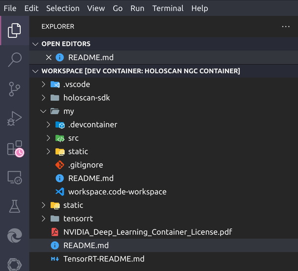
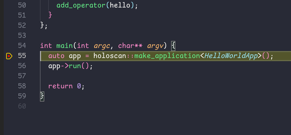
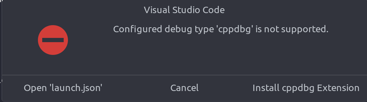

# Holoscan SDK Visual Studio Code Dev Container Template

## Overview

A [Dev Container](https://containers.dev/) (short for Development Container) is a lightweight, isolated environment for developing software. It's a self-contained directory that contains all the dependencies and tools needed to develop a software project without polluting the host machine or interfering with other projects.

This directory contains a pre-configured Dev Container designed for [Holoscan SDK](https://developer.nvidia.com/holoscan-sdk) using the [Holoscan NGC Container](https://catalog.ngc.nvidia.com/orgs/nvidia/teams/clara-holoscan/containers/holoscan) with [Visual Studio Code](https://code.visualstudio.com/). This Dev Container comes with the complete Holoscan SDK and source code, sample applications, and all the tools needed to build your next application using Holoscan SDK.

Follow this step-by-step guide to get started!

## Prerequisites

- [Docker](https://www.docker.com/)
- [VS Code](https://code.visualstudio.com/) with the [Dev Container Extension Pack](https://marketplace.visualstudio.com/items?itemName=ms-vscode-remote.remote-containers)
  - Install [Dev Container Extension Pack](https://marketplace.visualstudio.com/items?itemName=ms-vscode-remote.remote-containers) via command line
    ```bash
    code --install-extension ms-vscode-remote.remote-containers
    ```
- [NVIDIA Container Toolkit](https://docs.nvidia.com/datacenter/cloud-native/container-toolkit/latest/install-guide.html)
- [NVIDIA CUDA Toolkit](https://developer.nvidia.com/cuda-downloads)
- [Holoscan SDK container 2.3 or later](https://catalog.ngc.nvidia.com/orgs/nvidia/teams/clara-holoscan/containers/holoscan)

## Dev Container Setup

1. Download everything in this directory to a folder of your choice. This folder can also be used to store your project(s) later. See [Directory Structure](#directory-structure).
2. Open [.devcontainer/devcontainer.json](.devcontainer/devcontainer.json#L10), find and change the value of `HOLOSCAN_SDK_IMAGE` to a version of [Holoscan SDK container](https://catalog.ngc.nvidia.com/orgs/nvidia/teams/clara-holoscan/containers/holoscan) image you want to use.
  💡  **Important**: Holoscan SDK container v2.3 or later is required to step into Holoscan SDK source code in debug mode.
3. Start VS Code, open the *Command Palette* by pressing `F1`, `Ctrl+Shift+P`, or navigating to `View > Command Palette`, type to select `Dev Containers: Open Folder in Container...` and select the folder where you stored step 1.
4. Wait for the Dev Container to start up. Building the container and installing all the required extensions will take a while. (Switch to the `Output` view and select the `Server` option from the dropdown to check the status of extension installations.)

When everything is ready, you should see the following in the VS Code Explorer sidebar.



The `My Workspace` section contains all the files that you've copied. The `Holoscan SDK` section includes the Holoscan example applications from `~/examples`.

### Directory Structure

```bash
/workspace
   ├── .vscode/            # Visual Studio Code debugging configuration files
   ├── holoscan-sdk/       # Holoscan SDK source code
   └── my/                 # Your workspace directory - this is the directory created and mounted from step 1 above.
       ├── .devcontainer/  # Dev Container configurations
       ├── src/            # A folder set up to store your project(s)
       └── README.md       # This file
```

> 💡 Note: The Dev Container is configured with a default user account `holoscan` using user ID `1000` and group ID `1000` in the [devcontainer.json](./.devcontainer/devcontainer.json) file. <br />
>  - To change the user name, find and replace `USERNAME` and `remoteUser`.<br />
>  - To change the user ID, find and replace `USER_UID` and `userUid`.<br />
>  - To change the group ID, find and replace `USER_GID` and `userGid`.<br />

## Debugging Applications

### Debugging a C++ Application

> 💡 Tip: Open this `README.md` file in the Dev Container will help you navigate to the linked files faster.
     This file can be found inside the Dev Container under `/workspace/my/README.md`.

This section will walk you through the steps to debug the [Hello World](https://github.com/nvidia-holoscan/holoscan-sdk/blob/main/examples/hello_world/README.md) application using VS Code.

Open the [hello_world.cpp](../../../../holoscan-sdk/examples/hello_world/cpp/hello_world.cpp#L55) file in VS Code. (If the link doesn't work, click on **Explorer** from the sidebar and expand the **holoscan-sdk** folder. Find and open `hello_world.cpp` under the `examples/hello_world/cpp` directory.
Let's put a breakpoint on this line: `auto app = holoscan::make_application<HelloWorldApp>();` (Feel free to put more breakpoints wherever you want).

Now, let's switch to the **Run and Debug** panel on the sidebar, and then click on the dropdown box to the right of the **Start** button.

Select `(gdb) examples/hello_world/cpp` from the list of available launch configurations.

Hit **F5** on the keyboard or click the green arrow to start debugging. VS Code shall hit the breakpoint and stop as the screenshot shows below:


> 💡 *Tip*: **What happens when you hit F5?** VS Code looks up the launch profile for `(gdb) examples/hello_world/cpp` in the [.vscode/launch.json](/.vscode/launch.json) file and starts the debugger with the appropriate configurations and arguments.


### Debugging a Python Application

There are a few options when debugging a Python application. In the [.vscode/launch.json](/.vscode/launch.json) file, you may find the following options to debug the Hello World application:

* **Python: Debug Current File**: with this option selected, open [hello_world.py](../../../../holoscan-sdk/examples/hello_world/python/hello_world.py) file and hit F5. It shall stop at any breakpoints selected.
* **Python C++ Debug**: similar to the previous option, this launch profile allows you to debug both the Python and C++ code.
  Open [holoscan-sdk/src/core/application.cpp](../../../../holoscan-sdk/src/core/application.cpp#L209) and find the `Application::run()` function. Let's put a breakpoint inside this function. Navigate back to the [hello_world.py](../../../../holoscan-sdk/examples/hello_world/python/hello_world.py) file and hit F5. When the debug session starts, it stops at the top of the main application file and brings up a prompt in the terminal asking for superuser access.

  ```bash
  Superuser access is required to attach to a process. Attaching as superuser can potentially harm your computer. Do you want to continue? [y/N]
  ```

  You may answer `Y` or `y` to continue the debug session. The debugger shall now stop at the breakpoint you've set in the `application.cpp` file.

* **(gdb) examples/hello_world/python**: this third launch profile option allows you to debug the C++ code only.  Put a breakpoint in the `Application::run()` function inside the [holoscan-sdk/src/core/application.cpp](../../../../holoscan-sdk/src/core/application.cpp#L209) file.

> 💡 *Tip*: you must open a Python file and make sure the file tab is active to debug when using the first two launch profiles.*


## Troubleshooting

### Cannot Start Debugger



* Configured debug type 'cppdbg' is not supported.
* Configured debug type 'debugpy' is not supported.
* Configured debug type 'pythoncpp' is not supported.
* Configured debug type 'python' is not supported.

If you encounter the above errors, please ensure all the required extensions are installed in VS Code. It may take a while to install them for the first time.

### Cannot Set Breakpoints

If you cannot set breakpoints, please ensure all the required extensions are installed in VS Code. It may take a while to install them for the first time.
