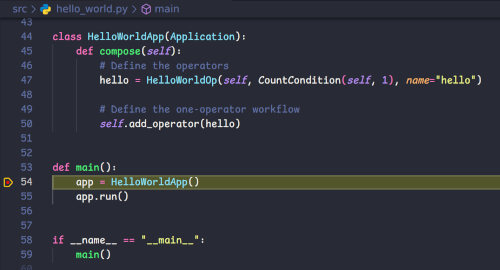

# Develop and Debugging Holoscan Application Natively

This tutorial will guide you through the steps to set up your development environment for building and debugging your applications using Holoscan SDK natively with VS Code.

Whether you are a C++ or Python developer, you can use the tutorial as a reference to set up your development environment and debug your Holoscan application.

> 💡 Note: This guide is specific to the Linux development environment and is tested on Ubuntu 22.04 LTS.

## Prerequisites

- [Holoscan SDK Prerequisites](https://docs.nvidia.com/holoscan/sdk-user-guide/sdk_installation.html#prerequisites)
- [Visual Studio Code](https://code.visualstudio.com/)
- [Holohub](https://github.com/nvidia-holoscan/holohub/)
  ```bash
  # clone the Holohub repository
  git clone https://github.com/nvidia-holoscan/holohub.git
  ```

### C++ Prerequisites

To build and debug your C++ applications natively, we must first install the redistribution of the Holoscan SDK. To install Holoscan SDK using a Debian package, refer to the Debian package installation section in the [Holoscan SDK documentation](https://docs.nvidia.com/holoscan/sdk-user-guide/sdk_installation.html#instructions).

- [CMake Tools](https://marketplace.visualstudio.com/items?itemName=ms-vscode.cmake-tools) extension for VS Code
- [CMake](https://cmake.org/cmake/help/latest/command/install.html) 3.24.0 or higher
- Ninja 1.10 or higher
  ```bash
  sudo apt update && sudo apt install ninja-build
  ```
- gcc 11.4 or higher
  ```bash
  sudo apt update && sudo apt install build-essential
  ```

### Python Prerequisites

- [Python C++ Debugger](https://marketplace.visualstudio.com/items?itemName=benjamin-simmonds.pythoncpp-debug) extension for VS Code
- [Python 3.10](https://www.python.org/) or higher
- [Holoscan SDK PyPI Wheel](https://pypi.org/project/holoscan/)
  ```bash
  pip install holoscan
  ```
- (Optional) Python virtual environment of your choice

## Environment Setup

In this section, we walk through setting up a development environment using VS Code with some templates that we have included in this directory. A Hello World Holoscan application in C++ and Python is also included in the `cpp/` and the `python/`, respectively.

### C++

The C++ example in this tutorial is pre-configured using the [CMake Tools](https://marketplace.visualstudio.com/items?itemName=ms-vscode.cmake-tools) extension in VS Code with a [CMake Preset](https://cmake.org/cmake/help/latest/manual/cmake-presets.7.html) file ([CMakePresets.json](cpp/CMakePresets.json)). Once installed, VS Code should include all the CMake options in the status bar, as shown below.

<figure>
 
 <figcaption>Figure 1: VS Code status bar with CMake options.</figcaption>
</figure>


Let's start a new instance of VS Code; run the following command from the root directory of the Holohub repository:

```bash
code tutorials/debugging/vscode-native/cpp
```

A new instance of VS Code shall open and display the following files in the **Explorer** tab.

<figure>
 
 <figcaption>Figure 2: VS Code Explorer showing files in the C++ Hello World sample application.</figcaption>
</figure>

#### Debugging

The first time VS Code opens this directory, it may do one of the following actions depending on the version of VS Code and the CMake Tools extension installed:

1. Prompt you to select a preset, **Debug** or **Release**. Select **Debug** to continue. This action configures CMake which creates a `build/` directory. Or,
2. Automatically configures CMake with the **Debug** configure preset and creates a `build/` directory for you.

If neither of these actions were performed, open the **Command Palette** from the **View** menu, or `Ctrl+Shift+P`. Select **CMake: Select Configure Preset** from the list of options and then select **Debug**. This configures CMake to build the Hello World sample application in debug mode using _g++_ as the compiler and _ninja_ as the build tool.

Next, open the **Command Palette** again, and select **CMake: Build** and then select **build** from **Select a build task** dropdown.
This action builds the Hello World binary and stores the artifact in `build/debug/src/hello_world`.

Let's debug the Hello World application, open the [hello_world.cpp](cpp/src/hello_world.cpp#L55) file in VS Code, and set a breakpoint in the `main()` function. Switch to the **Run and Debug** tab in VS Code. Select **(gdb) Launch Hello World** from the dropdown and click **Start Debugging** icon (play button ▶️) to start debugging. VS Code should stop at the breakpoint:

<figure>
 
 <figcaption>Figure 3: VS Code hitting the breakpoint set in the C++ Hello World sample application.</figcaption>
</figure>

##### Step into Holoscan Source Code

To step into Holoscan SDK source code, we need to clone the Holoscan SDK and create a debug build of the Holoscan SDK. First, complete the steps described in the [Building Holoscan SDK](#building-holoscan-sdk) section and then follow these steps to configure your debugging environment:

1. The Holoscan SDK build process creates an `install-[arch]/` directory upon completion. Open the [CMakePresets.json](cpp/CMakePresets.json#L19) and update the `HOLOSCAN_INSTALL_DIR` variable with the `install-[arch]` path. For example:

   ```json
   "cacheVariables": {
      ...
      "HOLOSCAN_INSTALL_DIR": "/home/user/holoscan-sdk/install-x86_64"
   }
   ```

   > 💡 Tip: Step 3 of the [Building Holoscan SDK](#building-holoscan-sdk) section describes how to find the Holoscan SDK installation path.

2. Open [launch.json](cpp/.vscode/launch.json#L22) and update the source map path **value** with the path to the `src/` directory of Holoscan SDK. For example:

   ```json
   "sourceFileMap": {
        "/workspace/holoscan-sdk/src/": "/home/user/holoscan-sdk/src"
    },
   ```

   > 💡 Tip: Change `/home/user/holoscan-sdk` to the path where you cloned the Holoscan SDK repository.

3. Clean up the existing build directory by opening the **Command Palette** and select **CMake: Clean Rebuild** and select **build**.

4. Add Holoscan SDK source code to the workspace: Select **Add Folder to Workspace...** from the **File** menu. Find and select the directory where Holoscan SDK repository resides. 
   The **Explorer** should now look like this:
   <figure>
   
   <figcaption>Figure 4: VS Code workspace with Holoscan SDK.</figcaption>
   </figure>

5. Open `src/core/application.cpp` from the `holoscan-sdk` folder. Find `void Application::run()` and set a breakpoint inside the function.

6. Switch to the **Run and Debug** tab in VS Code. Select **(gdb) Launch Hello World** from the dropdown and click **Start Debugging** icon (play button ▶️) to start debugging. This time, VS Code should stop in the `main()` of Hello World and inside `void Application::run()`.

#### Testing

The C++ Hello World sample application includes a test case in the [CMakeLists.txt](./cpp/src/CMakeLists.txt#L31) file. To run this test case, ensure the **Test Preset** is set to `[Test All]` and then click the **Run CTest** button on the status bar. This action should run the test case and output the following:

```bash
[main] Building folder: /.../holohub/tutorials/debugging/vscode-native/cpp/build/debug
[build] Starting build
[proc] Executing command: /usr/local/bin/cmake --build /.../holohub/tutorials/debugging/vscode-native/cpp/build/debug --config Debug --target hello_world --
[build] ninja: no work to do.
[driver] Build completed: 00:00:00.027
[build] Build finished with exit code 0
[proc] Executing command: /usr/local/bin/ctest -T test --output-on-failure --output-on-failure --stop-on-failure -R ^EXAMPLE_CPP_HELLO_WORLD_TEST$
[ctest]    Site: holoscan-dev
[ctest]    Build name: Linux-g++
[ctest] Test project /.../holohub/tutorials/debugging/vscode-native/cpp/build/debug
[ctest]     Start 1: EXAMPLE_CPP_HELLO_WORLD_TEST
[ctest] 1/1 Test #1: EXAMPLE_CPP_HELLO_WORLD_TEST .....   Passed    0.03 sec
[ctest]
[ctest] 100% tests passed, 0 tests failed out of 1
[ctest]
[ctest] Total Test time (real) =   0.03 sec
[ctest] CTest finished with return code 0
```

### Python

The Python example resides in `tutorials/debugging/vscode-native/python`. Open it with VS Code with the following command:

```bash
code tutorials/debugging/vscode-native/python
```

Inside VS Code, open the integrated terminal (select **Terminal** from the **View** menu) to set up a virtual environment and install the dependencies:

```bash
# Configure a Python virtual environment if desired, e.g.,
python3 -m venv .venv

# Install dependencies
pip install -r ./requirements.txt
```

> 💡Tip: Install the Holoscan SDK PyPI package in your favorite Python virtual environment or select the **Python: Create Environment** command from the **Command Palette** to create a new virtual environment.

#### Debugging

Open the [hello_world.py](python/src/hello_world.py#L54) file and set a breakpoint in the `main()` function.

A launch profile, **Python Debugger**, is configured in the [launch.json](python/.vscode/launch.json). Switch to the **Run and Debug** tab to select the launch profile from the list, then click the **Start Debugging** icon (play button ▶️) to run the application. VS Code should stop at your breakpoint:

<figure>
 
 <figcaption>Figure 5: VS Code hitting the breakpoint set in the Python Hello World sample application.</figcaption>
</figure>

##### Step into Holoscan Source Code

To step into Holoscan SDK source code with a Python application, we need to clone the Holoscan SDK and create a debug build of the Holoscan SDK. Complete the steps described in the [Building Holoscan SDK](#building-holoscan-sdk) section and then follow these steps to configure your debugging environment:

1. Open [launch.json](python/.vscode/launch.json#L22) and update `PYTHONPATH` and `LD_LIBRARY_PATH` environment variables with the path to the Holoscan SDK that we built in the previous step. For example:

   ```json
   "env": {
        "PYTHONPATH": "/home/user/holoscan-sdk/install-x86-64/python/lib",
        "LD_LIBRARY_PATH": "/home/user/holoscan-sdk/install-x86_64/lib"
    },
   ```
   > 💡 Tip: Step 3 of the [Building Holoscan SDK](#building-holoscan-sdk) section describes how to find the Holoscan SDK installation path.

2. Unlike the C++ debugger, VS Code does not support setting a `sourcemap`; therefore, we have to make a symbolic link to the `holoscan-sdk` directory that we just cloned:
   ```bash
   sudo mkdir /workspace
   sudo ln -s /home/user/holoscan-sdk /workspace/holoscan-sdk
   ```
   > 💡 Tip: Change `/home/user/holoscan-sdk` to the path where you cloned the Holoscan SDK repository.

3. Add Holoscan SDK source code to the workspace: Select **Add Folder to Workspace...** from the **File** menu. Find and select the directory where Holoscan SDK repository resides. 
   The **Explorer** should now look like this:
   <figure>
   
   <figcaption>Figure 6: VS Code workspace with Holoscan SDK.</figcaption>
   </figure>

4. Open `src/core/application.cpp` from the `holoscan-sdk` folder. Find `void Application::run()` and set a breakpoint inside the function.

5. Switch to the **Run and Debug** tab in VS Code. Select **Python C++ Debugger** from the dropdown and click the **Start Debugging** icon (play button ▶️) to start debugging. This time, VS Code should stop in the `main()` function of the Hello World application and the `void Application::run()` function from Holoscan SDK.

   > 💡 Tip: When the debug session starts, it stops at the top of the main application file and brings up a prompt in the terminal asking for superuser access.
   > ```bash
   > Superuser access is required to attach to a process. Attaching as superuser can potentially harm your computer. Do you want to continue? [y/N]
   > ```
   > You may answer `Y` or `y` to continue the debug session. The debugger shall now stop at the breakpoint you've set in the `application.cpp` file.

#### Testing

The Python Hello World sample application includes a test case in the [tests/](python/tests/) directory. To run the test case, ensure you have all the requirements installed from the previous [step](#python), and then run the following command:

```bash
$ pytest -v

========================================================================================== test session starts ==========================================================================================
platform linux -- Python 3.10.12, pytest-8.3.2, pluggy-1.5.0 -- /home/user/holohub/tutorials/debugging/vscode-native/python/.venv/bin/python
cachedir: .pytest_cache
rootdir: /home/user/holohub/tutorials/debugging/vscode-native/python
configfile: pytest.ini
collected 1 item

test_hello_world.py::test_hello_world PASSED [100%]

=========================================================================================== 1 passed in 0.03s ===========================================================================================

```

## Building Holoscan SDK

If you plan to step into the Holoscan SDK source code when debugging your application, you must build the Holoscan SDK from the source. To do this, follow these steps:

1. Clone Holoscan SDK:

   ```bash
   git clone --depth 1 --branch <tag> https://github.com/nvidia-holoscan/holoscan-sdk.git

   # For eaxmple, to clone and checkout Holoscan version 2.2.0
   git clone --depth 1 --branch v2.2.0 https://github.com/nvidia-holoscan/holoscan-sdk.git
   ```

   > 🔗 Link: [Holoscan SDK tags](https://github.com/nvidia-holoscan/holoscan-sdk/tags)

2. Build the Holoscan SDK in Debug mode:

   ```bash
   cd holoscan-sdk
   ./run build --type debug
   ```

   > 💡 Tip: A comprehensive guide on how to build the Holoscan SDK is also available from the [Holoscan SDK](https://github.com/nvidia-holoscan/holoscan-sdk/blob/v2.2.0/DEVELOP.md#building-the-sdk-from-source) repository.

   > 💡 Tip: To build Holoscan SDK v2.2.0 or earlier, check this [Github issue](https://github.com/nvidia-holoscan/holoscan-sdk/issues/30) for additional steps.

3. Run the following command to find the Holoscan SDK installation path, we will use it later:
   ```bash
   find $PWD -name "install-*" -type d
   # example output
   /home/user/holoscan-sdk/install-x86_64
   ```
