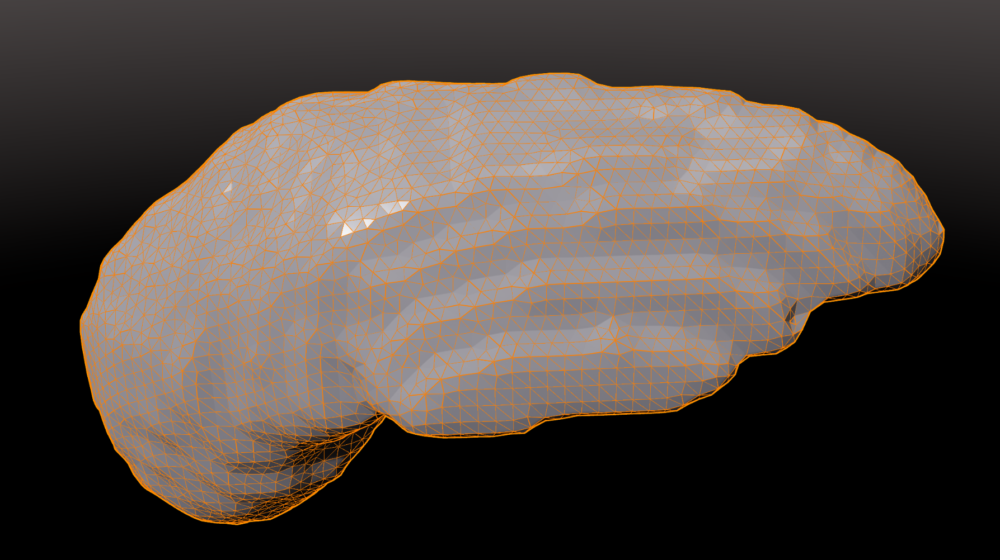

# Processing DICOM to USD with MONAI Deploy and Holoscan



In this tutorial we demonstrate a method leveraging a combined MONAI Deploy and Holoscan pipeline to process DICOM input data and write a resulting mesh to disk in the OpenUSD file format.

## Demonstrated Technologies

### DICOM

The [Digital Imaging and Communications in Medicine (DICOM) standard](https://www.dicomstandard.org/) is a comprehensive standard for medical imaging. DICOM covers a wide variety of medical imaging modalities and defines standards for both image storage and communications in medicine. DICOM data often represent 2D or 3D volumes or series of volumes.

### OpenUSD

[Universal Scene Description (OpenUSD)](https://openusd.org/release/index.html) is an extensible ecosystem of file formats, compositors, renderers, and other plugins for comprehensive 3D scene description.

OpenUSD serves as the backbone of the [NVIDIA Omniverse](https://www.nvidia.com/en-us/omniverse/) cloud computing platform. Omniverse includes a variety of applications such as [USD Composer](https://docs.omniverse.nvidia.com/composer/latest/index.html) for viewing and manipulating OpenUSD scenes, with features such as:
- State-of-the-art cloud rendering
- Live collaborative scene editing
- Multi-user mixed reality

Download the [NVIDIA Omniverse](https://www.nvidia.com/en-us/omniverse/foundation-apps/) launcher to get started with Omniverse. See [NVIDIA OpenUSD Tutorials](https://developer.nvidia.com/usd/tutorials) for getting started with the OpenUSD Python libraries we use in this tutorial.

### [MONAI Deploy](https://project-monai.github.io/deploy.html) + [Holoscan](https://developer.nvidia.com/holoscan-sdk) Pipeline

The MONAI Deploy App SDK provides a series of operators to load and select DICOM instances and then decode the pixel data into in-memory NumPy data objects. MONAI Deploy integrates seamlessly with Holoscan pipelines.

1. The DICOM Loader operator parses a set of DICOM instance files, and loads them into a set of objects representing the logical hierarchical structure of DICOM Study, Series, and Instance. Key DICOM metadata is extracted, while the image pixel data is not loaded in memory or decoded.
2. The DICOM Series Selector selects relevant DICOM Series, e.g, a MR T2 series, using simple configurable selection rules.
3. The Series to Volume converter decodes and combines the pixel data of the instances to a 3D NumPy array with a set of metadata for spacing, orientation, etc.
4. The MONAI Deploy AI Inference Operator accepts the 3D volume and runs AI inference to segment the region of interest, which in this case is pixels representing the spleen.
5. The MONAI STL Conversion Operator converts the output label volume to a mesh in STL format.
6. The Holoscan "Send Mesh to USD" operator writes the mesh to disk in the OpenUSD format.

## Requirements

Please review the [HoloHub README](../../README.md) to get started with HoloHub general requirements before continuing.

### Hardware

This tutorial may run on an `amd64` or `arm64` workstation.
- For `amd64` we rely on `usd-core` Python wheels from PyPI for OpenUSD support.
- For `arm64` we rely on NVIDIA Omniverse Python libraries for OpenUSD support.

### Host Software

This tutorial should run in a `docker` container:

```sh
sudo apt-get update && sudo apt-get install docker
```

## Building the tutorial container

Run the command below from the top-level HoloHub directory to build the tutorial container on the host workstation:

```sh
export NGC_CONTAINER_IMAGE_PATH="nvcr.io/nvidia/clara-holoscan/holoscan:v1.0.3-dgpu"
./holohub build-container --docker-file tutorials/dicom_to_usd_with_monai_and_holoscan/Dockerfile --base-img ${NGC_CONTAINER_IMAGE_PATH} --img holohub:dicom-to-usd
```

## Running the application

Run the commands below on the host workstation to launch the container and run the tutorial. The application will run the MONAI Deploy + Holoscan pipeline for AI segmentation and write results to the `.usd` output file. The mesh will also be available as a `mesh.stl` file on disk.

```sh
./holohub run-container --img holohub:dicom-to-usd # start the container
cd ./tutorials/dicom_to_usd_with_monai_and_holoscan
python tutorial.py --output ./output/spleen-segmentation.usd # run the tutorial
```

Download the [NVIDIA Omniverse](https://www.nvidia.com/en-us/omniverse/) launcher to explore applications such as [USD Composer](https://docs.omniverse.nvidia.com/composer/latest/index.html) for viewing and manipulating the OpenUSD output file.