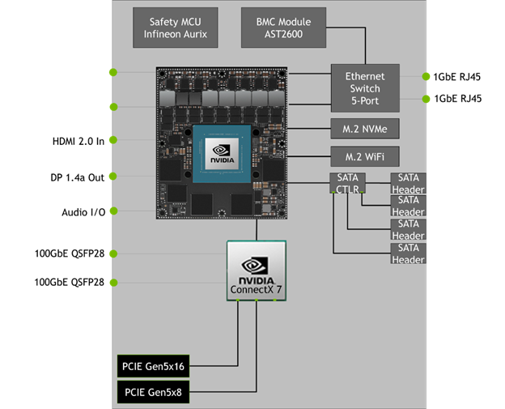
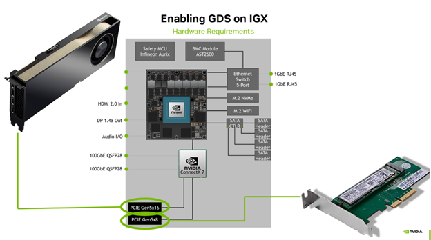
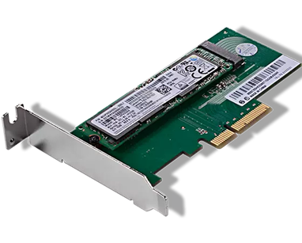

# Taking advantage of GPU Direct Storage on the latest NVIDIA Edge platform
## 	Introduction
Modern-day edge accelerated computing solutions constantly push the boundaries of what is possible. The success of edge computing is mainly due to a new approach to accelerated computing problems, which are viewed from both a GPU and systems perspective. With innovations such as GPU Direct Storage (GDS) and GPU Direct Storage-over-Fabrics (GDS-OF), we can load data directly onto the GPU at lightning-fast speeds. GDS allows us to transform previously offline batch workloads into online streaming solutions, bringing them into the 21st century. This tutorial demonstrates this with a sample pipeline using the latest industrial-grade edge hardware (IGX) and A6000 workstation GPU. We’ll start by providing an overview of the two main types of workflows, then discuss how to set up GDS, and finally, wrap up with an example application using Nvidia Holoscan and the Nvidia Rapids software suite.

## 	Overview of GDS and GDS-OF
To give a brief introduction to the GPU Direct Storage paradigm, we first need to understand the traditional file transfer pathway between the storage device and a GPU. Traditionally, to transfer a file from the storage device to the GPU, the CPU would create a temporary cache or bounce buffer out of the system memory (RAM). This buffer would hold data transferred from the storage device. Only after the data has been transferred to the bounce buffer or the buffer is full will the data transfer from the bounce buffer to the GPU. In the case of large file transfers to repetitive file transfers, this will result in increased latency. GPU Direct Storage sends the data directly from the storage device to the GPU without the need for the temporarily allocated CPU system memory to coordinate movement with the PCIE bus. For more information, please visit the blog below.
-	[Introduction to GPU Direct Storage](https://developer.nvidia.com/blog/gpudirect-storage/)

Before diving into the technical details of setting up GDS, we will first cover the two prominent use cases of ultra-fast GDS. The first case is the consumer use case, those developers that will take advantage of the GDS to read data in real time. These cases include:
- Running Digital Signal Processing models in real-time
- Streaming Video data for live analytics
- Streaming data from scientific instruments such as electron microscopes.

### 	Producer Use Cases
The other GDS use case for developers includes producing or writing data to 	a source. Examples of these workflows include:
- Writing streams from multiple scientific equipment into a single stream.
- Archiving raw or transformed data in real-time.
- Writing data to a secondary workflow.

## Overview of IGX
IGX is the latest generation of Industrial grade edge AI platform. It boasts an integrated 12-core ARM CPU and 2048 Cuda core + 64 Tensor Core integrated Ampere generation GPU. This powerful duo combines many other features, such as NVME support, RJ45 networking, and more, designed to optimize any edge AI workflow. The 2 PCIE slots connected to the ConnectX 7 chip onboard the IGX are critical. This ConnectX 7 chip uniquely facilitates GDS & GDS-OF for the GPU and any PCI-E expansion card. For this reason, we added a PCIE riser card and compatible SSD to the second PCIE Gen5x8 slot.    




## Setting Up GDS 
As previously mentioned, we have two open slots onboard the IGX system. The first x16 slot is for our GPU, which will take advantage of all x16 lanes for communication. The second x8 slot, however, can be used for any PCIE expansion card; we chose to use a PCIE riser to add an NVME-compatible drive to take advantage of GDS. It’s important to note that we couldn’t use the existing M.2 NVME boot drive since it’s not connected to the Connect 7 chip onboard the IGX.



### Hardware Requirements
The first step in this process is to obtain the correct hardware. In addition to the IGX system you have, you will also need a PCIE riser card and a compatible NVME SSD with the PCIE riser you chose (e.g., if you have a PCIE M.2 riser, then you’ll need an M.2 NVME SSD).
 
 

### Software Installation
The next step is to update the software inside your IGX. Note: You can skip this step if you have a new IGX system or one that has been freshly flashed. An explanation of each command will be available at the end of this post.
* Install/update GCC and Linux Headers
    * ```sudo apt update```
* Install MOFED drivers
    * ```wget --no-check-certificate https://content.mellanox.com/ofed/MLNX_OFED-24.01-0.3.3.1/MLNX_OFED_LINUX-24.01-0.3.3.1-ubuntu22.04-aarch64.iso```
    * ```mkdir /mnt/iso```
    * ```mount -o loop MLNX_OFED_LINUX-24.01-0.3.3.1-ubuntu22.04-x86_64.iso /mnt/iso```
    * ```/mnt/iso/mlnxofedinstall --with-nfsrdma --with-nvmf –force```
    * ```update-initramfs -u -k $(uname -r)```
    * ```sudo reboot```
* Install cuda toolkit, cuda drivers, and GPU drivers
    * ```sudo apt-get update```  
    * ```sudo apt-get -y install cuda-toolkit-12-5```
    * ```sudo apt-get install -y nvidia-driver-535-open```
    * ```sudo apt-get install -y cuda-drivers-535 ```

After updating the essential software, follow the instructions below to install the Nvidia-GDS application and reboot your machine.
* Install the nvidia-gds application
    * ```sudo apt-get install nvidia-gds```
* Reboot
    * ```sudo reboot```
* Mount a new directory to the SSD
    * Find which SSD is the new one:
        *   ```Lsblk```
    * Mount a compatible file system (In our case ext4) to the drive
        * ```sudo mount -t ext4 /dev/nvme1n1```
        * ```/mnt/nvme/ -o data=ordered```

Once you have completed the software setup process, there are some additional things you can do to ensure GDS is being used correctly:

* Modify your cufile.json only to be compatible with GDS file systems
    * Open ```/usr/local/cuda/gds/cufile.json```
    * Change ```“allow_compat_mode”``` to ```“false”```

After this, you can run several checks to ensure that GDS is working:
* Run the gdscheck script
    * ```/usr/local/cuda/gds/tools/gdscheck -p```
* Run the gdsio application to send sample data to the mounted directory
    * ```Sudo /usr/local/cuda/gds/tools/gdsio x 0 -i 1M -s 10M -d 0 -w 1 -I 1 -V -D /mnt/nvme```

## Example Application
### Using Nvidia Holoscan and RAPIDS

Kvikio is a part of the RAPIDS ecosystem of libraries. It gives you access to the GPU Direct Storage API, CuFile. Although you can access CuFile directly, Kvikio is a Python and C++ API that gives you easy access to the underlying CuFile functionality in a straightforward way.  

Holoscan, a powerful sensor processing SDK, plays a crucial role in enabling scientists and engineers to harness accelerated computing for their needs. It provides the essential framework for hosting a scientific pipeline. In the example below, we demonstrate how Holoscan, in conjunction with CuPy and Kvikio, can be used to read electron microscope data and identify electrons in the image.

Feel free to run the example application by either providing your own data, or using the data [generation script](./data_gen.py).
Once the data is generated you can run the application with the following command: 
```python3 holoscan_gds.py ```
 
## Conclusion
GPU Direct Storage (GDS) is revolutionizing edge computing by enabling ultra-fast data transfer directly to GPUs. Following the steps outlined in this tutoril, you can set up GDS on your IGX system and leverage its real-time data processing capabilities.
Try it out and see the difference it makes in your workflows!