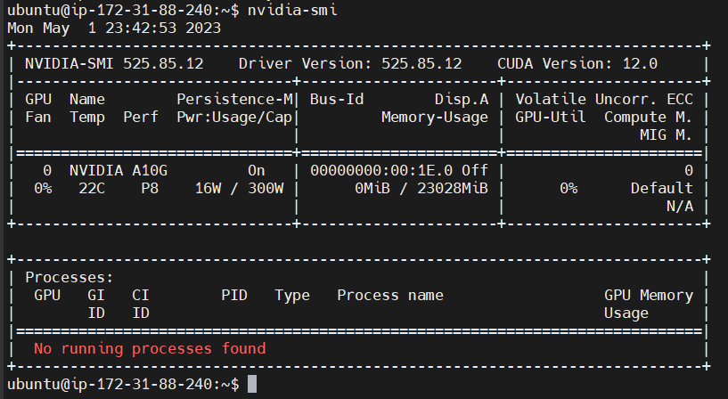

# Holoscan Playground on AWS
## Overview
The Holoscan on AWS EC2 experience is an easy way for having a first try at the Holoscan SDK. The [Holoscan SDK documentation](https://docs.nvidia.com/holoscan/sdk-user-guide/sdk_installation.html#prerequisites) lists out the hardware prerequisites. If you have a compatible hardware at hand, please get started with the SDK on your hardware. Otherwise, you could utilize an AWS EC2 instance to have a first look at the Holoscan SDK by following this guide.

We estimate the time needed to follow this guide is around 1 hour, after which you could feel free to explore more of the SDK examples and applications. Please note that for the g5.xlarge instance type utilized, [the cost](https://aws.amazon.com/ec2/pricing/on-demand/) is $1.006/hour.

1. The AWS experience is intended as a trial environment of the Holoscan SDK, not as a full time development environment. Some limitations of running the SDK on an EC2 instance are:

2. An EC2 instance does not have the capability of live input sources, including video capture cards like AJA and Deltacast, or the onboard HDMI input port on devkits.
An EC2 instance does not have ConnectX networking capabilities available on devkits.

3. Display forwarding from EC2 to your local machine depends on internet connectivity and results in heavy latency, so if you would like to develop applications with display, it is not ideal.

## Launch EC2 Instance
Type in the name that you want to give to the instance.


In the `Application and OS Images (Amazon Machine Image)` window, search for `NVIDIA`.


From the results, switch to `AWS Marketplace AMIs` and choose `NVIDIA GPU-Optimized AMI`.


Select `Continue` after viewing the details of this AMI.


The selected AMI should look like this in the view to create an instance:


For `Instance type`, select `g5.xlarge`.
Note: If you see an error similar to `The selected instance type is not supported in the zone (us-west-2d). Please select a different instance type or subnet.`, go down to `Network settings`, click on `Edit`, and try changing the `Subnet` selection.
Note: If `g5.xlarge` is not available in any region/subnet accessible to you, `p3.2xlarge` should also work.


For `Key pair`, create a new key pair, enter the key pair name as you like, and store the file as prompted. After clicking on `Create key pair`, the file `your-name.pem` will be automatically downloaded by the browser to the Downloads folder. Then select the key pair in the view to create an instance.


Configure the `Network settings`. Click on `Edit` to start.
* If you got an error in the `Instance type` selection about `g5.xlarge` being unavailable, try changing your `Subnet` selection in `Network settings`. Otherwise, there is no need to change the `Subnet` selection.
* Make sure your `Auto-assign public IP` is enabled, otherwise you would have issues ssh’ing into the instance.
* Select a security group with a public IP address where you plan to ssh from, if one doesn’t exist yet, select `create security group`.
    * If you’re already on the local machine you plan to ssh from, select `My IP` under `Source Type`.
    * To add other machines that you plan to ssh from, select `Custom` under `Source Type` and enter your public IP address under `Source`. You can find the public IP address of the machine by going to https://www.whatsmyip.org/ from the machine.


Keep the default 128 GB specification in `Configure storage`.


Your Summary on the right side should look like this:


Please note that with a different instance type, Storage (volumes) may look different too.

Click `Launch instance`, and you should see a `Success` notification.


Now go back to the `Instances` window to view the `Status check` of the instance we had just launched. It should show `Initializing` for a few minutes:


And later it should show `2/2 checks passed`:


Now we’re ready to ssh into the instance.

## SSH into EC2 Instance
Click on the instance ID, and you should see this layout for instance details. Click on the `Connect` button on the top right.


Under the `SSH client` tab there are the SSH instructions. Note that the username `root` is guessed, and for the AMI we chose, it should be `ubuntu`. The private key file that you saved from when you were configuring the instance should be on the machine that you are ssh’ing from.

Add `-X` to the ssh command to enable display forwarding.


## Setting up Display Forwarding from EC2 Instance
Holoscan SDK has examples and applications that depend on seeing a display. For this experience, we will do X11 forwarding.

### On EC2 Instance
First,install the package needed for a simple forwarding test, xeyes.

```sh
sudo apt install -y x11-apps
```

Next, run “xeyes” in the terminal, and you should get a display window popping up on the machine you’re ssh’ing from:
```sh
xeyes
```

https://github.com/jin-nvidia/holohub/assets/60405124/57c76bed-ca16-458b-8740-1e4351ca63f7


If you run into display issues, ensure the machine you’re ssh’ing from has X11 forwarding enabled. Please see the [Troubleshooting](#troubleshooting) section.

### In a Docker Container On EC2 Instance


Now you have enabled display forwarding on the EC2 instance bare metal, let’s take it one step further to enable display forwarding from a Docker container on the EC2 instance.

```sh
XSOCK=/tmp/.X11-unix
XAUTH=/tmp/.docker.xauth
# the error “file does not exist” is expected at the next command
xauth nlist $DISPLAY | sed -e 's/^..../ffff/' | sudo xauth -f $XAUTH nmerge -
sudo chmod 777 $XAUTH
docker run -ti -e DISPLAY=$DISPLAY -v $XSOCK:$XSOCK -v $XAUTH:$XAUTH -e XAUTHORITY=$XAUTH --net host ubuntu:latest
```

Within the container:

```sh
apt update && apt install -y x11-apps
xeyes
```
Press  `ctrl + D` to exit the Docker container.
Now we have enabled display forwarding from both EC2 bare metal and containerized environments!

## Run Holoscan
### Install Holoscan

There are [several ways](https://docs.nvidia.com/holoscan/sdk-user-guide/sdk_installation.html#development-software-stack) to install the Holoscan SDK. For the quickest way to get started, we will choose the Holoscan Docker container that already has all dependencies set up.
We run nvidia-smi in the EC2 instance to check that there are drivers installed:



Follow the overview of https://catalog.ngc.nvidia.com/orgs/nvidia/teams/clara-holoscan/containers/holoscan. Some modifications are made to the original commands due to the EC2 environment, `--gpus all` and `-v $XAUTH:$XAUTH -e XAUTHORITY=$XAUTH`.
```sh
# install xhost util
sudo apt install -y x11-xserver-utils

xhost +local:docker

nvidia_icd_json=$(find /usr/share /etc -path '*/vulkan/icd.d/nvidia_icd.json' -type f,l -print -quit 2>/dev/null | grep .) || (echo "nvidia_icd.json not found" >&2 && false)

export NGC_CONTAINER_IMAGE_PATH="nvcr.io/nvidia/clara-holoscan/holoscan:v0.6.0-dgpu"

docker run -it --rm --net host \
  --gpus all \
   -v $XAUTH:$XAUTH -e XAUTHORITY=$XAUTH \
  -v /tmp/.X11-unix:/tmp/.X11-unix \
  -v $nvidia_icd_json:$nvidia_icd_json:ro \
  -e NVIDIA_DRIVER_CAPABILITIES=graphics,video,compute,utility,display \
  -e DISPLAY=$DISPLAY \
  --ipc=host \
  --cap-add=CAP_SYS_PTRACE \
  --ulimit memlock=-1 \
  ${NGC_CONTAINER_IMAGE_PATH}
```
#### Sanity Check with Holoscan Hello World

```sh
/opt/nvidia/holoscan/examples/hello_world/cpp/hello_world
```

### Examples
Refer to each one of the Holoscan SDK examples on [GitHub](https://github.com/nvidia-holoscan/holoscan-sdk/tree/main/examples). You will find these examples installed under `/opt/nvidia/holoscan/examples/`.

#### Video Replayer Example

Let’s take a look at [the video replayer example](https://github.com/nvidia-holoscan/holoscan-sdk/tree/main/examples/video_replayer) which is a basic video player app. Since we are in the Docker container, there’s no need to manually download data as it already exists in the container.

Run the video_replayer example

```sh
cd /opt/nvidia/holoscan
./examples/video_replayer/cpp/video_replayer
```
You should see a window like below

https://github.com/jin-nvidia/holohub/assets/60405124/7ae99409-ca42-4c38-b495-84a59648b671

> Please note that it is normal for the video stream to be lagging behind since it is forwarded from a docker container on a EC2 instance to your local machine. How much the forwarded video will lag heavily depends on the internet connection. When running Holoscan applications on the edge, we should have significantly less latency lag.

You can close the sample application by pressing ctrl +C.

Now that we have run a simple video replayer, let’s explore the examples a little more.

#### Tensor Interoperability Example

##### The C++ Tensor Interop example

Since we used the Debian package install, run the C++ tensor interopability example by

```sh
/opt/nvidia/holoscan/examples/tensor_interop/cpp/tensor_interop
```

Please refer to the [README](https://github.com/nvidia-holoscan/holoscan-sdk/blob/main/examples/tensor_interop/README.md) and the [source file](https://github.com/nvidia-holoscan/holoscan-sdk/blob/main/examples/tensor_interop/cpp/tensor_interop.cpp) to see how we can have interoperability between a native operator (`ProcessTensorOp`) and two wrapped GXF Codelets (`SendTensor` and `ReceiveTensor`). For the Holoscan documentation on tensor interop in the C++ API, please see [Interoperability between GXF and native C++ operators](https://docs.nvidia.com/holoscan/sdk-user-guide/holoscan_create_operator.html#interoperability-between-gxf-and-native-c-operators).


##### The Python Tensor Interop example

The Python [Tensor Interop example](https://github.com/nvidia-holoscan/holoscan-sdk/tree/main/examples/tensor_interop) demonstrates interoperability between a native Python operator (`ImageProcessingOp`) and two operators that wrap existing C++ based operators,  (`VideoStreamReplayerOp` and `HolovizOp`) through the Holoscan Tensor object.

Run the Python example by

```sh
python3 /opt/nvidia/holoscan/examples/tensor_interop/python/tensor_interop.py
```
This example applies a Gaussian filtering to each frame of an endoscopy video stream and displays the filtered (blurred) video stream. You should see a window like below

https://github.com/jin-nvidia/holohub/assets/60405124/b043637b-5fd9-4ee1-abc5-0dae069e785f

The native Python operator is defined at [tensor_interop.py#L37](https://github.com/nvidia-holoscan/holoscan-sdk/blob/main/examples/tensor_interop/python/tensor_interop.py#L37). We can see in the initialization `__init__()` of the operator, `self.count` was initialize to 1. In the `setup()` method, the input message, output message and the parameter `sigma` is defined. The `compute()` method is what gets called every time. In the `compute()` method, first we receive the upstream tensor by

```python
in_message = op_input.receive("input_tensor")
```

Please note that `input_tensor` is the name defined in `setup()`.

`cp_array` is the CuPy array that holds the output value after the Gaussian filter, and we can see that the way the CuPy array gets transmitted downstream is
```python
out_message = dict()
…
# add each CuPy array to the out_message dictionary
out_message[key] = cp_array
…
op_output.emit(out_message, "output_tensor")
```

Please note that `output_tensor` is the name defined in `setup()`.

Since there is only one input and one output port, when connecting the native Python operator `ImageProcessingOp` to its upstream and downstream operators, we do not need to specify the in/out name for `ImageProcessingOp`:
```python
self.add_flow(source, image_processing)
self.add_flow(image_processing, visualizer, {("", "receivers")})
```

Otherwise, with each `add_flow()`, the input and output port names need to be specified when multiple ports are present.

For more information on tensor interop in Python API, please see the Holoscan documentation [Interoperability between wrapped and native Python operators](https://docs.nvidia.com/holoscan/sdk-user-guide/holoscan_create_operator.html#interoperability-between-wrapped-and-native-python-operators).

Now that we have seen an example of tensor interop for single tensors per port, let’s look at the next example where there are multiple tensors in the native operator’s output port.

#### Holoviz Example

Let’s take a look at the [Holoviz example](https://github.com/nvidia-holoscan/holoscan-sdk/tree/main/examples/holoviz). Run the example
```sh
python3 /opt/nvidia/holoscan/examples/holoviz/python/holoviz_geometry.py
```

You should get something like below on the display

https://github.com/jin-nvidia/holohub/assets/60405124/6d79845a-66bd-4448-9646-284b90c5e5f3

Please take your time to look through [holoviz_geometry.py](https://github.com/nvidia-holoscan/holoscan-sdk/blob/main/examples/holoviz/python/holoviz_geometry.py) for how each one of the shapes and text in the native Holoscan Python operator is defined.

Let’s also dive into how we can add to `out_message` and pass to Holoviz various tensors at the same time, including the frame itself, `box_coords`,  `triangle_coords`, `cross_coords`, `oval_coords`, the time varying `point_coords`, and `label_coords`.

```python
# define the output message dictionary where box_coords is a numpy array and “boxes” is the tensor name
out_message = {
            "boxes": box_coords,
            "triangles": triangle_coords,
            "crosses": cross_coords,
            "ovals": oval_coords,
            "points": point_coords,
            "label_coords": label_coords,
            "dynamic_text": dynamic_text,
}

# emit the output message
op_output.emit(out_message, "outputs")
```

We can also see that each tensor name is referenced by the `tensors` parameter in the instantiation of a Holoviz operator [at line 249](https://github.com/nvidia-holoscan/holoscan-sdk/blob/main/examples/holoviz/python/holoviz_geometry.py#L249).

This is a great example and reference not only for passing different shapes to Holoviz, but also creating and passing multiple tensors within one message from a native Holoscan Python operator to the downstream operators.

For more information on the Holoviz module, please see the [Holoscan documentation](https://docs.nvidia.com/holoscan/sdk-user-guide/visualization.html#holoviz-operator).

Exit from the Docker container by ctrl+D.

### Applications

To run the reference applications on Holoscan, let’s go to [HoloHub](https://github.com/nvidia-holoscan/holohub) - a central repository for users and developers to share reusable operators and sample applications.

On the EC2 instance, clone the HoloHub repo:
```sh
cd ~
git clone https://github.com/nvidia-holoscan/holohub.git
cd holohub
```
To set up and build HoloHub, we will go with the option `Building dev container`: Run the following command from the holohub directory to build the development container:
```sh
./dev_container build
```

Check the tag for the container we had just build:

```sh
docker images
```
There should be an image with repository:tag similar to `holohub:ngc-vx.y.z-dgpu` where `x.y.z` is the latest SDK version. We will set this as `HOLOHUB_IMAGE`:
```sh
# make sure to replace 0.6.0 with the actual SDK version
export HOLOHUB_IMAGE=holohub:ngc-v0.6.0-dgpu
```
Next, launch the dev container for HoloHub. On a regular machine we can do so by `./dev_container launch`, however we need to make a few adjustments to the command again since we’re running on an EC2 instance:
```sh
docker run -it --rm --net host  -v /etc/group:/etc/group:ro -v /etc/passwd:/etc/passwd:ro -v $PWD:/workspace/holohub -w /workspace/holohub --gpus all -e NVIDIA_DRIVER_CAPABILITIES=graphics,video,compute,utility,display -v /tmp/.X11-unix:/tmp/.X11-unix -e DISPLAY --group-add video -v /etc/vulkan/icd.d/nvidia_icd.json:/etc/vulkan/icd.d/nvidia_icd.json:ro  -v $XAUTH:$XAUTH -e XAUTHORITY=$XAUTH $HOLOHUB_IMAGE
```
Please refer to [HoloHub](https://github.com/nvidia-holoscan/holohub#building-holohub) for instructions on building each application.

#### Endoscopy Tool Tracking Application

Build the sample app and run:
```sh
./run build endoscopy_tool_tracking
./run launch endoscopy_tool_tracking cpp
```
You should see a window like:

https://github.com/jin-nvidia/holohub/assets/60405124/8eb93c50-d893-4b2c-897b-57de94b91371

> Note: Be prepared to wait a few minutes as we’re running the app for the first time, and it will convert the ONNX model to a TensorRT engine. The conversion happens only for the first time, after that, each time we run the app the TensorRT engine is already present.

Please visit [HoloHub](https://github.com/nvidia-holoscan/holohub/tree/main/applications/endoscopy_tool_tracking) to see the application graph, different input types (although on the EC2 instance we can not use a live source such as the AJA capture card), and the construction of the same application in C++ vs in Python.

#### Multi AI Ultrasound Application

In the last application we saw how to run AI inference on the video source. Next, let’s see how we can run inference with multiple AI models at the same time within a Holoscan application, enabled by Holoscan Inference Module.
Build the application in [applications/multiai_ultrasound](https://github.com/nvidia-holoscan/holohub/tree/main/applications/multiai_ultrasound)
```sh
./run build multiai_ultrasound
```

Launch the Python application:
```sh
./run launch multiai_ultrasound python
```
You should see a window like below:

https://github.com/jin-nvidia/holohub/assets/60405124/9d347b44-d635-4cc6-b013-7d26e3e4e2be

You can find more information on Holoscan Inference Module [here](https://docs.nvidia.com/holoscan/archive/holoscan-0.4.0/clara_holoinfer.html), including the parameters you can specify to define inference configuration, how to specify the multiple (or single) model(s) you want to run, and how the Holoscan Inference Module functions as an operator within the Holoscan SDK framework.

Please see the application graph and more on [HoloHub](https://github.com/nvidia-holoscan/holohub/tree/main/applications/multiai_ultrasound) for how the multi AI inference connects to the rest of the operators, the definition of the same application in Python vs in C++, and how the [multiai_ultrasound.yaml](https://github.com/nvidia-holoscan/holohub/blob/main/applications/multiai_ultrasound/python/multiai_ultrasound.yaml) config file defines parameters for each operator especially the [Holoscan Inference Module](https://github.com/nvidia-holoscan/holohub/blob/main/applications/multiai_ultrasound/python/multiai_ultrasound.yaml#L60-L78).

## Stop EC2 Instance

Now that you have run several Holoscan Examples and HoloHub Applications, please continue exploring the rest of Examples and Applications, and when you’re ready, stop the instance by going back to EC2 page with the list of `Instances`, select the launched instance, and select `Stop Instance` in the dropdown `Instance state`.


## Troubleshooting

If you receive a display forwarding error such as
```
unable to open display "localhost:10.0"
```
```
Glfw Error 65544: X11: Failed to open display localhost:10.0
terminate called after throwing an instance of 'std::runtime_error'
  what():  Failed to initialize glfw
```
Please see below to find the suggestion for your OS.

### From a Linux Local Machine
* Ensure that `-X` is added to the ssh command when connecting to the EC2 instance.

### From a Windows Local Machine
* Ensure that `-X` is added to the ssh command when connecting to the EC2 instance.
* Try using MobaXTerm to establish a SSH connection with X11 forwarding enabled.

### From a Mac Local Machine

* Download [Quartz](https://www.xquartz.org/), reboot, and enable the following.

  

  Once Quartz is downloaded it will automatically launch when running display forwarding apps like `xeyes`.

* Ensure that `-X` is added to the ssh command when connecting to the EC2 instance.
