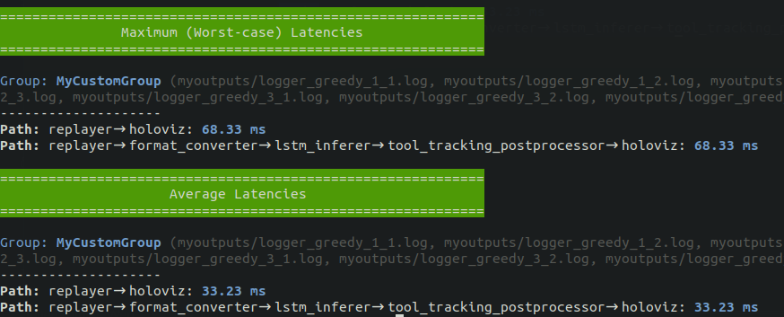
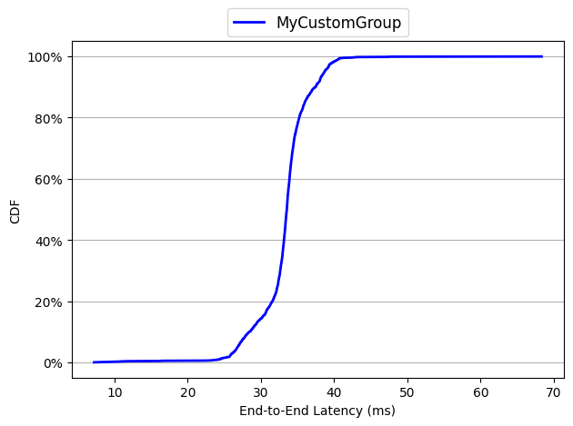
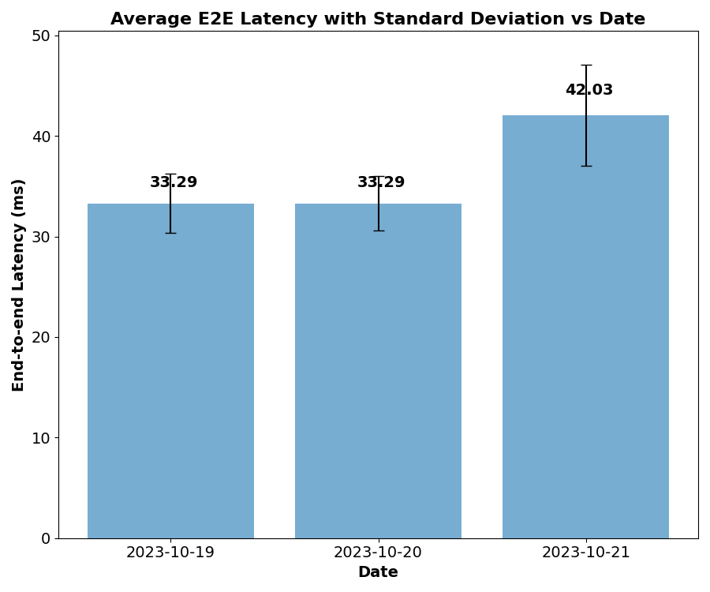

# Holoscan Flow Benchmarking for HoloHub

This is a benchmarking tool to evaluate the performance of HoloHub and other Holoscan applications.
Following is a high-level overview of Holoscan Flow Benchmarking. For more details on its possible
use-cases, please follow [Holoscan Flow Benchmarking Tutorial](./flow_benchmarking_tutorial.md) 
(up-to-date) or 
[Holoscan Flow Benchmarking whitepaper](https://developer.download.nvidia.com/holoscan/Holoscan-Flow-Benchmarking.pdf).

The tool supports benchmarking of any Holoscan application. Holoscan Python applications are
supported since Holoscan v1.0.

## Table of Contents

- [Pre-requisites](#pre-requisites)
- [Steps for Holoscan Flow Benchmarking](#steps-for-holoscan-flow-benchmarking)
- [Generate Application Graph with Latency Numbers](#generate-application-graph-with-latency-numbers)

## Pre-requisites
The following Python libraries need to be installed to run the benchmarking scripts (`pip install -r requirements.txt` can be used):

```
numpy matplotlib nvitop argparse
```
## Steps for Holoscan Flow Benchmarking

1. **Patch the application for benchmarking**

```
$ ./tutorials/holoscan_flow_benchmarking/patch_application.sh <application directory>
```

For example, to patch the endoscopy tool tracking application, you would run:

```
$ ./tutorials/holoscan_flow_benchmarking/patch_application.sh applications/endoscopy_tool_tracking
```
This script saves the original `cpp` files in a `*.cpp.bak` file.

2. **Build the application**

```
$ ./run build <application name> <other options> \
    --configure-args -DCMAKE_CXX_FLAGS=-I$PWD/tutorials/holoscan_flow_benchmarking
```

Please make sure to test that the application runs correctly after building it, and before going to
next steps of performance evaluation. You may also make sure that all the necessary TensorRT engine
files are generated by running the application at least once, for example, for the endoscopy tool
tracking application.

3. **Run the performance evaluation**

```
$ python tutorials/holoscan_flow_benchmarking/benchmark.py -a <application name> <other options>
```

The above command will run an application which is executed normally by 
`./run launch <application name> cpp`. If an application is executed differently, then use the
`--run-command` argument to specify the command to run an application.

`python tutorials/holoscan_flow_benchmarking/benchmark.py -h` shows all the possible benchmarking options.

All the log filenames are printed out at the end of the evaluation. The format of the filename for the data flow tracking log files is:
`logger_<scheduler>_<run_number>_<instance-id>.log`. The format of the filename for the GPU
utilization log files is: `gpu_utilization_<scheduler>_<run_number>.csv`.

**Example:**
When the endoscopy tool tracking application is evaluated for the greedy scheduler for 3 runs with 3
instances each for 200 number of data frames, the following output is printed:
```
$ python tutorials/holoscan_flow_benchmarking/benchmark.py -a endoscopy_tool_tracking -r 3 -i 3 -m 200 --sched greedy -d myoutputs
Log directory is not found. Creating a new directory at /home/ubuntu/holoscan-sdk/holohub-internal/myoutputs
Run 1 completed for greedy scheduler.
Run 2 completed for greedy scheduler.
Run 3 completed for greedy scheduler.

Evaluation completed.
Log file directory:  /home/ubuntu/holoscan-sdk/holohub/myoutputs
All the data flow tracking log files are: logger_greedy_1_1.log, logger_greedy_1_2.log, logger_greedy_1_3.log, logger_greedy_2_1.log, logger_greedy_2_2.log, logger_greedy_2_3.log, logger_greedy_3_1.log, logger_greedy_3_2.log, logger_greedy_3_3.log

```

4. **Get performance results and insights**

```
$ python tutorials/holoscan_flow_benchmarking/analyze.py -g <group of log files> <options>
```
`python tutorials/holoscan_flow_benchmarking/analyze.py -h` shows all the possible options.

**Example:**
For the above example experiment with the `benchmark.py` script, we can analyze worst-case and
average end-to-end latency by the following script:

```
python tutorials/holoscan_flow_benchmarking/analyze.py -m -a -g myoutputs/logger_greedy_* MyCustomGroup
```
The above command will produce an output like below:



We can also produce CDF curve of the observed latencies for a single path by the following commands:

```
$ python tutorials/holoscan_flow_benchmarking/analyze.py --draw-cdf single_path_cdf.png -g myoutputs/logger_greedy_* MyCustomGroup --no-display-graphs
Saved the CDF curve graph of the first path of each group in: single_path_cdf.png
```

The `single_path_cdf.png` looks like below:



A few auxiliary scripts are also provided to help plotting datewise results. For example, the
following script plots the average end-to-end latency along with standard deviation for three
consecutive dates:

```
python bar_plot_avg_datewise.py avg_values_2023-10-19.csv avg_values_2023-10-20.csv avg_values_2023-10-21.csv stddev_values_2023-10-19.csv stddev_values_2023-10-20.csv stddev_values_2023-10-21.csv
```



5. **Restore the application**

If benchmarking is not necessary anymore, an application can be restored by the following command:

```
$ ./tutorials/holoscan_flow_benchmarking/restore_application.sh <application directory>
```

## Generate Application Graph with Latency Numbers

The `app_perf_graph.py` script can be used to generate a graph of a Holoscan application with
latency data from benchmarking embedded into the graph. The graph looks like the figure below, where
graph nodes are operators along with their average and maximum execution times, and edges represent
connection between operators along with the average and maximum data transfer latencies.


It is also possible to generate such a graph and dynamically update it, while running the
`benchmarking.py` script to benchmark an application. For example, the following three commands can
be run in three different terminals to monitor the live performance of an endoscopy_tool_tracking
application.

```
# the following command initiates a benchmarking job and generates performance log files
$ python3 tutorials/holoscan_flow_benchmarking/benchmark.py -a endoscopy_tool_tracking -i 1 -d endoscopy_results --sched=greedy -r 3 -m 1000

# the following command keeps updating an application graph with the latest performance numbers
# -l means live mode
$ python3 tutorials/holoscan_flow_benchmarking/app_perf_graph.py -o live_app_graph.dot -l endoscopy_results

# use another terminal to visualize the graph with xdot. the graph will be updated as app_perf_graph.py updates the graph
$ xdot live_app_graph.dot
```
