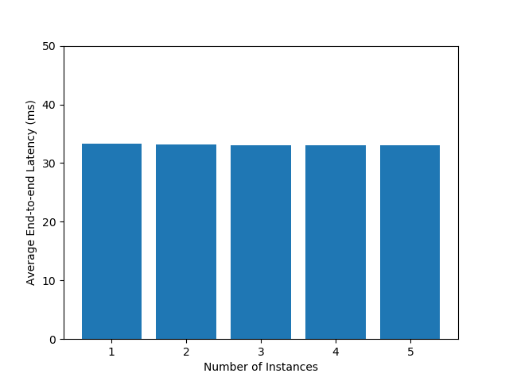

# Holoscan Flow Benchmarking

Developing and optimizing the performance of a time-critical application
is a challenging task. One needs to run an application with different
configurations and evaluate the performance to figure out the desired
production environment of an application. [Holoscan](https://developer.nvidia.com/holoscan-sdk)
is a real-time AI sensor processing platform that enables developers to
build real-time AI applications with intuitive interfaces. However,
performance measurements of a Holoscan application required significant
efforts by the application developers. In this article, we introduce
Holoscan flow benchmarking on HoloHub, which aims to make Holoscan
applications' performance measurements and analysis easy and scalable.
Holoscan flow benchmarking can help evaluate different configurations
before deploying a Holoscan application to production.

A key performance indicator (KPI) for real-time sensor processing
applications is the end-to-end latency. There are many possible metrics
on the end-to-end latency performance including average end-to-end
latency and maximum (worst-case) end-to-end latency. For a developer, it
is important to know these metrics, to understand how well their
application is performing in terms of responsiveness and efficiency.
Holoscan SDK allows [data flow
tracking](https://docs.nvidia.com/holoscan/sdk-user-guide/flow_tracking.html) to precisely measure
the end-to-end latency of Holoscan applications.
The Holoscan flow benchmarking in Holohub leverages the data flow
tracking of the Holoscan SDK.

## Introduction to the Holoscan Flow Benchmarking

Holoscan flow benchmarking helps with automating the benchmarking
process and generating necessary log files which are analyzed later. In
this article, we demonstrate how to use Holoscan flow benchmarking to
evaluate different configurations, applications and schedulers. In a
nutshell, there are four steps to perform Holoscan flow benchmarking
which are [summarized here](https://github.com/nvidia-holoscan/holohub/tree/main/tutorials/holoscan_flow_benchmarking/README.md).
Following is a high-level overview:

1.  **Patching an application:** In the first step, we patch a Holoscan application to turn on data flow tracking.

2.  **Building an application:** In the second step, we compile the patched application with necessary header files.

3.  **Running the benchmark:** In the third step, we run the `benchmark.py` script with necessary parameters to evaluate the performance of the application in different configurations. This
generates a number of log files which capture the result of the performance measurements in its raw format.

4.  **Analyzing the result:** In the fourth step, we retrieve the result
of the benchmarking process by using the generated log files with
the `analyze.py` script. We can also export the result in a CSV file
or generate graphs to visualize certain results.

Next, we demonstrate a few capabilities of Holoscan flow benchmarking.

## Compare performance for multiple instances of an application

In many cases, users may want to run multiple Holoscan applications in
parallel on their systems. They want to know the performance
implications of such a configuration before developing a full-fledged
system with more than one Holoscan application. Through Holoscan flow
benchmarking, they can easily evaluate the performance of running
multiple instances of an application in parallel to understand the
performance of such a configuration for their specific and curated
use-cases. They can learn how many parallel instances of an application,
representative of their own application, can safely run until the
configuration cannot meet their expected end-to-end latency guarantees.

Suppose we want to evaluate the performance of running multiple
instances of the endoscopy tool tracking application in parallel, to
understand the end-to-end latency performance. After completing the
first two steps mentioned above, we can run the following command to
evaluate performance of running up to 5 instances of the endoscopy tool
tracking application concurrently.

```
$ python tutorials/benchmarking/benchmark.py -a endoscopy_tool_tracking
--sched greedy -i <Number of Instances> -r 10 -m 1000 -d
endoscopy_<Number of Instance>
```

`Number of Instances` needs to be set to measure the performance of
running multiple instances of the endoscopy tool tracking
applications concurrently. The above command tests the application
against 1000 data frames (`-m 1000`) and repeats every experiment 10 times
(`-r 10`) for the greedy scheduler (`--sched greedy`). The log files
generated by the benchmarking process are stored in the
`endoscopy_<Number of Instance>` directory where `Number of Instance`
varies from 1 to 5. The format of the filename for the data flow
tracking log files is `logger_<scheduler>_<run_number>_<instance-id>.log`.

### Retrieving the result

After the benchmarking process is complete, we can analyze the result
with the help of the `analyze.py` script. If we want to know the average
end-to-end latencies of the above experiment, the following command
could be used:

```
$ python tutorials/holoscan_flow_benchmarking/analyze.py --avg -g
endoscopy_1/logger* Instance-1 -g endoscopy_2/logger* Instance-2 -g
endoscopy_3/logger* Instance-3 -g endoscopy_4/logger* Instance-4 -g
endoscopy_5/logger* Instance-5
```

In the above command, --avg is used to show the average end-to-end
latency of each experiment. Every -g parameter is used to specify a
group of log files. endoscopy_1/logger* specifies the data flow
tracking log files for the experiment in the endoscopy_1 directory. It
is followed by a group name of Instance-1. The same is true for the
other -g parameters. Executing the command shows a result like below:


### Plotting the data

In addition to getting the analysis results, it is important to plot the result in a graph to better
understand the trends in an evaluation result. The Holoscan flow benchmarking provides options to
export the results in a CSV file to plot the data with your favorite plotting tool later on.
Appending the `analyze.py` command with the `--save-csv` parameter enables
saving the results in an `avg_values.csv` file in CSV format:

```
$ python tutorials/holoscan_flow_benchmarking/analyze.py --avg -g
endoscopy_1/logger* Instance-1 -g endoscopy_2/logger* Instance-2 -g
endoscopy_3/logger* Instance-3 -g endoscopy_4/logger* Instance-4 -g
endoscopy_5/logger* Instance-5 --save-csv
```

Then, the average values could be plotted with your preferred plotting
tools. For example, `matplotlib` Python library could be used to plot the
average values in a bar-graph with the following code:

```python
import matplotlib.pyplot as plt

with open('avg_values.csv', 'r') as f:
    lines = f.readlines()
    avg_values = [float(x) for x in lines[0].strip().split(',') if x]

plt.bar(range(1, 6), avg_values)
plt.xlabel('Number of Instances')
plt.ylabel('Average End-to-end Latency (ms)')
plt.savefig('avg_bar_graph.png')
```

The graph looks like the following:


Similar results can be obtained for the maximum end-to-end latencies as
well, if the above analyze.py command is supplied with the --max
parameter. The bar-graph with the maximum end-to-end latency would look
like the following graph, as the worst-case latency gets affected by
interferences from multiple instances:

 end-to-end latency vs. Number of Instance")

The application developers can decide for their own applications the
acceptable maximum or average end-to-end latency and therefore:

-   decide how many parallel instances of an application they want to
run on their system
-   whether they need to further optimize the pipeline
-   whether they need more compute resources

### Measuring GPU utilization

Understanding the impact of running multiple instances of an application
on GPU utilization is crucial for optimizing performance. Holoscan flow
benchmarking can also help measure the GPU utilization for every
experiment. By appending `-u` to the above `benchmark.py` command, the GPU
utilization is monitored and logged in a CSV file named
`gpu_utilization_<scheduler>_<run_number>.csv`. For
example, the final command for GPU utilization monitoring looks like
below:

```
$ python tutorials/benchmarking/benchmark.py -a
endoscopy_tool_tracking --sched greedy -i <Number of Instances>
-r 10 -m 1000 -d endoscopy_<Number of Instance> -u
```

In the analysis phase, the average GPU utilization result can be saved
in a CSV file (`avg_gpu_utilization_values.csv`) using the `-u
--save-csv` parameters:

```
$ python tutorials/holoscan_flow_benchmarking/analyze.py -g
endoscopy_1/logger* Instance-1 -u endoscopy_1/gpu*
Instance-1-GPUUtil -u endoscopy_2/gpu* Instance-2-GPUUtil -u
endoscopy_3/gpu* Instance-3-GPUUtil -u endoscopy_4/gpu*
Instance-4-GPUUtil -u endoscopy_5/gpu* Instance-5-GPUUtil --save-csv
```

Each `-u` parameter specifies the group of GPU utilization log files
(`endoscopy_1/gpu*`) with a last parameter specifying the group name
(`Instance-1-GPUUtil`). `-g endoscopy_1/logger* Instance-1` is used to
satisfy the requirement of a mandatory `-g` parameter.

Suppose we want to plot the average GPU utilization as well in the above
bar-graph of maximum values. We can achieve that by the following code
in Python:

```python
import matplotlib.pyplot as plt

with open('max_values.csv', 'r') as f:
    lines = f.readlines()
    max_values = [float(x) for x in lines[0].strip().split(',') if x]

with open('avg_gpu_utilization_values.csv', 'r') as f:
    lines = f.readlines()
    avg_gpu_utilizations = [float(x) for x in lines[0].strip().split(',') if x]

fig, ax1 = plt.subplots()
ax1.bar(range(len(max_values)), max_values)
ax1.set_ylabel('Maximum End-to-end Latency (ms)')
ax1.set_xlabel('Number of Instances')
ax2 = ax1.twinx()
ax2.plot(range(len(avg_gpu_utilizations)), avg_gpu_utilizations, color='r', linewidth=2.0)
ax2.set_ylabel('Average GPU Utilization (%)')
plt.savefig('max_bar_graph.png')
```

The generated graph looks like below:


### Generate CDF curve

Holoscan flow benchmarking can also be used to generate the graph of
Cumulative Distribution Function (CDF) of the observed end-to-end
latencies. The CDF curve is a useful tool to understand how much the
latencies of all the data frames passing through an application graph
are distributed. The following command generates a CDF curve of the
end-to-end latencies of the first path for the experiment with 1
instance:

```
$ python tutorials/holoscan_flow_benchmarking/analyze.py --draw-cdf
single_path_cdf.png -g endoscopy_1/logger* MyCustomGroup
--no-display-graphs
```

By default, the command also displays the graph in a separate window.
The `--no-display-graphs` suppresses this option. The graph is saved in
`single_path_cdf.png` file and looks like below:


In addition to plotting the CDF curve of the first path, it is also
possible to plot the CDF curves of all the paths of an application graph
with the `--draw-cdf-paths` parameter.

## Compare two different applications

The `benchmark.py` script can be used to evaluate the performance of two
different applications. The results can be analyzed and compared using
the `analyze.py` script. For example, we can run the following two
commands to run two different applications under same settings:

```
$ python tutorials/holoscan_flow_benchmarking/benchmark.py -a
endoscopy_tool_tracking -r 10 -i 1 -m 1000 --sched greedy -d
endoscopy_outputs

$ python tutorials/holoscan_flow_benchmarking/benchmark.py -a
ultrasound_segmentation -r 10 -i 1 -m 1000 --sched greedy -d
ultrasound_outputs
```

The above commands run two experiments and save the corresponding log
files in two different directories, `endoscopy_outputs` and
`ultrasound_outputs`. We can analyze and compare their maximum end-to-end
latencies with the following analyze.py command:

```
$ python tutorials/holoscan_flow_benchmarking/analyze.py --max -g
endoscopy_outputs/logger* "Endoscopy Tool Tracking" -g
ultrasound_outputs/logger* "Ultrasound Segmentation"
```

The result looks like below:


Such a command shows the maximum end-to-end latency of two different
applications and helps the developers compare their performances.

## Compare different configurations

We can also compare different configurations of an application with
Holoscan flow benchmarking, such as specifying the GPU in which the
application is executed. For example, if we have two GPUs ([RTX
A6000](https://www.nvidia.com/en-us/design-visualization/rtx-a6000/)
and [RTX A4000](https://www.nvidia.com/en-us/design-visualization/rtx-a4000/))
both available for visualization, we may want to know the performance of
running an application only on a specific GPU. We can run the following
command:

```
$ python tutorials/holoscan_flow_benchmarking/benchmark.py -a
endoscopy_tool_tracking -r 10 -i 1 -m 1000 --sched greedy -d
endoscopy_outputs_<GPU Name> -g <Corresponding GPU UUID>
```

In the above command, users can provide corresponding GPU UUIDS by
looking it up via `nvidia-smi -L` and changing the `<GPU Name>` to
save the outputs in different directories. The `-g <Corresponding GPU UUID>` parameter sets the
`CUDA_VISIBLE_DEVICES` environment variable to the corresponding GPU UUID. It is important to note
that this option does not override the application-specific GPU settings in the code, for
example, via the GPU assignment in [Inference
operator](https://docs.nvidia.com/holoscan/sdk-user-guide/inference.html) (`device_map` option).

The results of the above experiment can be compared using the following
command:

```
$ python tutorials/holoscan_flow_benchmarking/analyze.py <insert
your metrics options> -g endoscopy_outputs_<GPU Name>/logger* "GPU1" -g endoscopy_outputs_<GPU Name>/gpu* "GPU2"
```

## Compare performance of different schedulers

It is also possible to compare different schedulers using Holoscan flow
benchmarking. The following commands can be used to evaluate performance
of the endoscopy tool tracking sample application under the [Greedy
scheduler](https://docs.nvidia.com/holoscan/sdk-user-guide/components/schedulers.html#greedy-scheduler)
and the [Multithread scheduler](https://docs.nvidia.com/holoscan/sdk-user-guide/components/schedulers.html#multithreadscheduler):

```
$ python tutorials/holoscan_flow_benchmarking/benchmark.py -a
endoscopy_tool_tracking -r 10 -i 1 -m 1000 --sched greedy -d endoscopy_greedy_outputs

$ python tutorials/holoscan_flow_benchmarking/benchmark.py -a
endoscopy_tool_tracking -r 10 -i 1 -m 1000 --sched multithread -w 5 -d ndoscopy_multithread_outputs
```

Then, the results can be analyzed and compared using the following
command:

```
$ python tutorials/holoscan_flow_benchmarking/analyze.py <insert
your metrics options> -g endoscopy_greedy_outputs/logger* "Endoscopy (Greedy)" -g endoscopy_multithread_outputs/logger* "Endoscopy (Multithread)"
```

## Tail and Flatness of the CDF Curve

The `analyze.py` script provides options for calculating the tail and
flatness of the CDF curve of the observed latencies using, `--tail` and
`--flatness` parameters, respectively. The tail of the CDF curve is the
difference between the 95 percentile and 100 percentile values. It helps
to understand how stretched out the worst-case latencies of an
application are. The lesser the value of the CDF curve tail, the better
the application is performing in the far end of the latency
distribution. The flatness of the CDF curve is the difference between
the 10 percentile and 90 percentile values. It informs how much the
observed latencies are distributed where most of the latencies are
observed. A smaller value of the flatness of the CDF curve indicates the
latencies are more concentrated, and the application is performing more
deterministically. Overall, we want both tail and flatness of the CDF
curve to be as small as possible.

## Conclusion

Holoscan flow benchmarking is currently available for four HoloHub C++
applications:

-   endoscopy_tool_tracking

-   multiai_endoscopy

-   multiai_ultrasound

-   ultrasound_segmentation

We plan to add Holoscan flow benchmarking for other C++ and Python
sample applications for HoloHub in the future.

Holoscan flow benchmarking allows developers to evaluate the performance
of Holoscan applications at scale. The article demonstrates a few common
use-cases. Please let us know how you are leveraging Holoscan flow
benchmarking and if you are experiencing any gaps or blockers for your
applications. Please feel free to [file issues on Github](https://github.com/nvidia-holoscan/holohub/issues)
or [contribute](https://github.com/nvidia-holoscan/holohub/blob/main/CONTRIBUTING.md) directly to
HoloHub.
