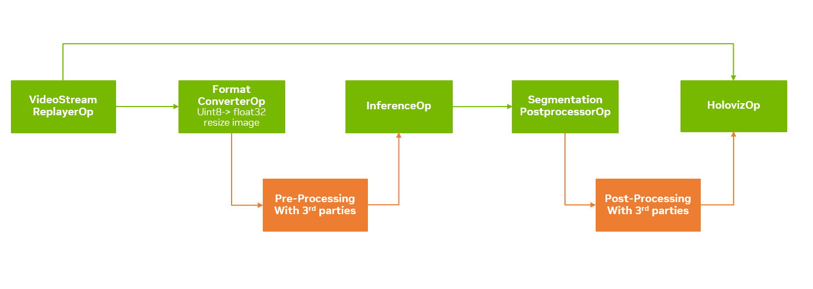

# Best Practices to integrate external libraries into Holoscan pipelines

The Holoscan SDK is part of NVIDIA Holoscan, the AI sensor processing platform that combines hardware systems for low-latency sensor and network connectivity, optimized libraries for data processing and AI, and core microservices to run streaming, imaging, and other applications, from embedded to edge to cloud. It can be used to build streaming AI pipelines for a variety of domains, including medical devices, high-performance computing at the edge, industrial inspection, and more.

With the Holoscan SDK, one can develop an end-to-end GPU-accelerated pipeline with RDMA support. However, with increasing requirements for pre-processing and post-processing beyond inference-only pipelines, integration with other powerful, GPU-accelerated libraries is needed.

<div align="center">

</div>

One of the key features of the Holoscan SDK is its seamless interoperability with other libraries.

This tutorial explains how to leverage this capability in your applications.
For detailed examples of integrating various libraries with Holoscan applications, refer to the following sections:
- Tensor Interoperability
  - [Integrate **MatX** library](#integrate-matx-library) - DLPack support in C++
  - [Integrate RAPIDS **cuCIM** library](#integrate-rapids-cucim-library)
  - [Integrate **CV-CUDA** library](#integrate-cv-cuda-library)
  - [Integrate **OpenCV with CUDA Module**](#integrate-opencv-with-cuda-module)
  - [Integrate **PyTorch** library](#integrate-pytorch-library)
- CUDA Interoperability
  - [Integrate **CUDA Python** library](#integrate-cuda-python-library)
  - [Integrate **CuPy** library](#integrate-cupy-library)

## Interoperability Features

### DLPack Support

The Holoscan SDK supports [DLPack](https://dmlc.github.io/dlpack/latest/), enabling efficient data exchange between deep learning frameworks.

### Array Interface Support

The SDK also supports the array interface, including:
- [`__array_interface__`](https://numpy.org/doc/stable/reference/arrays.interface.html)
- [`__cuda_array_interface__`](https://numba.readthedocs.io/en/stable/cuda/cuda_array_interface.html)

This allows for seamless integration with various Python libraries such as:
- [CuPy](https://docs.cupy.dev/en/stable/user_guide/interoperability.html)
- [PyTorch](https://github.com/pytorch/pytorch/issues/15601)
- [JAX](https://github.com/jax-ml/jax/issues/1100#issuecomment-580773098)
- [TensorFlow](https://github.com/tensorflow/community/pull/180)
- [Numba](https://numba.readthedocs.io/en/stable/cuda/cuda_array_interface.html)

### Technical Details

The `Tensor` class is a wrapper around the `DLManagedTensorContext` struct, which holds the `DLManagedTensor` object (a [DLPack structure](https://dmlc.github.io/dlpack/latest/c_api.html#c.DLManagedTensor)).

For more information on interoperability, refer to the following sections in the Holoscan SDK documentation:
- [Interoperability between GXF and native C++ operators](https://docs.nvidia.com/holoscan/sdk-user-guide/holoscan_create_operator.html#interoperability-between-gxf-and-native-c-operators)
- [Interoperability between wrapped and native Python operators](https://docs.nvidia.com/holoscan/sdk-user-guide/holoscan_create_operator.html#interoperability-between-wrapped-and-native-python-operators)

### CUDA Array Interface/DLPack Support

The following Python libraries have adopted the [CUDA Array Interface](https://numba.readthedocs.io/en/stable/cuda/cuda_array_interface.html#interoperability) and/or [DLPack](https://dmlc.github.io/dlpack/latest/) standards, enabling seamless interoperability with Holoscan Tensors:

- [CuPy](https://docs.cupy.dev/en/stable/user_guide/interoperability.html)
- [CV-CUDA](https://github.com/CVCUDA/CV-CUDA)
- [PyTorch](https://pytorch.org/)
- [Numba](https://numba.readthedocs.io/en/stable/user/5minguide.html)
- [PyArrow](https://arrow.apache.org/docs/python/generated/pyarrow.cuda.Context.html#pyarrow.cuda.Context.buffer_from_object)
- [mpi4py](https://mpi4py.readthedocs.io/en/latest/overview.html#support-for-cuda-aware-mpi)
- [ArrayViews](https://github.com/xnd-project/arrayviews)
- [JAX](https://jax.readthedocs.io/en/latest/index.html)
- [PyCUDA](https://documen.tician.de/pycuda/tutorial.html#interoperability-with-other-libraries-using-the-cuda-array-interface)
- [DALI: the NVIDIA Data Loading Library](https://github.com/NVIDIA/DALI) :
  - [TensorGPU objects](https://docs.nvidia.com/deeplearning/dali/user-guide/docs/data_types.html#nvidia.dali.backend.TensorGPU) expose the CUDA Array Interface.
  - [The External Source operator](https://docs.nvidia.com/deeplearning/dali/user-guide/docs/supported_ops.html#nvidia.dali.fn.external_source) consumes objects exporting the CUDA Array Interface.
- The RAPIDS stack:
  - [cuCIM](https://github.com/rapidsai/cucim)
  - [cuDF](https://docs.rapids.ai/api/cudf/stable/user_guide/10min/)
  - [cuML](https://docs.rapids.ai/api/cuml/nightly/)
  - [cuSignal](https://github.com/rapidsai/cusignal)
  - [RMM](https://docs.rapids.ai/api/rmm/stable/guide/)

For more details on using the CUDA Array Interface and DLPack with various libraries, see [CuPy's Interoperability guide](https://docs.cupy.dev/en/stable/user_guide/interoperability.html#).

### Using Holoscan Tensors in Python

The Holoscan SDK's Python API provides the `holoscan.as_tensor()` method to convert objects supporting the (CUDA) Array Interface or DLPack to a Holoscan Tensor. The `holoscan.Tensor` object itself also supports these interfaces, allowing for easy integration with compatible libraries.

Example usage:

```python
import cupy as cp
import numpy as np
import torch
import holoscan as hs

# Create tensors using different libraries
torch_cpu_tensor = torch.tensor([[1, 2, 3], [4, 5, 6]])
torch_gpu_tensor = torch.tensor([[1, 2, 3], [4, 5, 6]], device="cuda")
numpy_tensor = np.array([[1, 2, 3], [4, 5, 6]])
cupy_tensor = cp.array([[1, 2, 3], [4, 5, 6]])

# Convert to Holoscan Tensors
torch_cpu_to_holoscan = hs.as_tensor(torch_cpu_tensor)
torch_gpu_to_holoscan = hs.as_tensor(torch_gpu_tensor)
numpy_to_holoscan = hs.as_tensor(numpy_tensor)
cupy_to_holoscan = hs.as_tensor(cupy_tensor)
```

## Tensor Interoperability

### Integrate MatX library

[MatX library (An efficient C++17 GPU numerical computing library with Python-like syntax)](https://github.com/NVIDIA/MatX) is an open-source, efficient C++17 GPU numerical computing library created by NVIDIA. It provides a NumPy-like interface for GPU-accelerated numerical computing, enabling developers to write high-performance, GPU-accelerated code with ease.

#### Installation

MatX is a header-only library. Using it in your own projects is as simple as including only the core `matx.h` file.

Please refer to the [MatX documentation](https://nvidia.github.io/MatX/build.html) for detailed instructions on building and using the MatX library.

The following is a sample CMakeLists.txt file for a project that uses MatX:

```
cmake_minimum_required(VERSION 3.20)
project(my_app CXX)

# Holoscan
find_package(holoscan 2.2 REQUIRED CONFIG
             PATHS "/opt/nvidia/holoscan" "/workspace/holoscan-sdk/install")

# Enable cuda language
set(CMAKE_CUDA_ARCHITECTURES "70;80")
enable_language(CUDA)

# Download MatX (from 'main' branch)
include(FetchContent)
FetchContent_Declare(
  MatX
  GIT_REPOSITORY https://github.com/NVIDIA/MatX.git
  GIT_TAG main
)
FetchContent_MakeAvailable(MatX)

add_executable(my_app
  my_app.cpp
)

target_link_libraries(my_app
  PRIVATE
  holoscan::core
  # ...
  matx::matx
)

```

#### Sample code

The following are the sample applications that use the MatX library to integrate with Holoscan SDK.

- [Multi AI Application with SSD Detection and MONAI Endoscopic Tool Segmentation](https://github.com/nvidia-holoscan/holohub/tree/main/applications/multiai_endoscopy)
  - `applications/multiai_endoscopy`
- [Network Radar Pipeline](https://github.com/nvidia-holoscan/holohub/tree/main/applications/network_radar_pipeline/cpp)
  - `applications/network_radar_pipeline/cpp`
- [Simple Radar Pipeline Application](https://github.com/nvidia-holoscan/holohub/tree/main/applications/simple_radar_pipeline/cpp)
  - `applications/simple_radar_pipeline/cpp`

**On the GPU**

- <https://github.com/nvidia-holoscan/holohub/blob/main/applications/multiai_endoscopy/cpp/post-proc-matx-gpu/multi_ai.cu>

```cpp
#include <holoscan/holoscan.hpp>
#include <matx.h>

// ...

void compute(InputContext& op_input, OutputContext& op_output,
             ExecutionContext& context) override {
  // Get input message and make output message
  auto in_message = op_input.receive<gxf::Entity>("in").value();
  // ...
  auto boxes = in_message.get<Tensor>("inference_output_detection_boxes");
  auto scores = in_message.get<Tensor>("inference_output_detection_scores");
  int32_t Nb = scores->shape()[1];  // Number of boxes
  auto Nl = matx::make_tensor<int>({});  // Number of label boxes
  // ...
  auto boxesl_mx = matx::make_tensor<float>({1, Nl(), 4});
  (boxesl_mx = matx::remap<1>(boxes_ix_mx, ixl_mx)).run();
  // ...
  // Holoscan tensors to MatX tensors
  auto boxes_mx = matx::make_tensor<float>((float*)boxes->data(), {1, Nb, 4});
  // ...
  // MatX to Holoscan tensor
  auto boxes_hs = std::make_shared<holoscan::Tensor>(boxesls_mx.GetDLPackTensor());
  // ...
}
```

**On the CPU**

- <https://github.com/nvidia-holoscan/holohub/blob/main/applications/multiai_endoscopy/cpp/post-proc-matx-cpu/multi_ai.cpp>

MatX library usage on the CPU is similar to the GPU version, but the `run()` function is called with `matx::SingleThreadHostExecutor()` to run the operation on the CPU.

```cpp
#include <holoscan/holoscan.hpp>
#include <matx.h>

// ...

void compute(InputContext& op_input, OutputContext& op_output,
             ExecutionContext& context) override {
  // Get input message and make output message
  auto in_message = op_input.receive<gxf::Entity>("in").value();
  // ...
  auto boxesh = in_message.get<Tensor>("inference_output_detection_boxes");  // (1, num_boxes, 4)
  auto scoresh = in_message.get<Tensor>("inference_output_detection_scores");  // (1, num_boxes)
  int32_t Nb = scoresh->shape()[1];  // Number of boxes
  auto Nl = matx::make_tensor<int>({});  // Number of label boxes
  // ...
  auto boxes = copy_device2vec<float>(boxesh);
  // Holoscan tensors to MatX tensors
  auto boxes_mx = matx::make_tensor<float>(boxes.data(), {1, Nb, 4});
  // ...
  auto boxesl_mx = matx::make_tensor<float>({1, Nl(), 4});
  (boxesl_mx = matx::remap<1>(boxes_ix_mx, ixl_mx)).run(matx::SingleThreadHostExecutor());
  // ...
  // MatX to Holoscan tensor
  auto boxes_hs = std::make_shared<holoscan::Tensor>(boxesls_mx.GetDLPackTensor());
  // ...
}
```

### Integrate RAPIDS cuCIM library

[RAPIDS cuCIM](https://github.com/rapidsai/cucim) (Compute Unified Device Architecture Clara IMage) is an open-source, accelerated computer vision and image processing software library for multidimensional images used in biomedical, geospatial, material and life science, and remote sensing use cases.

See the supported Operators in [cuCIM documentation](https://docs.rapids.ai/api/cucim/stable/).

cuCIM offers interoperability with CuPy. We can initialize CuPy arrays directly from Holoscan Tensors and use the arrays in cuCIM operators for processing without memory transfer between host and device.

#### Installation

Follow the [cuCIM documentation](https://github.com/rapidsai/cucim?tab=readme-ov-file#install-cucim) to install the RAPIDS cuCIM library.

#### Sample code

```py
import cupy as cp
import cucim.skimage.exposure as cu_exposure
from cucim.skimage.util import img_as_ubyte
from cucim.skimage.util import img_as_float

def CustomizedcuCIMOperator(Operator):
    ### Other implementation of __init__, setup()... etc.

    def compute(self, op_input, op_output, context):
        message = op_input.receive("input_tensor")
        input_tensor = message.get()
        # Directly use Holoscan tensor to initialize CuPy array
        cp_array = cp.asarray(input_tensor)

        cp_array = img_as_float(cp_array)
        cp_res=cu_exposure.equalize_adapthist(cp_array)
        cp_array = img_as_ubyte(cp_res)

        # Emit CuPy array memory as an item in a `holoscan.TensorMap`
        op_output.emit(dict(out_tensor=cp_array), "out")

```

### Integrate CV-CUDA library

[CV-CUDA](https://github.com/CVCUDA/CV-CUDA) is an open-source, graphics processing unit (GPU)-accelerated library for cloud-scale image processing and computer vision developed jointly by NVIDIA and the ByteDance Applied Machine Learning teams. CV-CUDA helps developers build highly efficient pre- and post-processing pipelines that can improve throughput by more than 10x while lowering cloud computing costs.

See the supported CV-CUDA Operators in the [CV-CUDA developer guide](https://github.com/CVCUDA/CV-CUDA/blob/main/DEVELOPER_GUIDE.md)

#### Installation

Follow the [CV-CUDA documentation](https://cvcuda.github.io/CV-CUDA/installation.html) to install the CV-CUDA library.

Requirement: CV-CUDA >= 0.2.1 (From which version DLPack interop is supported)

#### Sample code

CV-CUDA is implemented with DLPack standards. A CV-CUDA tensor can directly access a Holoscan Tensor.

Refer to the [Holoscan CV-CUDA sample application](https://github.com/nvidia-holoscan/holohub/tree/main/applications/cvcuda_basic) for an example of how to use CV-CUDA with Holoscan SDK.

```py
import cvcuda

class CustomizedCVCUDAOp(Operator):
    def __init__(self, *args, **kwargs):

        # Need to call the base class constructor last
        super().__init__(*args, **kwargs)

    def setup(self, spec: OperatorSpec):
        spec.input("input_tensor")
        spec.output("output_tensor")

    def compute(self, op_input, op_output, context):
        message = op_input.receive("input_tensor")
        input_tensor = message.get()

        cvcuda_input_tensor = cvcuda.as_tensor(input_tensor,"HWC")

        cvcuda_resize_tensor = cvcuda.resize(
                    cvcuda_input_tensor,
                    (
                        640,
                        640,
                        3,
                    ),
                    cvcuda.Interp.LINEAR,
                )

        buffer = cvcuda_resize_tensor.cuda()

        # Emits an `holoscan.TensorMap` with a single entry `out_tensor`
        op_output.emit(dict(out_tensor=buffer), "output_tensor")

```

### Integrate OpenCV with CUDA Module

[OpenCV](https://opencv.org/) (Open Source Computer Vision Library) is a comprehensive open-source library that contains over 2500 algorithms covering Image & Video Manipulation, Object and Face Detection, OpenCV Deep Learning Module and much more.

OpenCV also supports GPU [acceleration](https://docs.opencv.org/4.8.0/d2/dbc/cuda_intro.html) and includes a CUDA module which is a set of classes and functions to utilize CUDA computational capabilities. It is implemented using NVIDIA CUDA Runtime API and provides utility functions, low-level vision primitives, and high-level algorithms.

#### Installation

Prerequisites:
- OpenCV >= 4.8.0 (From which version, OpenCV GpuMat supports initialization with GPU Memory pointer)

Install OpenCV with its CUDA module following the guide in [opencv/opencv_contrib](https://github.com/opencv/opencv_contrib/tree/4.x)

We also recommend referring to the [Holoscan Endoscopy Depth Estimation application container](https://github.com/nvidia-holoscan/holohub/blob/main/applications/endoscopy_depth_estimation/Dockerfile) as an example of how to build an image with Holoscan SDK and OpenCV CUDA.

#### Sample code

The data type of OpenCV is GpuMat which implements neither the __cuda_array_interface__ nor the standard DLPack. To achieve the end-to-end GPU accelerated pipeline/application, we need to implement 2 functions to convert the GpuMat to CuPy array which can be accessed directly with Holoscan Tensor and vice versa.

Refer to the [Holoscan Endoscopy Depth Estimation sample application](https://github.com/nvidia-holoscan/holohub/tree/main/applications/cvcuda_basic) for an example of how to use the OpenCV operator with Holoscan SDK.

1. Conversion from GpuMat to CuPy Array

The GpuMat object of OpenCV Python bindings provides a cudaPtr method that can be used to access the GPU memory address of a GpuMat object. This memory pointer can be utilized to initialize a CuPy array directly, allowing for efficient data handling by avoiding unnecessary data transfers between the host and device.

Refer to the function below, which is used to create a CuPy array from a GpuMat. For more details, see the source code in [holohub/applications/endoscopy_depth_estimation-gpumat_to_cupy](https://github.com/nvidia-holoscan/holohub/blob/main/applications/endoscopy_depth_estimation/endoscopy_depth_estimation.py#L52).

```py
import cv2
import cupy as cp

def gpumat_to_cupy(gpu_mat: cv2.cuda.GpuMat) -> cp.ndarray:
    w, h = gpu_mat.size()
    size_in_bytes = gpu_mat.step * w
    shapes = (h, w, gpu_mat.channels())
    assert gpu_mat.channels() <=3, "Unsupported GpuMat channels"

    dtype = None
    if gpu_mat.type() in [cv2.CV_8U,cv2.CV_8UC1,cv2.CV_8UC2,cv2.CV_8UC3]:
        dtype = cp.uint8
    elif gpu_mat.type() == cv2.CV_8S:
        dtype = cp.int8
    elif gpu_mat.type() == cv2.CV_16U:
        dtype = cp.uint16
    elif gpu_mat.type() == cv2.CV_16S:
        dtype = cp.int16
    elif gpu_mat.type() == cv2.CV_32S:
        dtype = cp.int32
    elif gpu_mat.type() == cv2.CV_32F:
        dtype = cp.float32
    elif gpu_mat.type() == cv2.CV_64F:
        dtype = cp.float64

    assert dtype is not None, "Unsupported GpuMat type"

    mem = cp.cuda.UnownedMemory(gpu_mat.cudaPtr(), size_in_bytes, owner=gpu_mat)
    memptr = cp.cuda.MemoryPointer(mem, offset=0)
    cp_out = cp.ndarray(
        shapes,
        dtype=dtype,
        memptr=memptr,
        strides=(gpu_mat.step, gpu_mat.elemSize(), gpu_mat.elemSize1()),
    )
    return cp_out

```

Note: In this function, we used the [UnownedMemory](https://docs.cupy.dev/en/stable/reference/generated/cupy.cuda.UnownedMemory.html#cupy.cuda.UnownedMemory) API to create the CuPy array. In some cases, the OpenCV operators will allocate new device memory which needs to be handled by CuPy and the lifetime is not limited to one operator but the whole pipeline. In this case, the CuPy array initiated from the GpuMat shall know the owner and keep the reference to the object. Check the CuPy documentation for more details on [CuPy interoperability](https://docs.cupy.dev/en/stable/user_guide/interoperability.html#device-memory-pointers).

2. Conversion from Holoscan Tensor to GpuMat via CuPy array

With the release of OpenCV 4.8, the Python bindings for OpenCV now support the initialization of GpuMat objects directly from GPU memory pointers. This capability facilitates more efficient data handling and processing by allowing direct interaction with GPU-resident data, bypassing the need for data transfer between host and device memory.

Within pipeline applications based on Holoscan SDK, the GPU Memory pointer can be obtained through the `__cuda_array_interface__` interface provided by CuPy arrays.

Refer to the functions outlined below for creating GpuMat objects utilizing CuPy arrays. For a detailed implementation, see the source code provided in [holohub/applications/endoscopy_depth_estimation-gpumat_from_cp_array](https://github.com/nvidia-holoscan/holohub/blob/main/applications/endoscopy_depth_estimation/endoscopy_depth_estimation.py#L28).

```py
import cv2
import cupy as cp
import holoscan as hs
from holoscan.gxf import Entity

def gpumat_from_cp_array(arr: cp.ndarray) -> cv2.cuda.GpuMat:
    assert len(arr.shape) in (2, 3), "CuPy array must have 2 or 3 dimensions to be a valid GpuMat"
    type_map = {
        cp.dtype('uint8'): cv2.CV_8U,
        cp.dtype('int8'): cv2.CV_8S,
        cp.dtype('uint16'): cv2.CV_16U,
        cp.dtype('int16'): cv2.CV_16S,
        cp.dtype('int32'): cv2.CV_32S,
        cp.dtype('float32'): cv2.CV_32F,
        cp.dtype('float64'): cv2.CV_64F
    }
    depth = type_map.get(arr.dtype)
    assert depth is not None, "Unsupported CuPy array dtype"
    channels = 1 if len(arr.shape) == 2 else arr.shape[2]
    mat_type = depth + ((channels - 1) << 3)

     mat = cv2.cuda.createGpuMatFromCudaMemory(
      arr.__cuda_array_interface__['shape'][1::-1],
      mat_type,
      arr.__cuda_array_interface__['data'][0]
  )
    return mat
```

3. Integrate OpenCV Operators inside customized Operator

The demonstration code is provided below. For the complete source code, please refer to the [holohub/applications/endoscopy_depth_estimation-customized Operator](https://github.com/nvidia-holoscan/holohub/blob/main/applications/endoscopy_depth_estimation/endoscopy_depth_estimation.py#L161).

```py
   def compute(self, op_input, op_output, context):
        stream = cv2.cuda_Stream()
        message = op_input.receive("in")

        cp_frame = cp.asarray(message.get(""))  # CuPy array
        cv_frame = gpumat_from_cp_array(cp_frame)  # GPU OpenCV mat

        ## Call OpenCV Operator
        cv_frame = cv2.cuda.XXX(hsv_merge, cv2.COLOR_HSV2RGB)

        cp_frame = gpumat_to_cupy(cv_frame)
        cp_frame = cp.ascontiguousarray(cp_frame)

        op_output.emit(dict(out_tensor=cp_frame), "out")
```

### Integrate PyTorch library

[PyTorch](https://pytorch.org/) is a popular open-source machine learning library developed by Facebook's AI Research lab. It provides a flexible and dynamic computational graph that allows for easy model building and training. PyTorch also supports GPU acceleration, making it ideal for deep learning applications that require high-performance computing.

Since PyTorch tensors support the array interface and DLPack ([link](https://github.com/pytorch/pytorch/issues/15601)), they can be interoperable with other array/tensor objects including Holoscan Tensors.

#### Installation

Follow the [PyTorch documentation](https://pytorch.org/) to install the PyTorch library.

e.g., for CUDA 12.x with pip:

```bash
python3 -m pip install torch torchvision torchaudio
```

#### Sample code

The following is a sample application that demonstrates how to use PyTorch with Holoscan SDK:

```py
import torch

def CustomizedTorchOperator(Operator):
    ### Other implementation of __init__, setup()... etc.

    def compute(self, op_input, op_output, context):
        message = op_input.receive("input_tensor")
        input_tensor = message.get()
        # Directly use Holoscan tensor to initialize PyTorch tensor
        torch_tensor = torch.as_tensor(input_tensor, device="cuda")

        torch_tensor *= 2

        # Emit PyTorch tensor memory as a `holoscan.Tensor` item in a `holoscan.TensorMap`
        op_output.emit(dict(out_tensor=torch_tensor), "out")
```

## CUDA Interoperability

### Integrate CUDA Python library

[CUDA Python](https://developer.nvidia.com/cuda-python) is a Python library that provides Cython/Python wrappers for CUDA driver and runtime APIs. It offers a convenient way to leverage GPU acceleration for complex computations, making it ideal for high-performance applications that require intensive numerical processing.

When using CUDA Python with the Holoscan SDK, you need to use the Primary context ([CUDA doc link](https://docs.nvidia.com/cuda/cuda-runtime-api/group__CUDART__DRIVER.html#group__CUDART__DRIVER)) by calling `cuda.cuDevicePrimaryCtxRetain()` ([link](https://nvidia.github.io/cuda-python/cuda-core).

Since the Holoscan Operator is executed in an arbitrary non-main thread, you may need to set the CUDA context using the [cuda.cuCtxSetCurrent()](https://nvidia.github.io/cuda-python/cuda-core) method in the `Operator.compute()` method.

#### Installation

Follow the instructions in the [CUDA Python documentation](https://nvidia.github.io/cuda-python/cuda-core/latest/install.html) to install the CUDA Python library.

CUDA Python can be installed using `pip`:

```bash
python3 -m pip install cuda-python
```

#### Sample code

Please see the example application ([cuda_example.py](cuda_example.py)) that demonstrates how to use CUDA Python with the Holoscan SDK.

In this example, we define a `CudaOperator` class that encapsulates the CUDA context, stream, and memory management. The `CudaOperator` class provides methods for allocating device memory, building CUDA kernels, launching kernels, and cleaning up. We also define three operators: `CudaTxOp`, `ApplyGainOp`, and `CudaRxOp`, which perform data initialization, apply a gain operation, and process the output data, respectively. The output of the `CudaRxOp` operator is passed to both a `ProbeOp` operator, which inspects the data and prints the metadata information, and a `HolovizOp` operator, which visualizes the data using the Holoviz module.

There are four examples in the `CudaRxOp.compute()` method that demonstrate different ways to handle data conversion and transfer between tensor libraries. These examples include creating 1) a NumPy array from CUDA memory, 2) converting a NumPy array to a CuPy array, 3) creating a CUDA array interface object, and 4) creating a CuPy array from CUDA memory.

`__cuda_array_interface__` is a dictionary that provides a standard interface for exchanging array data between different libraries in Python. It contains metadata such as the shape, data type, and memory location of the array. By using this interface, you can efficiently transfer tensor data between two libraries without copying the data.

In the following example, we create a `CudaArray` class to represent a CUDA array interface object and populate it with the necessary metadata. This object can then be passed to the `op_output.emit()` method to transfer the data to downstream operators.

In the `__cuda_array_interface__` dictionary, the `stream` field is the CUDA stream associated with the data. When passing a `cuda.cuda.CUstream` object (the variable named `stream`) to the `stream` field, you need to convert it to an integer using `int(stream)`:

```python
class CudaRxOp(CudaOperator):
    # ...
    def compute(self, op_input, op_output, context):
        # ...
        class CudaArray:
            """Class to represent a CUDA array interface object."""

            pass

        cuda_array = CudaArray()

        # Reference: https://numba.readthedocs.io/en/stable/cuda/cuda_array_interface.html
        cuda_array.__cuda_array_interface__ = {
            "shape": (self._frame_height, self._frame_width, self._frame_channels),
            "typestr": np.dtype(np.uint8).str,  # "|u1"
            "descr": [("", np.dtype(np.uint8).str)],
            "stream": int(stream),
            "version": 3,
            "strides": None,
            "data": (int(value), False),
        }
        # ...
```

Please don't confuse this with the `cuda.cuda.CUstream.getPtr()` method. If you use the `stream.getPtr()` method, it will return a pointer to the CUDA stream object, not the stream ID. To get the stream ID, you need to convert the `stream` object to an integer using `int(stream)`. Otherwise, you will get an error that is difficult to debug, like this:

```bash
[error] [tensor.cpp:479] Runtime call "Failure during call to cudaEventRecord" in line 479 of file ../python/holoscan/core/tensor.cpp failed with 'context is destroyed' (709)
[error] [gxf_wrapper.cpp:84] Exception occurred for operator: 'rx' - RuntimeError: Error occurred in CUDA runtime API call
```

### Integrate CuPy library

[CuPy](https://cupy.dev/) is an open-source array library for GPU-accelerated computing with a NumPy-compatible API. It provides a convenient way to perform high-performance numerical computations on NVIDIA GPUs, making it ideal for applications that require efficient data processing and manipulation.

#### Installation

CuPy can be installed using `pip`:

```bash
python3 -m pip install cupy-cuda12x  # for CUDA v12.x
```

For more detailed installation instructions, refer to the [CuPy documentation](https://docs.cupy.dev/en/stable/install.html).

#### Sample code

Please see the example application ([cupy_example.py](cupy_example.py)) that demonstrates how to use CuPy with the Holoscan SDK.

This example performs the same operations as the previous example but uses CuPy instead of [CUDA Python](#integrate-cuda-python-library). The `CudaOperator` class is modified to use CuPy arrays, and the `ApplyGainOp` operator is updated to use CuPy functions for array manipulation. The `CudaTxOp` and `CudaRxOp` operators are also updated to work with CuPy arrays.

With CuPy, you can conveniently perform GPU-accelerated computations on multidimensional arrays, making it an excellent choice for high-performance data processing tasks in Holoscan applications.

Please note that CuPy does not fully support certain CUDA APIs, such as `cupy.cuda.driver.occupancyMaxPotentialBlockSize()`. While the driver API may be available ([link](https://github.com/cupy/cupy/pull/2424)), it is currently undocumented ([link](https://docs.cupy.dev/en/stable/reference/cuda.html)) and lacks support for calling the API with RawKernel's pointer ([link](https://github.com/cupy/cupy/issues/2450)), or using CUDA Python's `cuda.cuOccupancyMaxPotentialBlockSize()` Driver API with CuPy-generated RawKernel functions.

Currently, direct assignment of a non-default CUDA stream to HolovizOp in Holoscan applications is not supported without utilizing the `holoscan.resources.CudaStreamPool` resource. CuPy also has limited support for custom stream management, necessitating reliance on the default stream in this context.

For more detailed information, please refer to the following resources:
- [New RawKernel Calling Convention / Kernel Occupancy Functions · Issue #3684 · cupy/cupy · GitHub](https://github.com/cupy/cupy/issues/3684)
- CUDA Stream Support:
  - [Enhancing stream support in CuPy's default memory pool · Issue #8068 · cupy/cupy](https://github.com/cupy/cupy/issues/8068)
  - [cupy.cuda.ExternalStream — CuPy 13.1.0 documentation](https://docs.cupy.dev/en/stable/reference/generated/cupy.cuda.ExternalStream.html)
