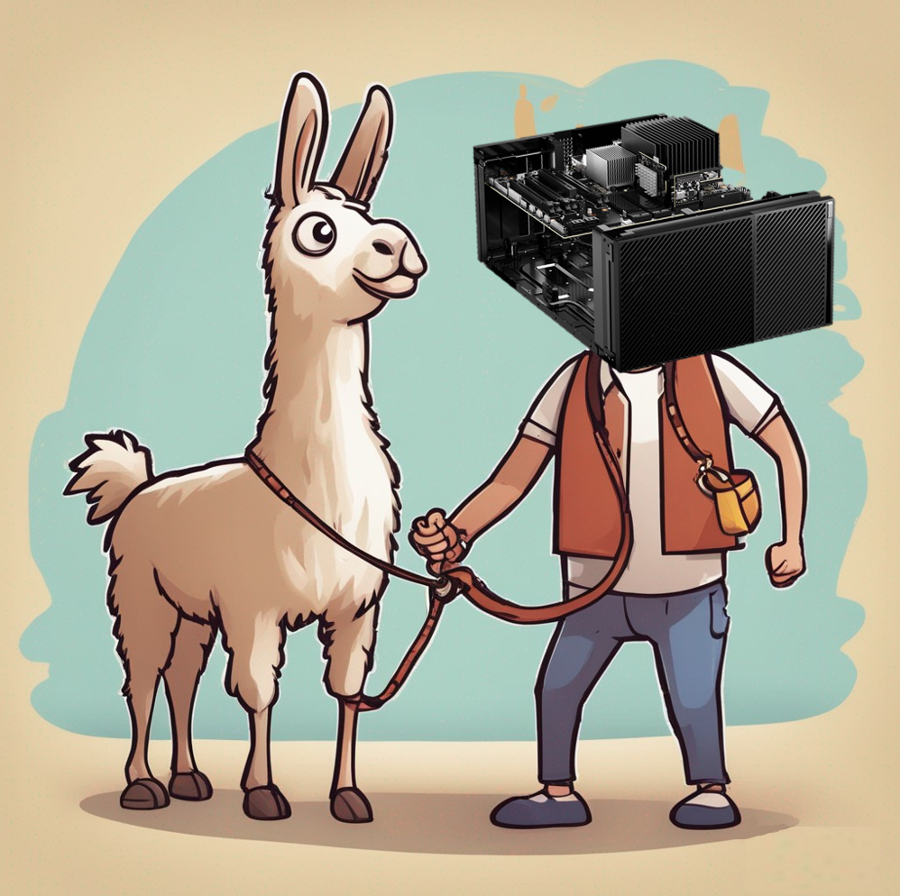
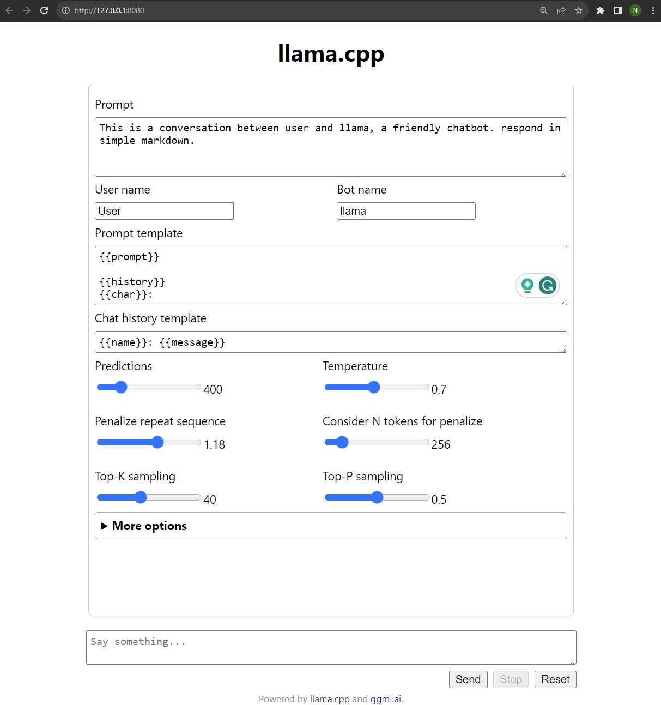
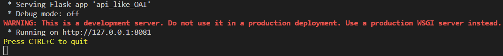
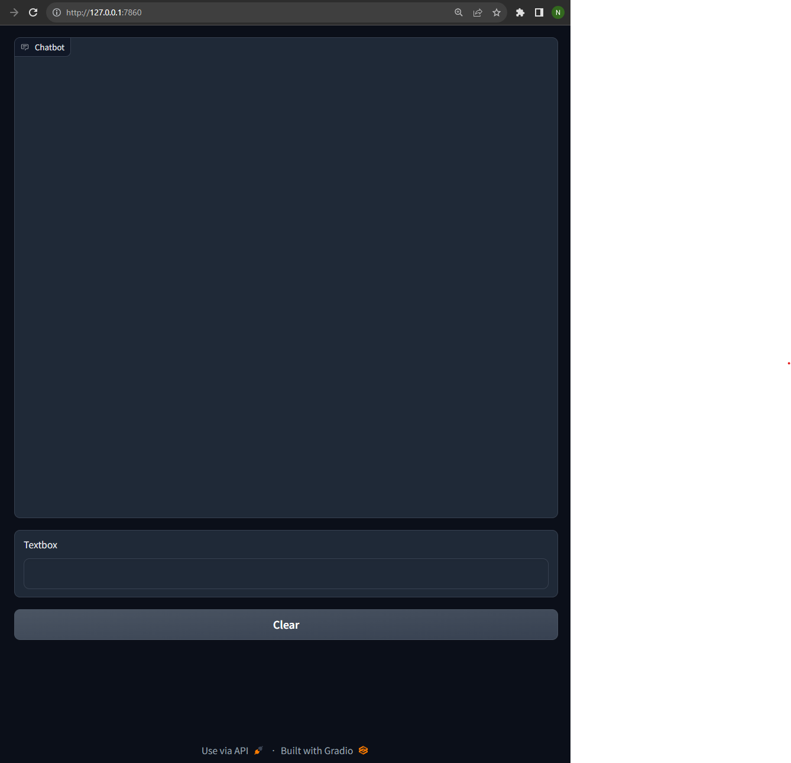

# Deploying Llama-2 70b model on the edge with IGX Orin

<div align="center">

</div>

## 🦙 Introduction

With the recent release of the [Llama-2](https://about.fb.com/news/2023/07/llama-2/) family of models, there has been an excess of excitement in the LLM community due to these models being released freely for research and commercial use. Upon their release, the 70b version of the Llama-2 model quickly rose to the top place on HuggingFace's [Open LLM Leaderboard](https://huggingface.co/spaces/HuggingFaceH4/open_llm_leaderboard). Additionally, thanks to the publishing of the model weights, fine-tuned versions of these models are consistently being released and raising the bar for the top performing open-LLM. This most recent release of Llama-2 provides some of the first legitimate open-source alternatives to the previously unparalleled performance of closed-source LLMs. This enables developers to deploy these Llama-2 models locally, and benefit from being able to use some of the most advanced LLMs ever created, while also keeping all of their data on their own host machines.

The only edge device that is capable of running the Llama-2 70b locally is the [NVIDIA IGX Orin](https://www.nvidia.com/en-us/edge-computing/products/igx/). In order to get the Llama-2 70b model running inference, all you need is an IGX Orin, a mouse, a keyboard, and to follow the tutorial below.

## 📖 Overview

This tutorial will walk you through how to run a quantized version of Meta's Llama-2 70b model as the backend LLM for a Gradio chatbot app, all running on an NVIDIA IGX Orin. Specifically, we will use [Llama.cpp](https://github.com/ggerganov/llama.cpp), a project that ports Llama models into C and C++ with CUDA acceleration, to load and run the quantized Llama-2 models. We will setup Llama.cpp's `api_like_OAI.py` Flask app that emulates the OpenAI API. This will then enable us to create a Gradio chatbot app that utilizes the popular OpenAI API Python library to interact with our local Llama-2 model. Thus, at the conclusion of this tutorial you will have a chatbot app that rivals the performance of closed-source models, while keeping all of your data local and running everything self-contained on an NVIDIA IGX Orin.

## 💻 Hardware Requirements
- [NVIDIA IGX Orin](https://www.nvidia.com/en-us/edge-computing/products/igx/) with:
  - RTX A6000 dGPU
  - 500 GB SSD

## 📦 Dependencies

- [NVIDIA Drivers](https://www.nvidia.com/download/index.aspx)
- [CUDA Toolkit](https://developer.nvidia.com/cuda-downloads) >= 11.8
- Python >= 3.8
- [`build-essential`](https://packages.ubuntu.com/focal/build-essential) apt package (gcc, g++, etc.)
- [Cmake](https://apt.kitware.com/) >= 3.17

## 🔨 Cloning and building Llama.cpp

1. Clone Llama.cpp:

    ```bash
    git clone https://github.com/ggerganov/llama.cpp.git
    ```

2. Checkout a stable commit of llama.cpp:

    ```bash
    cd llama.cpp
    git checkout e519621010cac02c6fec0f8f3b16cda0591042c0 # Commit date: 9/27/23
    ```

3. Follow [cuBLAS build instructions](https://github.com/ggerganov/llama.cpp/tree/master#cublas) for Llama.cpp to provide BLAS acceleration using the CUDA cores of your NVIDIA GPU.

    Navigate to the `/Llama.cpp` directory:
    ```bash
    cd llama.cpp
    ```
    Using `make`:
    ```bash
    make LLAMA_CUBLAS=1
    ```

By successfully executing these commands you will now be able to run Llama models on your local machine with BLAS acceleration!

## 💾 Downloading Llama-2 70B

In order to use Llama-2 70b as it is provided by Meta, you’d need 140 GB of VRAM (70b params x 2 bytes = 140 GB in FP16). However, by utilizing model quantization, we can reduce the computational and memory costs of running inference by representing the weights and activations as low-precision data types, like int8 and int4, instead of higher-precision data types like FP16 and FP32. To learn more about quantization, check out: The [Ultimate Guide to Deep Learning Model Quantization](https://deci.ai/quantization-and-quantization-aware-training/).

Llama.cpp uses quantized models that are stored in the GGUF format. Browse to [TheBloke](https://huggingface.co/TheBloke) on [Huggingface.co](https://huggingface.co/), who provides hundred of the latest quantized models. Feel free to choose a GGUF model that suits your needs. However, for this tutorial, we will use [*TheBloke's* 4-bit medium GGUF quantization](https://huggingface.co/TheBloke/Llama-2-70B-chat-GGUF) of Meta’s LLama-2-70B-Chat model.
1. Download the GGUF model from Huggingface.co.

:warning: This model requires ~43 GB of VRAM.

```bash
cd /media/m2 # Download the model to your SSD drive
mkdir models # Create a directory for GGUF models
cd models
wget https://huggingface.co/TheBloke/Llama-2-70B-chat-GGUF/resolve/main/llama-2-70b-chat.Q4_K_M.gguf
```

## 🤖 Running Llama-2 70B

1. Return to the home directory of Llama.cpp:

    ```bash
    cd <your_parent_dir>/llama.cpp
    ```

2. Run Llama.cpp’s example server application to set up a HTTP API server and a simple web front end to interact with our Llama model:

    ```bash
    ./server -m /media/m2/models/llama-2-70b-chat.Q4_K_M.gguf -ngl 1000 -c 4096 --alias llama_2
    ```

- `-m`: indicates the location of our model.
- `-ngl`: the number of layers to offload to the GPU (1000 ensures all layers are).
- `-c`: the size of the prompt context.
- `--alias`: name given to our model for access through the API.

After executing, you should see the below output indicating the model being loaded to VRAM and the specs of the model:
```bash
ggml_init_cublas: found 1 CUDA devices:
  Device 0: NVIDIA RTX A6000, compute capability 8.6
{"timestamp":1695853185,"level":"INFO","function":"main","line":1294,"message":"build info","build":1279,"commit":"e519621"}
{"timestamp":1695853185,"level":"INFO","function":"main","line":1296,"message":"system info","n_threads":6,"total_threads":12,"system_info":"AVX = 0 | AVX2 = 0 | AVX512 = 0 | AVX512_VBMI = 0 | AVX512_VNNI = 0 | FMA = 0 | NEON = 1 | ARM_FMA = 1 | F16C = 0 | FP16_VA = 0 | WASM_SIMD = 0 | BLAS = 1 | SSE3 = 0 | SSSE3 = 0 | VSX = 0 | "}
llama_model_loader: loaded meta data with 19 key-value pairs and 723 tensors from /media/m2/models/llama-2-70b-chat.Q4_K_M.gguf (version GGUF V2 (latest))
**Verbose llama_model_loader output removed for conciseness**
llm_load_print_meta: format         = GGUF V2 (latest)
llm_load_print_meta: arch           = llama
llm_load_print_meta: vocab type     = SPM
llm_load_print_meta: n_vocab        = 32000
llm_load_print_meta: n_merges       = 0
llm_load_print_meta: n_ctx_train    = 4096
llm_load_print_meta: n_ctx          = 4096
llm_load_print_meta: n_embd         = 8192
llm_load_print_meta: n_head         = 64
llm_load_print_meta: n_head_kv      = 8
llm_load_print_meta: n_layer        = 80
llm_load_print_meta: n_rot          = 128
llm_load_print_meta: n_gqa          = 8
llm_load_print_meta: f_norm_eps     = 0.0e+00
llm_load_print_meta: f_norm_rms_eps = 1.0e-05
llm_load_print_meta: n_ff           = 28672
llm_load_print_meta: freq_base      = 10000.0
llm_load_print_meta: freq_scale     = 1
llm_load_print_meta: model type     = 70B
llm_load_print_meta: model ftype    = mostly Q4_K - Medium
llm_load_print_meta: model params   = 68.98 B
llm_load_print_meta: model size     = 38.58 GiB (4.80 BPW)
llm_load_print_meta: general.name   = LLaMA v2
llm_load_print_meta: BOS token = 1 '<s>'
llm_load_print_meta: EOS token = 2 '</s>'
llm_load_print_meta: UNK token = 0 '<unk>'
llm_load_print_meta: LF token  = 13 '<0x0A>'
llm_load_tensors: ggml ctx size =    0.23 MB
llm_load_tensors: using CUDA for GPU acceleration
llm_load_tensors: mem required  =  140.86 MB (+ 1280.00 MB per state)
llm_load_tensors: offloading 80 repeating layers to GPU
llm_load_tensors: offloading non-repeating layers to GPU
llm_load_tensors: offloading v cache to GPU
llm_load_tensors: offloading k cache to GPU
llm_load_tensors: offloaded 83/83 layers to GPU
llm_load_tensors: VRAM used: 40643 MB
....................................................................................................
llama_new_context_with_model: kv self size  = 1280.00 MB
llama_new_context_with_model: compute buffer total size =  561.47 MB
llama_new_context_with_model: VRAM scratch buffer: 560.00 MB

llama server listening at http://127.0.0.1:8080

{"timestamp":1695853195,"level":"INFO","function":"main","line":1602,"message":"HTTP server listening","hostname":"127.0.0.1","port":8080}
```

Now, you can interact with the simple web front end by browsing to http://127.0.0.1:8080. Use the provided chat interface to query the Llama-2 model and experiment with manipulating the provided hyperparameters to tune the responses to your liking.

<div align="center">

</div>

## 🖥️ Setting up a local OpenAI server

Llama.cpp includes a nifty Flask app `api_like_OAI.py`. This Flask app sets up a server that emulates the OpenAI API. Its trick is that it converts the OpenAI API requests into the format expected by the Llama model, and forwards the captured requests to our local Llama-2 model. This allows you to use the popular OpenAI Python backend, and thus, countless powerful LLM libraries like [LangChain](https://python.langchain.com/docs/tutorials/#get-started), [Scikit-LLM](https://github.com/iryna-kondr/scikit-llm), [Haystack](https://haystack.deepset.ai/), and more. However, instead of your data being sent to OpenAI’s servers, it is all processed locally on your machine!

1. In order to run the OpenAI API server and our eventual Gradio chat app, we need to open a new terminal and install a few Python dependencies:

    ```bash
    cd tutorials/local-llama
    pip install -r requirements.txt
    ```

2. This then allows us to run the Flask server:

    ```bash
    cd <your_parent_dir>/llama.cpp/examples/server/
    python api_like_OAI.py
    ```

3. The server should begin running almost immediately and give you the following output:

<div align="center">

</div>

## 💬 Creating the Gradio Chat App

1. Create a new project directory and a `chatbot.py` file that contains the following code:

    ```python
    import gradio as gr
    import openai

    # Indicate we'd like to send the request
    # to our local model, not OpenAI's servers
    openai.api_base = "http://127.0.0.1:8081"
    openai.api_key = ""


    def to_oai_chat(history):
        """Converts the gradio chat history format to
        the OpenAI chat history format:

        Gradio format: ['<user message>', '<bot message>']
        OpenAI format: [{'role': 'user', 'content': '<user message>'},
                        {'role': 'assistant', 'content': '<bot_message>'}]

        Additionally, this adds the 'system' message to the chat to tell the
        assistant how to act.
        """
        chat = [
            {
                "role": "system",
                "content": "You are a helpful AI Assistant who ends all of your responses with </BOT>",
            }
        ]

        for msg_pair in history:
            if msg_pair[0]:
                chat.append({"role": "user", "content": msg_pair[0]})
            if msg_pair[1]:
                chat.append({"role": "assistant", "content": msg_pair[1]})
        return chat


    with gr.Blocks() as demo:
        chatbot = gr.Chatbot(height=650)
        msg = gr.Textbox()
        clear = gr.Button("Clear")

        def user(user_message, history):
            """Appends a submitted question to the history"""
            return "", history + [[user_message, None]]

        def bot(history):
            """Sends the chat history to our Llama-2 model server
            so that the model can respond appropriately
            """
            # Gradio chat -> OpenAI chat
            oai_chat = to_oai_chat(history)

            # Send chat history to our Llama-2 server
            response = openai.ChatCompletion.create(
                messages=oai_chat,
                stream=True,
                model="llama_2",
                temperature=0,
                # Used to stop runaway responses
                stop=["</BOT>"],
            )

            history[-1][1] = ""
            for response_chunk in response:
                # Filter through meta-data in the HTTP response to get response text
                next_token = response_chunk["choices"][0]["delta"].get("content")
                if next_token:
                    history[-1][1] += next_token
                    # Update the Gradio app with the streamed response
                    yield history

        msg.submit(user, [msg, chatbot], [msg, chatbot], queue=False).then(bot, chatbot, chatbot)
        clear.click(lambda: None, None, chatbot, queue=False)

    demo.queue()
    demo.launch()
    ```

2. Begin running the Gradio chat app:

    ```bash
    python chatbot.py
    ```

3. The chat app should now be accessible at http://127.0.0.1:7860:

<div align="center">

</div>

You're now set up to interact with the Llama-2 70b model, with everything running locally! If you want to take this project further, you can experiment with different system messages to suit your needs or add the ability to interact with your local documents using frameworks like LangChain. Enjoy experimenting!
## Sources:
- https://huggingface.co/meta-llama/Llama-2-70b-chat-hf/tree/main
- https://huggingface.co/docs/optimum/concept_guides/quantization
- https://deci.ai/quantization-and-quantization-aware-training/
- https://www.gradio.app/guides/creating-a-custom-chatbot-with-blocks#add-streaming-to-your-chatbot
