# Interoperability between Holoscan and a Windows Application on a Single Machine

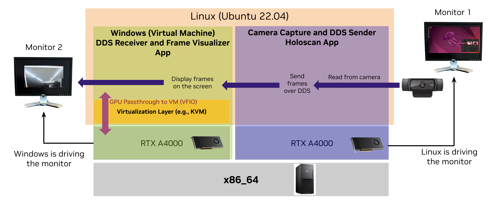

## Overview

This tutorial enables Holoscan and Windows applications to run concurrently on the same machine or node.

## Table of Contents

- [Description](#description)
- [Platform Requirements](#platform-requirements)
- [Windows VM Setup Instructions](#windows-vm-setup-instructions)
  - [Software Pre-requisites](#software-pre-requisites)
  - [GPU Passthrough](#gpu-passthrough)
	- [Two Different GPUs (e.g., RTX A4000 and RTX A6000)](#two-different-gpus-eg-rtx-a4000-and-rtx-a6000)
	- [Two Identical GPUs (e.g., 2x RTX A4000)](#two-identical-gpus-eg-2x-rtx-a4000)
  - [Windows VM Configuration for Passed-through GPU](#windows-vm-configuration-for-passed-through-gpu)
	- [Install NVIDIA Driver in Windows VM](#install-nvidia-driver-in-windows-vm)
- [Communication Performance between Linux Host and Windows VM](#communication-performance-between-host-and-vm)
- [Running Holoscan DDS App and Windows VM App](#running-holoscan-dds-app-and-windows-vm-app)

## Description

Many legacy graphics applications, particularly in medical devices, are developed and operated on
the Windows platform. A significant number of these medical devices rely on Windows OS for their
functionality. To integrate AI/ML and sensor processing capabilities from NVIDIA Holoscan into such
Windows-based systems, we previously introduced a "sidecar" architecture. This architecture involved
an AI compute node running Holoscan interoperating with a Windows node via a DDS link, showcased in
the [Holoscan DDS reference application](../../applications/dds/dds_video/).
This tutorial extends the options for such use-cases by providing developers with a straightforward
and clear system design to enable interoperability between Holoscan applications and Windows
applications running on the same physical machine. It demonstrates how to achieve efficient
communication and processing without the need for separate hardware nodes.

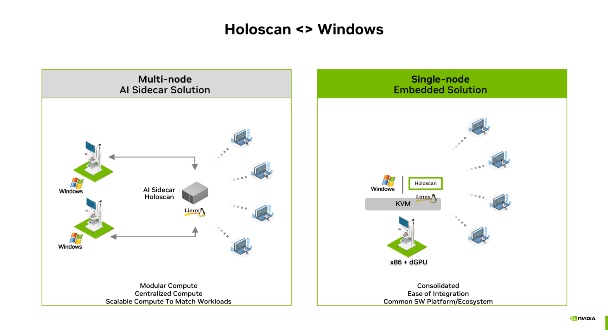

In this tutorial, Holoscan runs on an x86_64 workstation hosting Ubuntu 22.04. Two RTX A4000 GPUs
are plugged into the x86_64 workstation. Using Linux KVM, a Windows VM is created on the host Ubuntu Linux. One RTX A4000 GPU is passed through to the Windows VM using
[VFIO](https://docs.kernel.org/driver-api/vfio.html). The other RTX A4000 GPU is reserved for the
host Ubuntu OS and used by Holoscan. We provide a step-by-step guide on how to achieve
this setup. Furthermore, we also demonstrate how a Holoscan application reads USB-based camera
frames and sends the frames via DDS to an application running on the Windows VM. Finally, the
Windows VM application renders the camera frames on the screen using its dedicated RTX A4000 GPU.

## Platform Requirements

The setup described in this tutorial requires an x86_64 workstation and
[ProViz class of NVIDIA GPUs](https://www.nvidia.com/en-us/design-visualization/desktop-graphics/).
The exact platform details are provided below:

- **CPU**: AMD Ryzen 9 7950X 16-Core Processor
- **OS**: Ubuntu 22.04
- **Kernel Version**: 6.8.0-48-generic
- **GPU**: 2x [NVIDIA RTX A4000](https://www.nvidia.com/en-us/design-visualization/rtx-a4000/)

Although we used two same GPUs in this tutorial, combinations of two different GPUs, for example,
RTX A4000 and RTX A6000, can also be used.

Since x86_64 workstations are very much diverse, the steps to enable the setup described in this
tutorial may not work as-is on all x86_64 workstations. Performances may also vary across different
x86_64 workstations.

## Windows VM Setup Instructions

### Software Pre-requisites

Install the
[NVIDIA Holoscan SDK](https://docs.nvidia.com/holoscan/sdk-user-guide/sdk_installation.html) and the
[NVIDIA GPU driver](https://www.nvidia.com/en-in/drivers/) on the host Ubuntu 22.04.

**Install KVM and QEMU**

```bash
sudo apt update
sudo apt install qemu-kvm libvirt-clients libvirt-daemon-system bridge-utils virt-manager ovmf
```

**Check if KVM works**

```bash
$ kvm-ok
INFO: /dev/kvm exists
KVM acceleration can be used
```

If KVM does not work, kindly figure out how KVM can be enabled for your specific Linux kernel version.

### GPU Passthrough

A GPU can be passed through to a virtual machine using Linux's VFIO driver. The VM
is, then, capable of using the passed through GPU directly without any host operating system
intervention. If a machine has two different GPUs, then it is much more straightforward to
passthrough one of the GPUs to a VM. A bit more configuration is required if two GPUs are same. We
show how one of the two identical GPUs can be passed through to a VM with the VFIO driver.

#### Two Different GPUs (e.g., RTX A4000 and RTX A6000)

##### Identify the GPU to be Passed Through

```bash
$ lspci | grep -i NVIDIA
17:00.0 VGA compatible controller [0300]: NVIDIA Corporation Device [RTX A4000] [10de:24b0] (rev a1)
17:00.1 Audio device [0403]: NVIDIA Corporation Device [10de:228b] (rev a1)
65:00.0 VGA compatible controller [0300]: NVIDIA Corporation Device [RTX A6000] [10de:2230] (rev a1)
65:00.1 Audio device [0403]: NVIDIA Corporation Device [10de:1aef] (rev a1)
```

Let's assume that we want to passthrough the RTX A4000 GPU to a VM (in this tutorial it's a Windows
VM). We note the PCI ID of RTX A4000 as `10de:24b0`.

> **Note**: Make sure that the RTX A4000 GPU to be passed through is not currently used for
> displaying to the monitor.

##### Update GRUB Configuration

Open the `/etc/default/grub` file and find the following line:

```bash
GRUB_CMDLINE_LINUX_DEFAULT="quiet splash"
```

Update the above line to the following to add the previously noted PCI ID of RTX A4000 for the VFIO
driver:

```bash
GRUB_CMDLINE_LINUX_DEFAULT="quiet splash intel_iommu=on amd_iommu=on iommu=pt vfio-pci.ids=10de:24b0"
```

The above line enables IOMMU and passes the PCI ID of RTX A4000 to the VFIO driver for Linux kernel.

##### Update Linux Kernel Module Configuration

Create a new file `/etc/modprobe.d/vfio.conf` and add the following lines:

```bash
options vfio-pci ids=10de:24b0
softdep nvidia pre: vfio-pci
```

The above lines ensure that the NVIDIA driver is loaded after the VFIO driver. Therefore, VFIO takes
over the RTX A4000 GPU, and the RTX A6000 GPU is used by the default NVIDIA driver.

##### Update Initial RAMFS and GRUB

```bash
sudo update-initramfs -u # optionally add -k all to update all kernels
sudo update-grub
```

##### Check if VFIO is loaded for Passed-through GPU

Reboot the system: `sudo reboot`. Now, check the loaded driver for RTX A4000:

```bash
$ lspci -nnk -d 10de:24b0
17:00.0 VGA compatible controller [0300]: NVIDIA Corporation [RTX A4000] [10de:24b0] (rev a1)
	Subsystem: NVIDIA Corporation [RTX A4000] [10de:14ad]
	Kernel driver in use: vfio-pci
	Kernel modules: nvidiafb, nouveau, nvidia_drm, nvidia
```

#### Two Identical GPUs (e.g., 2x RTX A4000)

In case of two identical GPUs, the PCI IDs of the GPUs are the same.

```bash
$ lspci -nn | grep "NVIDIA"
01:00.0 VGA compatible controller [0300]: NVIDIA Corporation GA104GL [RTX A4000] [10de:24b0] (rev a1)
01:00.1 Audio device [0403]: NVIDIA Corporation GA104 High Definition Audio Controller [10de:228b] (rev a1)
09:00.0 VGA compatible controller [0300]: NVIDIA Corporation GA104GL [RTX A4000] [10de:24b0] (rev a1)
09:00.1 Audio device [0403]: NVIDIA Corporation GA104 High Definition Audio Controller [10de:228b] (rev a1)
```

Therefore, we cannot just pass PCI ID `10de:24b0` to the VFIO driver to pass through one RTX A4000
to a VM and keep the other one for the host Linux.

To mitigate the issue, we force the Linux kernel to load the VFIO driver for one of the RTX A4000 GPUs by identifying the
GPU by its PCI bus address at the time of booting Linux. Let's assume that we want to pass through
the RTX A4000 GPU at PCI bus address `01:00.0` to a VM.

> **Note**: Make sure that the RTX A4000 GPU to be passed through is not currently used for
> displaying to the monitor. `nvidia-smi` can be used to figure out which GPU is being used for
> display.

The following instructions are only verified for Ubuntu 22.04 and Linux kernel 6.8.0-48-generic. For
other Ubuntu and Linux kernel versions, the instructions may not work.

##### Update GRUB Configuration

Open the `/etc/default/grub` file and find the following line:

```bash
GRUB_CMDLINE_LINUX_DEFAULT="quiet splash"
```

Update the above line to the following to enable IOMMU:

```bash
GRUB_CMDLINE_LINUX_DEFAULT="quiet splash intel_iommu=on amd_iommu=on iommu=pt vfio-pci.ids="
```

##### Create a script to bind the RTX A4000 GPU to VFIO driver

Create a script `/usr/local/bin/vfio-pci-override.sh` with the following content:

```bash
#!/bin/sh

echo "vfio-pci" > /sys/bus/pci/devices/0000\:01\:00.0/driver_override
echo "vfio-pci" > /sys/bus/pci/devices/0000\:01\:00.0/iommu_group/devices/0000\:01\:00.0/driver_override
echo "vfio-pci" > /sys/bus/pci/devices/0000\:01\:00.0/iommu_group/devices/0000\:01\:00.1/driver_override
modprobe -i vfio-pci
```

Kindly, note that we are using the PCI bus address `0000:01:00.0` of the RTX A4000 in the above
script. In specific cases, the PCI bus address may be different and needs to be updated.

##### Install VFIO driver with the above script

Create a new file `/etc/modprobe.d/vfio.conf` and add the following lines:

```bash
install vfio-pci /usr/local/bin/vfio-pci-override.sh
softdep nvidia pre: vfio-pci
```

##### Update Initial RAMFS and GRUB

```bash
sudo update-initramfs -u # optionally add -k all to update all kernels
sudo update-grub
```

##### Check if VFIO is loaded for Passed-through GPU

Reboot the system: `sudo reboot`. Now, check the loaded driver for RTX A4000:

```bash
$ lspci -nnk -d 10de:24b0
01:00.0 VGA compatible controller [0300]: NVIDIA Corporation GA104GL [RTX A4000] [10de:24b0] (rev a1)
	Subsystem: NVIDIA Corporation GA104GL [RTX A4000] [10de:14ad]
	Kernel driver in use: vfio-pci
	Kernel modules: nvidiafb, nouveau, nvidia_drm, nvidia
09:00.0 VGA compatible controller [0300]: NVIDIA Corporation GA104GL [RTX A4000] [10de:24b0] (rev a1)
	Subsystem: NVIDIA Corporation GA104GL [RTX A4000] [10de:14ad]
	Kernel driver in use: nvidia
	Kernel modules: nvidiafb, nouveau, nvidia_drm, nvidia
```

In the above output, we can see that different kernel drivers are loaded for the two RTX A4000 GPUs.

### Windows VM Configuration for Passed-through GPU

A Windows VM can be created using `virt-manager` or `virsh`
(see [references](#references) if needed). We assume that the Windows VM is
already created and running. We show how to assign the passed-through RTX A4000 GPU to the Windows
VM.

In the "Hardware Details" tab of `virt-manager` GUI, add a new PCI device by selecting
`Add Hardware -> PCI Host Device` option. Select the RTX A4000 GPU at PCI bus address `01:00.0` (and
also other functions of the PCI device such as `01:00.1`).

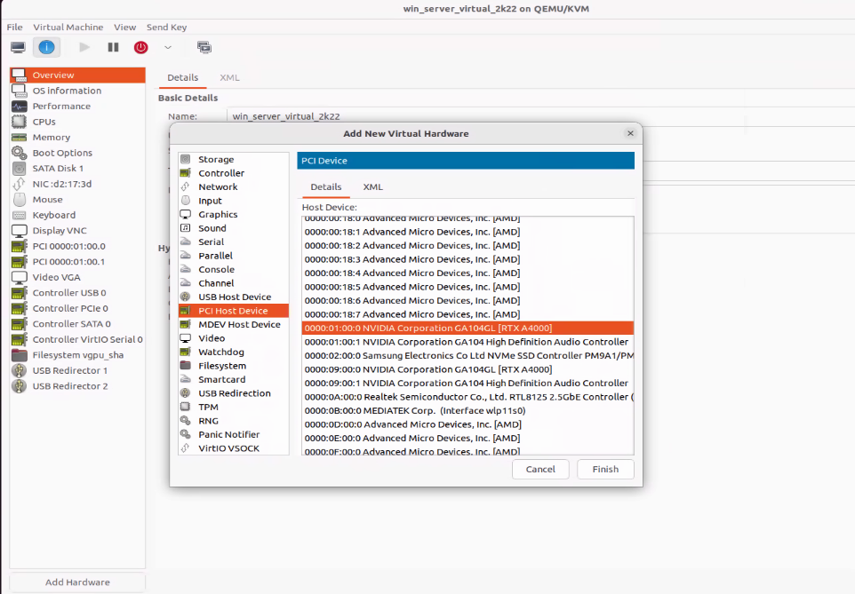

If the GPU is assigned to the VM correctly, then the left panel of the VM hardware details and the
XML of the assigned GPU in `virt-manager` window should look like the following:

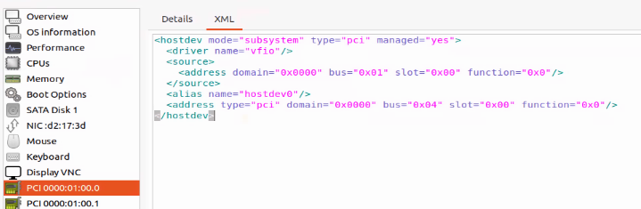

### Add VNC Display for Windows VM

Add VNC display server via "Add Hardware" option in `virt-manager` so that the Windows VM display
can be controlled via VNC server running on Linux host.

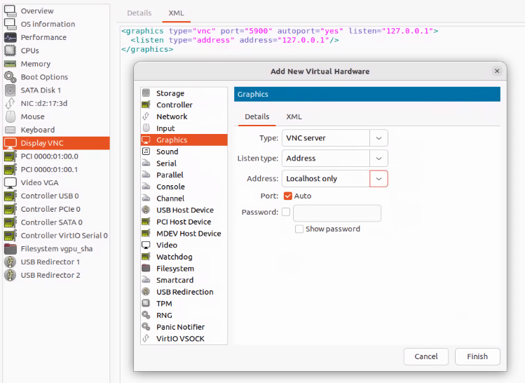

#### Install NVIDIA Driver in Windows VM

Download the NVIDIA driver for RTX A4000 GPU from the
[NVIDIA website](https://www.nvidia.com/en-us/drivers/).

After installing the NVIDIA driver, reboot the Windows VM. Then, open command-prompt by typing `cmd` in the Windows search bar
and type `nvidia-smi`. The following output should be displayed:

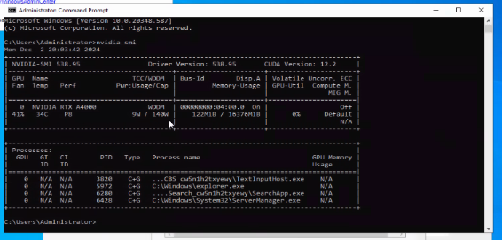

#### Replicate Monitor Display to VNC Display

Right now, we have two screen for the Windows VM: physical monitor (VGA) and VNC display. It could be
difficult to control mouse and keyboard with both the displays. Therefore, the monitor display can
be replicated to the monitor display so that the Windows VM's physical monitor display can be
controlled via the VNC display.

The following configuration shows that the screens are replicated in Windows VM:

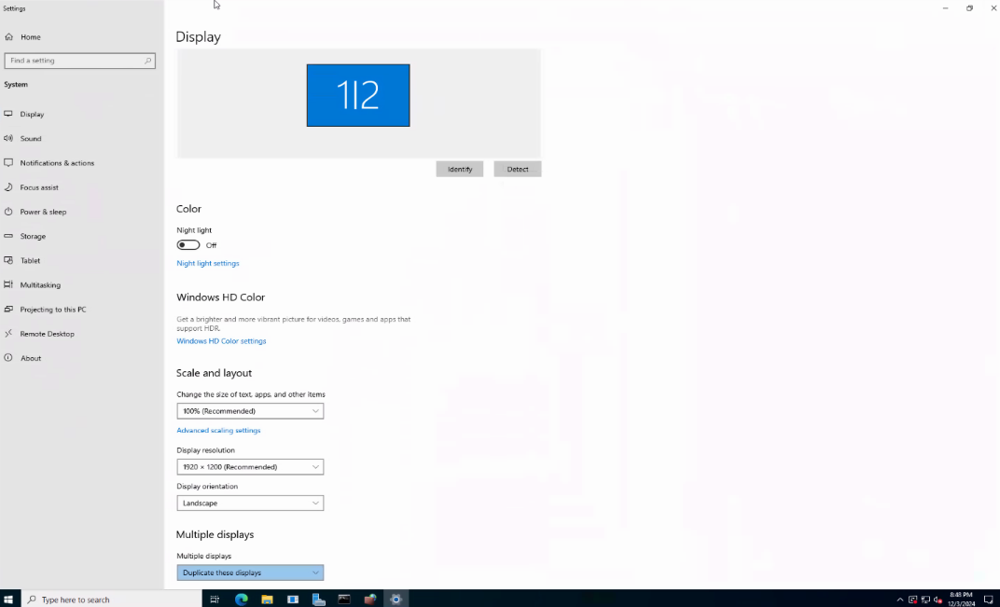

## Communication Performance between Host and VM

The performance of a Windows VM running on a Linux under KVM-based virtualization is well-studied in
the research literature. The performance is dependent on specific hardware and applications. In this
tutorial, we provide the data-transfer performance in our hardware configuration.

> **Note**: Firewalls in both Windows VM and Linux host need to be properly configured to allow
> network traffic between the two OS. Configuring exact firewall rules is out-of-scope of this
> tutorial. However, we provide a few tips below as guiding help on this topic.

**Allowing Network Traffic between VM and Host**

Use a "bridge device" for the VM's network configuration.

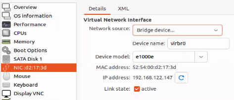

In Windows VM search bar, type "Windows Defender Firewall with Advanced Security" and open the
application. For both "Inbound Rules" and "Outbound Rules", add new rules to allow TCP and UDP
traffic on common (or all) port numbers.

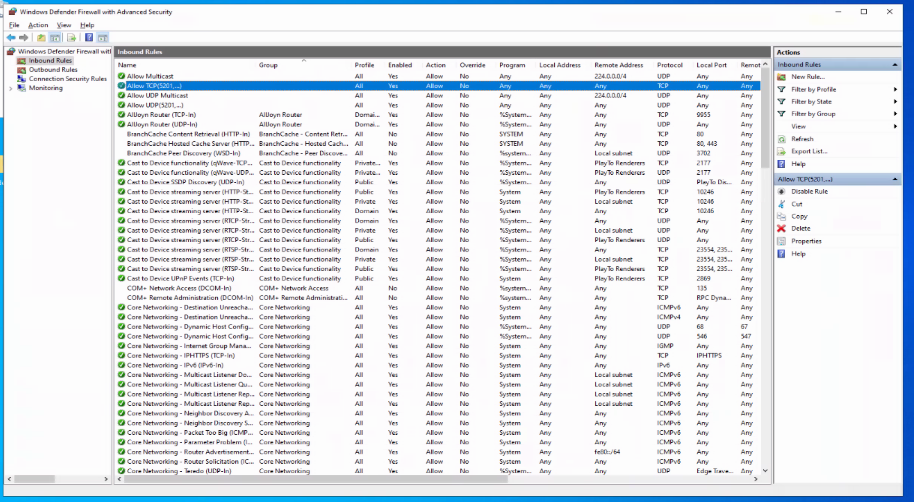

In the host Linux, it may not be needed to configure the firewall to allow network traffic between
VM and host. However, in case it does not work, `iptables` or `ufw` can be used to configure traffic
on specific ports.

**Configuring firewall**

Turning off the firewall, either in Windows VM, or in host Linux, is not recommended. However, to
test the setup in this tutorial, firewalls can be turned off. In Windows, type "firewall" in the
search bar and turn off the firewall. The setting will look like below:

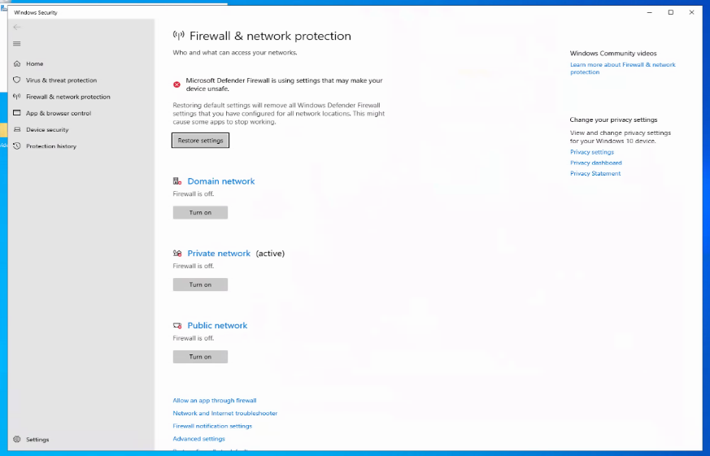

### iperf3 Performance Test

Install iperf3 in both Windows VM and host Linux.

We need the IP address of the Windows VM and the host Linux. In our setup, the Linux server IP is
`192.168.122.1` and the Windows VM client IP is `192.168.122.147`. To check the host Linux IP
address, run `ifconfig` and the IP address of the `virbr0` interface is the IP address of the host.
The Windows VM IP address can be checked in `virt-manager` GUI in the NIC setting, or by running
`ipconfig` in the Command Prompt.

#### Host Linux Server and Windows VM Client

In host Linux, run the following command:

```bash
iperf3 -s -B 192.168.122.1
```

In the Windows VM, run the following command for a 5 second test:
```
iperf3.exe -c 192.168.122.1 -t 5
```

Output in Linux should look like below:
```bash
$ iperf3 -s -B 192.168.122.1
-----------------------------------------------------------
Server listening on 5201
-----------------------------------------------------------
Accepted connection from 192.168.122.147, port 50807
[  5] local 192.168.122.1 port 5201 connected to 192.168.122.147 port 50808
[ ID] Interval           Transfer     Bitrate
[  5]   0.00-1.00   sec  1.98 GBytes  17.0 Gbits/sec
[  5]   1.00-2.00   sec  1.88 GBytes  16.1 Gbits/sec
[  5]   2.00-3.00   sec  2.01 GBytes  17.3 Gbits/sec
[  5]   3.00-4.00   sec  2.01 GBytes  17.3 Gbits/sec
[  5]   4.00-5.00   sec  2.00 GBytes  17.2 Gbits/sec
[  5]   5.00-5.02   sec  46.6 MBytes  16.0 Gbits/sec
- - - - - - - - - - - - - - - - - - - - - - - - -
[ ID] Interval           Transfer     Bitrate
[  5]   0.00-5.02   sec  9.93 GBytes  17.0 Gbits/sec                  receiver
```

Output in Windows VM should look like below:

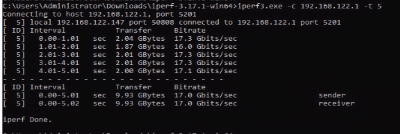

For Linux host to Windows, we have observed **21.9 Gbits/sec** transfer rate for a 1 minute test.

#### Host Linux Client and Windows VM Server

The above commands are reversed for host Linux client and Windows VM server. In the Windows VM, run
the following command:

```
iperf3.exe -s -B 192.168.122.147
```

In the host Linux, run the following command for a 5 second test:

```bash
iperf3 -c 192.168.122.147 -t 60
```

For a 1 minute test, we have observed **4.33 Gbits/sec** transfer rate from Windows VM to host.

## Running Holoscan DDS App and Windows VM App

If the above configurations are done correctly, then interoperating between a Holoscan application
and Windows VM application is straightforward. For this tutorial, we will use the
[Holoscan DDS app](../../applications/dds/dds_video/) and a simple Windows application. The Holoscan DDS
app is used in `publisher` mode where it reads frames from a USB camera and sends the frames via
DDS. The Windows application (available upon request) receives the frames via DDS and renders the
frame on the screen using the RTX A4000 GPU with the help of OpenGL.

In Linux host, run the Holoscan DDS app in `publisher` mode:

```bash
./run launch dds_video --extra_args "-p"
```

In Windows VM, running the renderer application shows the camera input from Linux host:

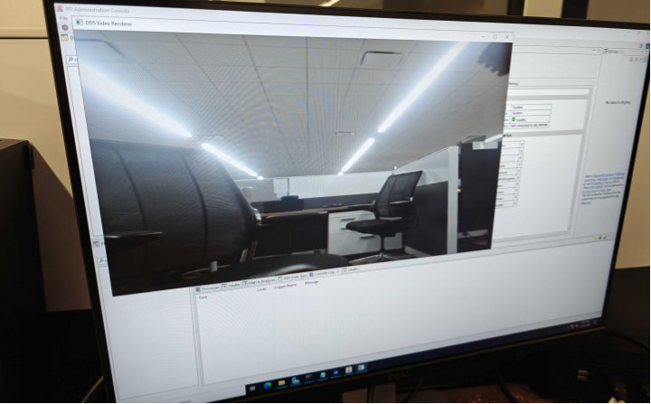

## References

- https://wiki.archlinux.org/title/PCI_passthrough_via_OVMF
- https://www.makeuseof.com/create-windows-virtual-machine-in-linux-with-kvm/
