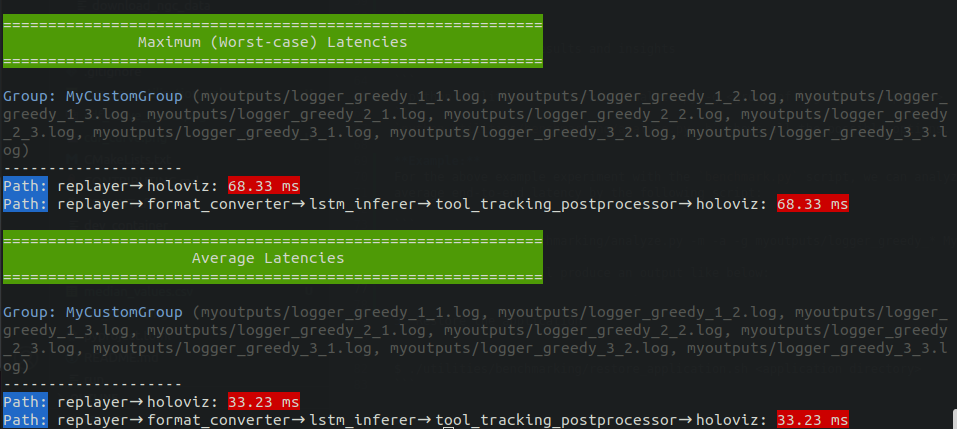
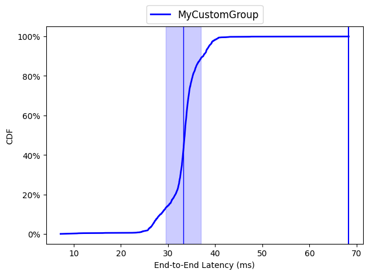

# A Benchmarking Tool for HoloHub

This is a tool to evaluate the performance of HoloHub applications. The tool currently supports
benchmarking of C++ HoloHub applications. We plan to have support for Python applications in the future.

## Pre-requisites
The following Python libraries need to be installed to run the benchmarking scripts (`pip install <library name>` can be used):

```
numpy matplotlib nvitop argparse
```
## Steps for Benchmarking

1. **Patch the application for benchmarking**

```
$ ./utilities/benchmarking/patch_application.sh <application directory>
```

For example, to patch the endoscopy tool tracking application, you would run:

```
$ ./utilities/benchmarking/patch_application.sh applications/endoscopy_tool_tracking
```
This script saves the original `cpp` files in a `*.cpp.bak` file.

2. **Build the application**

```
$ ./run build <application name> <other options> --configure-args \
    -DCMAKE_CXX_FLAGS=-I$PWD/utilities/benchmarking
```

3. **Run the performance evaluation**

```
$ python utilities/benchmarking/benchmark.py -a <application name> <other options>
```

`python utilities/benchmarking/benchmark.py -h` shows all the possible evaluation options.

All the log filenames are printed out at the end of the evaulation. The format of the flow tracking log filename is:
`logger_<scheduler>_<run_number>_<instance-id>.log`. The format of the GPU utilization log filename
is: `gpu_utilization_<scheduler>_<run_number>.csv`.

**Example:**
When the endoscopy tool tracking application is evaluated for the greedy scheduler for 3 runs with 3
instances each for 200 number of data frames, the following output is printed:
```
$ python utilities/benchmarking/benchmark.py -a endoscopy_tool_tracking -r 3 -i 3 -m 200 --sched greedy -d myoutputs
Log directory is not found. Creating a new directory at /home/ubuntu/holoscan-sdk/holohub-internal/myoutputs
Run 1 completed for greedy scheduler.
Run 2 completed for greedy scheduler.
Run 3 completed for greedy scheduler.

Evaluation completed.
Log file directory:  /home/ubuntu/holoscan-sdk/holohub-internal/myoutputs
All the DFFT log files are:  logger_greedy_1_1.log, logger_greedy_1_2.log, logger_greedy_1_3.log, logger_greedy_2_1.log, logger_greedy_2_2.log, logger_greedy_2_3.log, logger_greedy_3_1.log, logger_greedy_3_2.log, logger_greedy_3_3.log

```

4. **Get performance results and insights**

```
$ python utilities/benchmarking/analyze.py -g <group of log files> <options>
```
`python utilities/benchmarking/analyze.py -h` shows all the possible options.

**Example:**
For the above example experiment with the `benchmark.py` script, we can analyze worst-case and
average end-to-end latency by the following script:

```
python utilities/benchmarking/analyze.py -m -a -g myoutputs/logger_greedy_* MyCustomGroup
```
The above command will produce an output like below:



We can also produce CDF curve of the observed latencies for a single path by the following commands:

```
$ python utilities/benchmarking/analyze.py --draw-cdf single_path_cdf.png -g myoutputs/logger_greedy_* MyCustomGroup --no-display-graphs
Saved the CDF curve graph of the first path of each group in: single_path_cdf.png
```
The `single_path_cdf.png` looks like below:


5. **Restore the application**

If benchmarking is not necessary anymore, an application can be restored by the following command:

```
$ ./utilities/benchmarking/restore_application.sh <application directory>
```