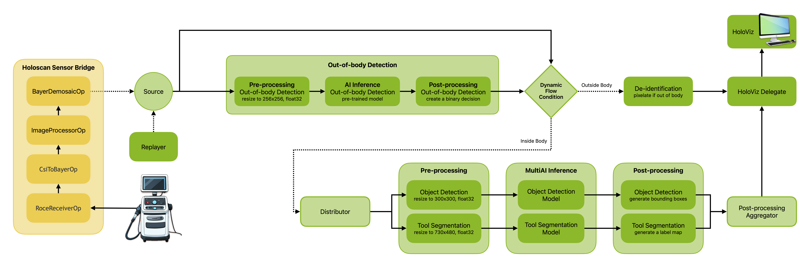
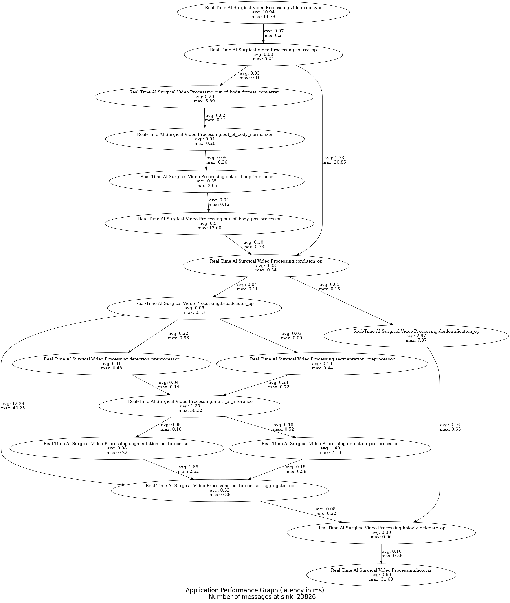

# Real-Time AI Surgical Video Processing Workflow


Fig.1: Endoscopy image from a partial nephrectomy procedures (surgical removal of the diseased portion of the kidney) showing AI tool segmentation results when the camera is inside the body and a deidenfied (pixelated) output image when the camera is outside of the body.

## Overview

Holoscan Workflows are end-to-end reference applications that may include Holoscan Sensor Bridge.
In this workflow, we demonstrate a comprehensive real-time AI surgical video processing pipeline that includes:

1. Integration with [Holoscan Sensor Bridge](https://docs.nvidia.com/holoscan/sensor-bridge/latest/introduction.html), which enables an end-to-end pipeline.
2. Out-of-body detection to determine if the endoscope is inside or outside the patient's body.
3. Dynamic flow condition based on out-of-body detection results:
   - Deidentification (pixelation) when outside the body
   - Multi-AI processing when inside the body
4. De-identification: pixelate the image to anonymize outside of body elements like people's faces.
5. Multi-AI Surgical Tool processing with:
   - SSD detection for surgical tool detection
   - MONAI segmentation for endoscopic tool segmentation

### Workflow Components


Fig.2: The workflow diagram representing all the holoscan operators (in green) and holoscan sensor bridge operators (in yellow). The source can be a Holoscan Sensor Bridge, an AJA Card and a video replayer.

### 1. Out-of-Body Detection

The workflow first determines if the endoscope is inside or outside the patient's body using an AI model.

### 2. Conditional Processing

- If outside the body: The video is deidentified through pixelation to protect privacy
- If inside the body: The video is processed by the multi-AI pipeline

### 3. Multi-AI Processing

When inside the body, two AI models run concurrently:

- SSD detection model identifies surgical tools with bounding boxes
- MONAI segmentation model provides pixel-level segmentation of tools

### 4. Visualization

The HolovizOp displays the processed video with overlaid AI results, including:

- Bounding boxes around detected tools
- Segmentation masks for tools
- Text labels for detected tools

## Requirements

- **Holoscan SDK `v3.0`**:
Holohub command takes care of this dependency when using Holohub container. However, you can install the Holoscan SDK via one of the methods specified in [the SDK user guide](https://docs.nvidia.com/holoscan/sdk-user-guide/sdk_installation.html#development-software-stack).
- **Holoscan Sensor Bridge `v2.0`**

- **Models**: This workflow utilizes the following three AI models.

  - [📦️ Out-of-body Detection Model](https://catalog.ngc.nvidia.com/orgs/nvidia/teams/clara-holoscan/resources/holoscan_orsi_academy_sample_data): `anonymization_model.onnx`  
  - [📦️ SSD Detection for Endoscopy Surgical Tools](https://catalog.ngc.nvidia.com/orgs/nvidia/teams/clara-holoscan/resources/ssd_surgical_tool_detection_model) with additional NMS op: `epoch24_nms.onnx`  
  - [📦️  MONAI Endoscopic Tool Segmentation](https://catalog.ngc.nvidia.com/orgs/nvidia/teams/clara-holoscan/resources/monai_endoscopic_tool_segmentation_model): `model_endoscopic_tool_seg_sanitized_nhwc_in_nchw_out.onnx`

- **Data**: Here is the sample data that is used in this workflow when using the `replayer` source:

  - [📦️ Orsi partial nephrectomy procedures](https://catalog.ngc.nvidia.com/orgs/nvidia/teams/clara-holoscan/resources/holoscan_endoscopy_sample_data)
  
> **Note:** The directory specified by `--data` at the runtime is assumed to contain three subdirectories, corresponding to the NGC resources specified in Models and Data: `orsi`, `monai_tool_seg_model` and `ssd_model`. These resources will be automatically downloaded to the Holohub data directory when building the application.

## Quick start guide

When using the workflow with `--source hsb`, it requires the Holoscan Sensor Bridge software to be installed. you can build a Holoscan Sensor Bridge container using the following command:

```sh
git clone https://github.com/nvidia-holoscan/holoscan-sensor-bridge.git
cd holoscan-sensor-bridge
git checkout 2.0.0
./docker/build.sh
```

This will build a docker image called `hololink-demo:2.0.0`
Once you have built the Holoscan Sensor Bridge container, you can build the Holohub container using the following command:

```sh
./dev_container build_and_run --base_img hololink-demo:2.0.0 --img holohub:link real_time_ai_surgical_video_processing
```

## Advanced usage

First you need to run the Holohub container:

```sh
./dev_container launch --img holohub:link 
```

Then, you can build the workflow using the following command:

```sh
./run build real_time_ai_surgical_video_processing
```

### Running the application

#### Use Holohub container from outside of the container

Using the Holohub container, you can run the workflow without building it again:

```sh
./dev_container build_and_run --base_img hololink-demo:2.0.0 --img holohub:link --no_build real_time_ai_surgical_video_processing
```

However, if you want to build the workflow, you can just remove the `--no_build` flag:

```sh
./dev_container build_and_run --base_img hololink-demo:2.0.0 --img holohub:link real_time_ai_surgical_video_processing
```

#### Use Holohub container from inside the container

First you need to run the Holohub container:

```sh
./dev_container launch --img holohub:link 
```

To run the Python application, you can make use of the run script

```sh
./run launch real_time_ai_surgical_video_processing python
```

Alternatively, you can run the application directly:

```sh
cd <HOLOHUB_SOURCE_DIR>/workflows/real_time_ai_surgical_video_processing/python
python3 real_time_ai_surgical_video_processing.py --source hsb --data <DATA_DIR> --config <CONFIG_FILE>
```

> **TIP:** You can get the exact command by executing `./run launch real_time_ai_surgical_video_processing python --dryrun`

### Command Line Arguments

The application accepts the following command line arguments:

- `-s, --source`: Source of video input. Options are:
  - `replayer`: Use prerecorded video from the endoscopy dataset
  - `aja`: Use an AJA capture card as the source
  - `hsb`: Use the Holoscan Sensor Bridge as the source
  Default: `replayer`

- `-c, --config`: Path to a custom configuration file
  Default: `config.yaml` in the application directory

- `-d, --data`: Path to the data directory containing model and video files
  Default: Uses the HOLOHUB_DATA_PATH environment variable

- `--headless`: Run in headless mode (no visualization)

- `--fullscreen`: Run in fullscreen mode

- `--camera-mode`: Camera mode to use [0,1,2,3]
  Default: `0`

- `--frame-limit`: Exit after receiving this many frames
  Default: No limit

- `--hololink`: IP address of Hololink board
  Default: `192.168.0.2`

- `--log-level`: Logging level to display
  Default: `20`

- `--ibv-name`: IBV device to use
  Default: First available InfiniBand device

- `--ibv-port`: Port number of IBV device
  Default: `1`

- `--expander-configuration`: I2C Expander configuration
  Options: `0` or `1`
  Default: `0`

- `--pattern`: Configure to display a test pattern
  Options: `0` through `11`
  Default: None

- `--ptp-sync`: After reset, wait for PTP time to synchronize

- `--skip-reset`: Don't call reset on the hololink device

## Benchmarking

Please refer to [Holoscan Benchmarking](../../benchmarks/holoscan_flow_benchmarking/README.md) for how to perform benchmarking of this workflow. Below you can find the latency of each operator in a connected graph.


Fig.3: Latency for all Holoscan operators in Real-time AI Surgical Video Processing Workflow.
