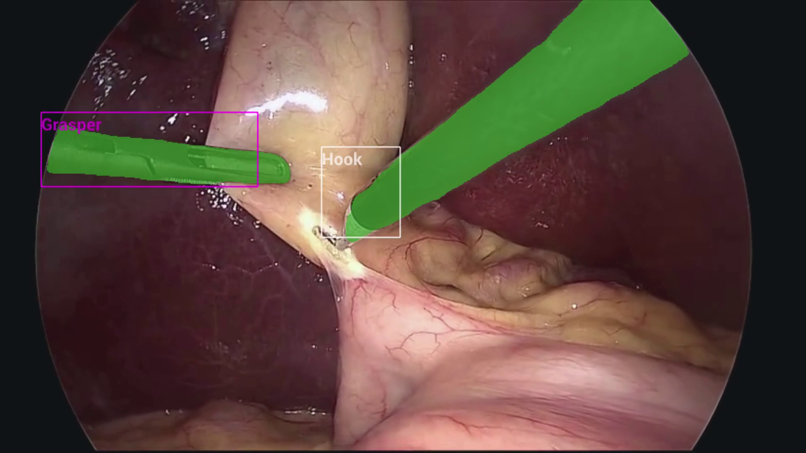

# Real-Time AI Surgical Video Processing Workflow

In this workflow, we demonstrate a comprehensive real-time AI pipeline for surgical video processing that includes:

1. Out-of-body detection to determine if the endoscope is inside or outside the patient
2. Conditional processing based on detection results:
   - Deidentification (pixelation) when outside the body
   - Multi-AI processing when inside the body
3. Multi-AI processing with:
   - SSD detection for surgical tool detection
   - MONAI segmentation for endoscopic tool segmentation



Fig. 1 Endoscopy (laparoscopy) image from a cholecystectomy (gallbladder removal surgery) showing tool detection and segmentation results from two concurrently executed AI models.
Image courtesy of Research Group Camma, IHU Strasbourg and the University of Strasbourg ([NGC Resource](https://catalog.ngc.nvidia.com/orgs/nvidia/teams/clara-holoscan/resources/holoscan_endoscopy_sample_data))

Please refer to the README under [./app_dev_process](./app_dev_process/README.md) to see the process of developing the applications.

The application graph looks like:


## Models

This workflow combines three AI models:

- [Out-of-body detection model](https://catalog.ngc.nvidia.com/orgs/nvidia/teams/clara-holoscan/resources/holoscan_endoscopy_sample_data): `out_of_body_detection.onnx`
- [SSD model from NGC](https://catalog.ngc.nvidia.com/orgs/nvidia/teams/clara-holoscan/resources/ssd_surgical_tool_detection_model) with additional NMS op: `epoch24_nms.onnx`
- [MONAI tool segmentation model from NGC](https://catalog.ngc.nvidia.com/orgs/nvidia/teams/clara-holoscan/resources/monai_endoscopic_tool_segmentation_model): `model_endoscopic_tool_seg_sanitized_nhwc_in_nchw_out.onnx`

## Data

[📦️ (NGC) Sample App Data for AI-based Endoscopy Tool Tracking](https://catalog.ngc.nvidia.com/orgs/nvidia/teams/clara-holoscan/resources/holoscan_endoscopy_sample_data)

[📦️ (NGC) Sample App Data for Out-of-Body Detection](https://catalog.ngc.nvidia.com/orgs/nvidia/teams/clara-holoscan/resources/holoscan_endoscopy_sample_data)

## Requirements

Ensure you have installed the Holoscan SDK via one of the methods specified in [the SDK user guide](https://docs.nvidia.com/holoscan/sdk-user-guide/sdk_installation.html#development-software-stack).

The directory specified by `--data` at app runtime is assumed to contain three subdirectories, corresponding to the NGC resources specified in [Model](#models) and [Data](#data): `endoscopy`, `endoscopy_out_of_body_detection`, `monai_tool_seg_model` and `ssd_model`. These resources will be automatically downloaded to the holohub data directory when building the application.

## Building the application

The repo level build command

```sh
./run build real_time_ai_surgical_video_processing
```

will build the application.

## Running the application

### Python App

To run the Python application, you can make use of the run script

```sh
./run launch real_time_ai_surgical_video_processing python
```

Alternatively, to run this application, you'll need to configure your PYTHONPATH environment variable to locate the
necessary python libraries based on your Holoscan SDK installation type.

You should refer to the [glossary](../../README.md#Glossary) for the terms defining specific locations within HoloHub.

If your Holoscan SDK installation type is:

- python wheels:

  ```bash
  export PYTHONPATH=$PYTHONPATH:<HOLOHUB_BUILD_DIR>/python/lib
  ```

- otherwise:

  ```bash
  export PYTHONPATH=$PYTHONPATH:<HOLOSCAN_INSTALL_DIR>/python/lib:<HOLOHUB_BUILD_DIR>/python/lib
  ```

Next, run the application:

```sh
cd <HOLOHUB_SOURCE_DIR>/workflows/real_time_ai_surgical_video_processing/python
python3 main.py --data <DATA_DIR>
```

### Command Line Arguments

The application accepts the following command line arguments:

- `-s, --source`: Source of video input. Options are:
  - `replayer1`: Use prerecorded video from the endoscopy dataset
  - `replayer2`: Use prerecorded video from the out-of-body detection dataset
  - `aja`: Use an AJA capture card as the source
  Default: `replayer`

- `-c, --config`: Path to a custom configuration file
  Default: `multi_ai.yaml` in the application directory

- `-d, --data`: Path to the data directory containing model and video files
  Default: Uses the HOLOHUB_DATA_PATH environment variable

- `-l, --labelfile`: Path to a CSV file containing class labels for visualization
  Default: `endo_ref_data_labels.csv` in the application directory

## Workflow Components

### 1. Out-of-Body Detection

The workflow first determines if the endoscope is inside or outside the patient's body using an AI model.

### 2. Conditional Processing

- If outside the body: The video is deidentified through pixelation to protect privacy
- If inside the body: The video is processed by the multi-AI pipeline

### 3. Multi-AI Processing

When inside the body, two AI models run concurrently:

- SSD detection model identifies surgical tools with bounding boxes
- MONAI segmentation model provides pixel-level segmentation of tools

### 4. Visualization

The HolovizOp displays the processed video with overlaid AI results, including:

- Bounding boxes around detected tools
- Segmentation masks for tools
- Text labels for detected tools
